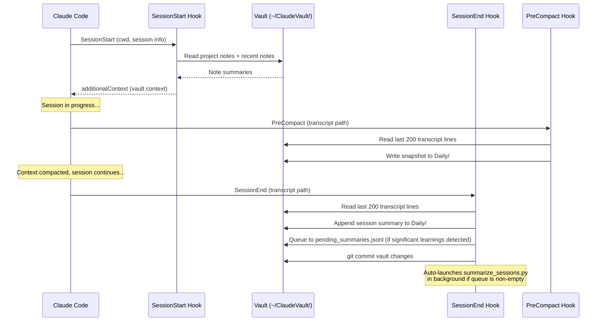
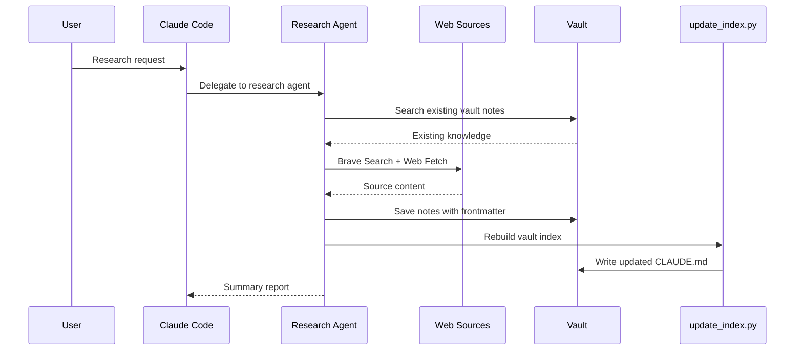
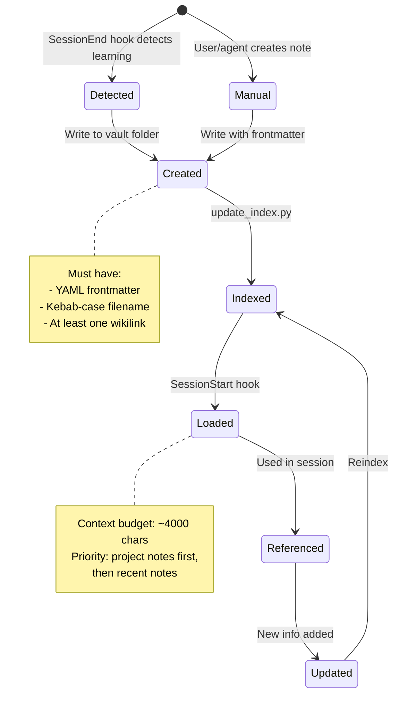

# Parsidion CC Architecture

A Claude Code customization toolkit that replaces built-in auto memory with an Obsidian vault-based knowledge management system, augmented by lifecycle hooks, a research agent, and a graph-colorized vault explorer.

## Table of Contents
- [Overview](#overview)
- [System Architecture](#system-architecture)
- [Component Details](#component-details)
  - [Claude Vault Skill](#claude-vault-skill)
  - [Hook Scripts](#hook-scripts)
  - [Session Summarizer](#session-summarizer)
  - [Graph Coverage Checker](#graph-coverage-checker)
  - [Research Agent](#research-agent)
  - [Vault Common Library](#vault-common-library)
  - [Index Generator](#index-generator)
  - [Trigger Evaluation](#trigger-evaluation)
  - [Obsidian Integration](#obsidian-integration)
- [Configuration](#configuration)
- [Data Flow](#data-flow)
- [File Layout](#file-layout)
- [Vault Note Lifecycle](#vault-note-lifecycle)
- [Obsidian Graph View](#obsidian-graph-view)
- [Related Documentation](#related-documentation)

## Overview

**Purpose:** Provide a structured, searchable, cross-linked knowledge base that persists across Claude Code sessions, replacing the flat auto memory with richly organized Obsidian notes.

**Key capabilities:**
- Automatic context loading at session start based on project and recency
- Automatic learning capture at session stop via transcript analysis
- Working state snapshots before context compaction
- A dedicated research agent that saves findings to the vault
- An auto-generated index with tag cloud and per-folder listings
- Obsidian graph view with domain-based color grouping

**Runtime requirements:**
- Python 3.13+ (stdlib only -- no third-party packages)
- `uv` for script execution
- Obsidian for vault browsing and graph view (optional but recommended)

**Configuration:** All hooks and the summarizer read `~/ClaudeVault/config.yaml` for tuneable settings. A reference config with all defaults is shipped as `templates/config.yaml`. Precedence: script defaults → config.yaml → CLI arguments.

## System Architecture

```mermaid
graph TB
    subgraph "Claude Code Runtime"
        CC[Claude Code Session]
        Hooks[Hook System]
    end

    subgraph "Parsidion CC"
        Skill[Claude Vault Skill]
        Agent[Research Agent]
        VC[vault_common.py]
        SSH[session_start_hook.py]
        STH[session_stop_hook.py]
        PCH[pre_compact_hook.py]
        SUM[summarize_sessions.py]
        IDX[update_index.py]
        CGC[check_graph_coverage.py]
        EVAL[run_trigger_eval.py]
    end

    subgraph "Obsidian Vault ~/ClaudeVault/"
        Config[config.yaml]
        Index[CLAUDE.md Index]
        Pending[pending_summaries.jsonl]
        Daily[Daily/]
        Projects[Projects/]
        Languages[Languages/]
        Frameworks[Frameworks/]
        Patterns[Patterns/]
        Debugging[Debugging/]
        Tools[Tools/]
        Research[Research/]
        Graph[.obsidian/graph.json]
    end

    CC --> Hooks
    Hooks -->|SessionStart| SSH
    Hooks -->|SessionEnd| STH
    Hooks -->|PreCompact| PCH
    CC -->|invokes| Agent

    SSH -->|reads| VC
    STH -->|reads| VC
    PCH -->|reads| VC
    IDX -->|reads| VC
    SUM -->|reads| VC
    VC -->|loads| Config
    Agent -->|saves to| Research

    SSH -->|loads context from| Daily
    SSH -->|loads context from| Projects
    STH -->|writes to| Daily
    STH -->|queues to| Pending
    SUM -->|reads| Pending
    SUM -->|creates notes in| Debugging
    SUM -->|creates notes in| Patterns
    SUM -->|creates notes in| Research
    PCH -->|writes to| Daily
    IDX -->|generates| Index
    CGC -->|reads| Graph

    Skill -->|defines conventions| CC
    EVAL -->|reads description| Skill

    style CC fill:#e65100,stroke:#ff9800,stroke-width:3px,color:#ffffff
    style Hooks fill:#e65100,stroke:#ff9800,stroke-width:2px,color:#ffffff
    style Skill fill:#4a148c,stroke:#9c27b0,stroke-width:2px,color:#ffffff
    style Agent fill:#4a148c,stroke:#9c27b0,stroke-width:2px,color:#ffffff
    style VC fill:#0d47a1,stroke:#2196f3,stroke-width:2px,color:#ffffff
    style SSH fill:#1b5e20,stroke:#4caf50,stroke-width:2px,color:#ffffff
    style STH fill:#880e4f,stroke:#c2185b,stroke-width:2px,color:#ffffff
    style PCH fill:#ff6f00,stroke:#ffa726,stroke-width:2px,color:#ffffff
    style SUM fill:#4a148c,stroke:#9c27b0,stroke-width:2px,color:#ffffff
    style IDX fill:#0d47a1,stroke:#2196f3,stroke-width:2px,color:#ffffff
    style CGC fill:#0d47a1,stroke:#2196f3,stroke-width:2px,color:#ffffff
    style EVAL fill:#ff6f00,stroke:#ffa726,stroke-width:2px,color:#ffffff
    style Config fill:#1a237e,stroke:#3f51b5,stroke-width:2px,color:#ffffff
    style Index fill:#1a237e,stroke:#3f51b5,stroke-width:2px,color:#ffffff
    style Pending fill:#1a237e,stroke:#3f51b5,stroke-width:2px,color:#ffffff
    style Daily fill:#37474f,stroke:#78909c,stroke-width:2px,color:#ffffff
    style Projects fill:#37474f,stroke:#78909c,stroke-width:2px,color:#ffffff
    style Languages fill:#37474f,stroke:#78909c,stroke-width:2px,color:#ffffff
    style Frameworks fill:#37474f,stroke:#78909c,stroke-width:2px,color:#ffffff
    style Patterns fill:#37474f,stroke:#78909c,stroke-width:2px,color:#ffffff
    style Debugging fill:#37474f,stroke:#78909c,stroke-width:2px,color:#ffffff
    style Tools fill:#37474f,stroke:#78909c,stroke-width:2px,color:#ffffff
    style Research fill:#37474f,stroke:#78909c,stroke-width:2px,color:#ffffff
    style Graph fill:#37474f,stroke:#78909c,stroke-width:1px,color:#ffffff
```



## Component Details

### Claude Vault Skill

**Location:** `skills/claude-vault/SKILL.md`

The skill definition loaded into Claude Code's context. Establishes the philosophy, conventions, and anti-patterns for vault usage. It is not executable code -- it is a prompt artifact that shapes how Claude interacts with the vault.

**Auto-triggering:** The SKILL.md includes YAML frontmatter with a `name` and `description` field that enables Claude Code to automatically invoke the skill when users mention saving knowledge, checking vault notes, or persisting findings across sessions. The description was iteratively optimized using the trigger eval harness (see [Trigger Evaluation](#trigger-evaluation)).

**Key conventions enforced:**
- Search before create (no duplicates)
- Atomic notes (one concept per note)
- Mandatory YAML frontmatter on every note
- Wikilinks for cross-referencing
- Kebab-case filenames

### Hook Scripts

Three Python scripts execute at different points in the Claude Code session lifecycle. All hooks read JSON from stdin, interact with the vault via `vault_common`, and write JSON to stdout. Each hook supports tuneable options via `~/ClaudeVault/config.yaml` and/or CLI arguments (precedence: script defaults → config.yaml → CLI args).

#### SessionStart Hook

**Script:** `skills/claude-vault/scripts/session_start_hook.py`

Fires when a Claude Code session begins. Loads relevant vault context into the conversation so Claude has prior knowledge available immediately.

**CLI flags:** `--ai [MODEL]`, `--max-chars N`, `--debug`

**Configurable options** (section `session_start_hook` in `config.yaml`):

| Key | Default | Description |
|-----|---------|-------------|
| `ai_model` | `null` (disabled) | Model for AI note selection |
| `max_chars` | `4000` | Maximum characters for injected context |
| `ai_timeout` | `25` | AI call timeout in seconds |
| `recent_days` | `3` | Days to look back for recent notes |
| `debug` | `false` | Append injected context + metadata to debug log in `$TMPDIR` |

**Standard behaviour:**
1. Determines the current project from the working directory
2. Ensures vault directories and today's daily note exist
3. Gathers project-specific notes (by `project` frontmatter field)
4. Gathers recent notes (modified within last `recent_days` days, configurable)
5. Deduplicates and builds a context block (max `max_chars`, default ~4000 chars)
6. Returns the context as `additionalContext` in the hook output
7. When `debug` is enabled, appends the full context plus quality metadata (project, mode, char count, budget %, note count, elapsed time) to `$TMPDIR/claude-vault-session-start-debug.log`

**AI-powered mode (`--ai [MODEL]`):**

Pass `--ai` (or `--ai <model-id>`) to the hook command, or set `session_start_hook.ai_model` in config.yaml, to enable intelligent note selection via `claude -p`. When enabled:

1. Collects **all** vault notes as candidates — project-tagged notes first, then the rest sorted by mtime descending
2. Builds a summarised candidate block (up to 8000 chars) from note titles and first 6 body lines
3. Runs `claude -p <prompt> --model <model> --no-session-persistence` with `CLAUDECODE` unset so it can be called from within an active session; timeout is controlled by `session_start_hook.ai_timeout` (default 25 s)
4. Claude selects and formats the most relevant notes as context (target ≤ `max_chars - 500` chars)
5. Falls back silently to standard behaviour on timeout, missing binary, or non-zero exit

Default model: `claude-haiku-4-5-20251001`. Override with `--ai claude-sonnet-4-6`, any valid model ID, or `session_start_hook.ai_model` in config.yaml.

**Hook timeout:** The default 10 s hook timeout must be increased to at least `30000` ms when using `--ai`.

```json
{
  "command": "uv run --no-project ~/.claude/skills/claude-vault/scripts/session_start_hook.py --ai",
  "timeout": 30000
}
```

#### SessionEnd Hook

**Script:** `skills/claude-vault/scripts/session_stop_hook.py`

Registered under the `SessionEnd` hook event — fires once when the session terminates (unlike `Stop`, which fires after every agent turn). Analyzes the session transcript to detect learnable content and persists it to the vault.

**Configurable options** (section `session_stop_hook` in `config.yaml`):

| Key | Default | Description |
|-----|---------|-------------|
| `ai_model` | `null` (disabled) | Model for AI classification |
| `ai_timeout` | `25` | AI call timeout in seconds |
| `auto_summarize` | `true` | Auto-launch summarizer when pending entries exist |

**Behavior:**
1. Reads the last 200 lines of the JSONL transcript
2. Extracts assistant message text
3. Resolves AI model: CLI `--ai` → `session_stop_hook.ai_model` config → `null` (disabled)
4. Runs keyword-based heuristics to detect four categories:
   - **Error fixes** (keywords: "fixed", "root cause", "the fix", etc.)
   - **Research findings** (keywords: "found that", "documentation says", etc.)
   - **Patterns** (keywords: "pattern", "best practice", "architecture", etc.)
   - **Config/setup** (keywords: "configured", "installed", "set up", etc.)
5. Appends a session summary to today's daily note under `## Sessions`
6. Queues sessions with significant learnings (error_fix, research, or pattern categories) to `pending_summaries.jsonl` for AI-powered summarization. Uses `fcntl.flock` on macOS/Linux (with a `try/except ImportError` fallback for Windows) for safe concurrent access; deduplicates by `session_id`.
7. Calls `git_commit_vault` to commit the updated daily note to the vault git repository (respects `git.auto_commit` config)
8. Auto-launches `summarize_sessions.py` as a detached background process if there are pending entries in the queue and `session_stop_hook.auto_summarize` is `true` (default)
9. Uses an environment variable guard (`CLAUDE_VAULT_STOP_ACTIVE`) to prevent recursive invocation

**AI-powered mode (`--ai [MODEL]`):**

Pass `--ai` (or `--ai <model-id>`) to the hook command, or set `session_stop_hook.ai_model` in config.yaml, to enable semantic classification via `claude -p`. When enabled:

1. Samples the first 10 assistant messages (up to 1500 chars total)
2. Asks Claude to determine `should_queue`, `categories`, and a one-sentence `summary`; timeout is controlled by `session_stop_hook.ai_timeout` (default 25 s)
3. Skips queuing if `should_queue` is false (avoids storing routine sessions)
4. Falls back silently to keyword heuristics on timeout, missing binary, or non-zero exit

Default model: `claude-haiku-4-5-20251001`. Override with `--ai <model-id>` or `session_stop_hook.ai_model` in config.yaml. Requires increasing the hook timeout in `settings.json` to at least `30000` ms.

#### PreCompact Hook

**Script:** `skills/claude-vault/scripts/pre_compact_hook.py`

Fires before Claude Code compacts the conversation context. Snapshots the current working state so it survives compaction.

**CLI flags:** `--lines N`

**Configurable options** (section `pre_compact_hook` in `config.yaml`):

| Key | Default | Description |
|-----|---------|-------------|
| `lines` | `200` | Number of transcript lines to analyse |

**Behavior:**
1. Reads the last N lines of the JSONL transcript (default 200, configurable via `--lines` or `pre_compact_hook.lines`)
2. Extracts the most recent user message as a task summary
3. Extracts file paths mentioned in the transcript (up to 15)
4. Appends a `## Pre-Compact Snapshot` section to today's daily note
5. Calls `git_commit_vault` to commit the snapshot (respects `git.auto_commit` config)

### Session Summarizer

**Location:** `skills/claude-vault/scripts/summarize_sessions.py`

An on-demand PEP 723 script (requires `claude-agent-sdk`, `anyio`) that processes the `pending_summaries.jsonl` queue and generates structured vault notes using Claude AI.

**CLI flags:** `--sessions FILE`, `--dry-run`, `--model MODEL`, `--persist`

**Configurable options** (section `summarizer` in `config.yaml`):

| Key | Default | Description |
|-----|---------|-------------|
| `model` | `claude-sonnet-4-6` | Model for note generation |
| `max_parallel` | `5` | Concurrent summarization tasks |
| `transcript_tail_lines` | `400` | Transcript lines to read per entry |
| `max_cleaned_chars` | `12000` | Maximum characters after cleaning |
| `persist` | `false` | SDK session persistence (for debugging) |

**Behavior:**
1. Reads entries from `pending_summaries.jsonl`
2. Pre-processes each transcript via `preprocess_transcript(tail_lines, max_chars)` to extract a cleaned human/assistant dialogue
3. Calls Claude via the Agent SDK (up to `max_parallel` parallel sessions, default 5) to generate structured notes. Default model is `claude-sonnet-4-6`.
4. Saves notes to the appropriate vault subfolder (`Debugging/`, `Patterns/`, `Research/`, etc.) with YAML frontmatter
5. Removes processed entries from the queue, rebuilds the vault index, and commits via `git_commit_vault`

**Must be run from a separate terminal** (or with `env -u CLAUDECODE`) because the Agent SDK cannot be nested inside an active Claude Code session.

### Graph Coverage Checker

**Location:** `skills/claude-vault/scripts/check_graph_coverage.py`

A utility script that audits vault tags against the Obsidian graph color groups in `.obsidian/graph.json`.

**Behavior:**
1. Collects all tags used across vault notes
2. Compares against tags defined in each graph color group
3. Reports uncovered tags (used in vault but not in any color group)
4. Reports stale entries (in color groups but not used in any note)
5. Supports `--threshold N` to filter by minimum tag usage count and `--json` for scripting

### Research Agent

**Location:** `agents/research-documentation-agent.md`

A Claude Code agent definition (runs on Sonnet) that conducts technical research and saves structured findings to the vault.

**Workflow:**
1. Searches existing vault notes before doing external research
2. Uses NotebookLM (if available) for deep synthesis of source material
3. Uses Brave Search for web research, Web Fetch for content extraction
4. Saves results to the appropriate vault subfolder with YAML frontmatter
5. Runs `update_index.py` after saving notes
6. Provides a summary report of findings and gaps

### Vault Common Library

**Location:** `skills/claude-vault/scripts/vault_common.py`

The shared utility library used by all hook scripts and the index generator. Uses only Python stdlib (no third-party dependencies).

**Key functions:**

| Function | Purpose |
|----------|---------|
| `parse_frontmatter()` | Regex-based YAML frontmatter parser |
| `get_body()` | Returns markdown content after frontmatter |
| `find_notes_by_project()` | Search by `project` frontmatter field |
| `find_notes_by_tag()` | Search by tag in `tags` list |
| `find_notes_by_type()` | Search by `type` frontmatter field |
| `find_recent_notes()` | Find notes modified within N days |
| `read_note_summary()` | Extract title + first few body lines |
| `build_context_block()` | Assemble notes into a character-budgeted context string |
| `get_project_name()` | Derive project name from cwd or git root |
| `ensure_vault_dirs()` | Create missing vault directories and Templates symlink |
| `create_daily_note_if_missing()` | Create today's daily note from template |
| `slugify()` | Convert text to kebab-case filename |
| `all_vault_notes()` | Return all `.md` files in the vault (excluding `EXCLUDE_DIRS`) |
| `git_commit_vault()` | Stage and commit vault changes; respects `git.auto_commit` config |
| `load_config()` | Load and cache `config.yaml` from `VAULT_ROOT` |
| `get_config()` | Look up a config value by section/key with fallback default |

**Configuration system:** `load_config()` reads `~/ClaudeVault/config.yaml` on first call and caches the result for the process lifetime. The file is parsed by `_parse_config_yaml()`, a stdlib-only YAML parser that handles one level of nesting (section headers with nested key-value pairs). `_strip_inline_comment()` handles trailing `# comment` syntax. `get_config(section, key, default)` provides the lookup API used by all hooks and the summarizer.

**Design decisions:**
- No external dependencies (stdlib only) for maximum portability in hook contexts
- Custom YAML parser via regex rather than importing `pyyaml`; the config parser (`_parse_config_yaml`) is similarly stdlib-only
- File walking excludes `.obsidian/`, `Templates/`, `.git/`, `.trash/`, `TagsRoutes/`

### Index Generator

**Location:** `skills/claude-vault/scripts/update_index.py`

Rebuilds `~/ClaudeVault/CLAUDE.md` by scanning all vault notes.

**Output sections:**
1. **Quick Stats** -- total note count and last updated timestamp
2. **Tag Cloud** -- all tags sorted by frequency
3. **Recent Activity** -- notes modified within the last 7 days (max 20)
4. **Folders** -- per-folder listings with wikilinks and summaries

### Trigger Evaluation

**Location:** `skills/claude-vault/scripts/run_trigger_eval.py`, `skills/claude-vault/scripts/run_trigger_eval.sh` (macOS/Linux), `skills/claude-vault/scripts/run_trigger_eval.bat` (Windows)

A standalone eval harness that measures how accurately Claude invokes the skill based on its SKILL.md description. Uses a "skill-selection simulation" approach: presents Claude with the skill description alongside distractor skills and asks whether it would invoke `claude-vault` for each test query.

**How it works:**
1. Parses the `name` and `description` from SKILL.md frontmatter
2. Presents 20 test queries (10 should-trigger, 10 should-not-trigger) to Claude via `claude -p`
3. Each query runs 3 times for statistical reliability (60 total API calls)
4. Uses 6 parallel workers via `ProcessPoolExecutor`
5. Computes precision, recall, accuracy, and per-query pass rates
6. Writes results to `~/.claude/skills/claude-vault/eval_results.json`

**Important:** Must be run from a **separate terminal** (not inside Claude Code) because `claude -p` cannot be nested inside an active session. The shell wrappers `run_trigger_eval.sh` (macOS/Linux) and `run_trigger_eval.bat` (Windows) handle unsetting the `CLAUDECODE` environment variable.

**Distractor skills** (5 real skills from the user's setup) are included in the prompt to simulate realistic skill selection. Without distractors, results would be unrealistically optimistic.

### Context Preview Script

**Location:** `scripts/show-context`

A shell script that previews what vault context would be injected at session start for a given project directory. Useful for debugging the SessionStart hook without launching a full Claude Code session.

**Usage:**
```bash
# Preview context for the current directory
./scripts/show-context

# Preview context for a specific project
./scripts/show-context /path/to/project
```

Requires `jq` to be installed. The script invokes `session_start_hook.py` with a synthetic JSON input and extracts the `additionalContext` field from the hook output.

### Obsidian Integration

The vault is a standard Obsidian vault at `~/ClaudeVault/`. Obsidian provides the graph view, search, and wikilink navigation.

**Templates:** The `Templates/` directory is a symlink to the skill's `templates/` folder, making 8 note templates and the reference `config.yaml` available in Obsidian:

| Template | Note Type |
|----------|-----------|
| `daily.md` | Session summaries |
| `project.md` | Per-project context |
| `language.md` | Language-specific knowledge |
| `framework.md` | Framework knowledge |
| `pattern.md` | Design patterns |
| `debugging.md` | Error patterns and fixes |
| `tool.md` | CLI tools and packages |
| `research.md` | Deep-dive research |
| `config.yaml` | Reference config with all defaults |

## Configuration

All hooks and the summarizer support a centralized configuration file at `~/ClaudeVault/config.yaml`. A reference template with all defaults documented is shipped at `templates/config.yaml` and copied to the vault during installation.

**Precedence:** script defaults → `config.yaml` → CLI arguments.

**Sections:**

```yaml
session_start_hook:  # session_start_hook.py
  ai_model: null     # Model for AI note selection (null = disabled)
  max_chars: 4000    # Max context injection characters
  ai_timeout: 25     # AI call timeout in seconds
  recent_days: 3     # Days to look back for recent notes
  debug: false       # Append injected context + metadata to debug log in $TMPDIR

session_stop_hook:   # session_stop_hook.py
  ai_model: null     # Model for AI classification (null = disabled)
  ai_timeout: 25     # AI call timeout in seconds
  auto_summarize: true  # Auto-launch summarizer when pending entries exist

pre_compact_hook:    # pre_compact_hook.py
  lines: 200         # Transcript lines to analyse

summarizer:          # summarize_sessions.py
  model: claude-sonnet-4-6
  max_parallel: 5
  transcript_tail_lines: 400
  max_cleaned_chars: 12000
  persist: false     # SDK session persistence (for debugging)

git:
  auto_commit: true  # Auto-commit vault changes after writes
```

**Model defaults:** Hook scripts (`session_start_hook.py`, `session_stop_hook.py`) default to `claude-haiku-4-5-20251001` when AI mode is enabled. The summarizer defaults to `claude-sonnet-4-6`. Override any model via the corresponding config key or CLI flag. Setting `ai_model` to a model ID in config enables AI mode without needing the `--ai` CLI flag.

**`git.auto_commit`:** When `false`, `git_commit_vault()` returns immediately without staging or committing. This disables all automatic vault git commits across hooks and the summarizer.

## Data Flow

### Session Lifecycle



### Research Flow



## File Layout

### Source Repository (parsidion-cc)

```
parsidion-cc/
├── README.md
├── scripts/
│   └── show-context                 # CLI: preview session start context for any project
├── docs/
│   ├── ARCHITECTURE.md              # This document
│   └── DOCUMENTATION_STYLE_GUIDE.md
├── agents/
│   └── research-documentation-agent.md
└── skills/claude-vault/
    ├── SKILL.md                     # Skill definition
    ├── scripts/
    │   ├── vault_common.py          # Shared library
    │   ├── session_start_hook.py    # SessionStart hook
    │   ├── session_stop_hook.py     # SessionEnd hook (queues to pending_summaries.jsonl)
    │   ├── pre_compact_hook.py      # PreCompact hook
    │   ├── summarize_sessions.py    # On-demand AI summarizer (PEP 723)
    │   ├── update_index.py          # Index generator
    │   ├── check_graph_coverage.py  # Graph color group coverage audit
    │   ├── run_trigger_eval.py      # Trigger accuracy eval
    │   ├── run_trigger_eval.sh      # Shell wrapper for eval (macOS/Linux)
    │   ├── run_trigger_eval.bat     # Batch wrapper for eval (Windows)
    │   ├── migrate_research.py      # One-time migration
    │   └── migrate_memory.py        # One-time migration
    └── templates/
        ├── config.yaml              # Reference config with all defaults
        ├── daily.md
        ├── project.md
        ├── language.md
        ├── framework.md
        ├── pattern.md
        ├── debugging.md
        ├── tool.md
        └── research.md
```

### Installed Locations

```
~/.claude/
├── settings.json                    # Hook registrations
├── agents/
│   └── research-documentation-agent.md
└── skills/claude-vault/
    ├── SKILL.md
    ├── eval_results.json            # Trigger eval results
    ├── scripts/
    └── templates/

~/ClaudeVault/                       # Obsidian vault
├── .obsidian/
│   └── graph.json                   # Graph view color config
├── config.yaml                      # User config (copied from templates/config.yaml)
├── CLAUDE.md                        # Auto-generated index
├── Daily/
├── Projects/
├── Languages/
├── Frameworks/
├── Patterns/
├── Debugging/
├── Tools/
├── Research/
├── History/
└── Templates/ -> ~/.claude/skills/claude-vault/templates/
```

## Vault Note Lifecycle



## Obsidian Graph View

The graph view uses domain-based color groups configured in `.obsidian/graph.json`. Since Obsidian applies **first-match-wins** coloring and 57% of vault notes have multiple tags, colors represent semantic categories rather than individual tags.

### Color Groups (Priority Order)

| Priority | Category | Color | Hex | Tags |
|----------|----------|-------|-----|------|
| 1 | Projects | Cyan | `#00BCD4` | synknot, fractal-flythroughs, parvitar, parsistant, termflix, parvault, cctmux, parsidion-cc |
| 2 | Debugging | Red/Orange | `#FF5722` | debugging |
| 3 | Patterns | Green | `#4CAF50` | memory, migration, sync |
| 4 | Research | Purple | `#9C27B0` | research, e2b, qdrant, pkm-apps-comparison |
| 5 | Tools & SDKs | Blue | `#2196F3` | claude-code, claude-agent-sdk, claude, rich, mcp, ollama, maturin, redis, websockets, sentry, mermaid-cli, custom-tools, acp-protocol, tool, api, encryption |
| 6 | Languages | Amber | `#FFC107` | rust, python, swift, swiftui, typescript, nextjs, react, macos, macos-26, rust-packages |
| 7 | Terminal | Teal | `#009688` | terminal, par-term, par-term-emu-core-rust |
| 8 | Graphics / 3D | Pink | `#E91E63` | wgpu, sdf, sdf-terrain, voxel, fractals, mandel, vrm, avatar, face-tracking |

Nodes with no matching tags remain the default gray. The priority order means a debugging note tagged with a project name appears as Cyan (project), since project membership is the highest-priority grouping. RGB colors are stored as decimal integers in `graph.json` (e.g., `int("FF5722", 16)` → `16733986`).

## Related Documentation

- [README.md](../README.md) - Project overview and quick reference
- [DOCUMENTATION_STYLE_GUIDE.md](DOCUMENTATION_STYLE_GUIDE.md) - Documentation formatting standards
- [SKILL.md](../skills/claude-vault/SKILL.md) - Vault philosophy, conventions, and anti-patterns
