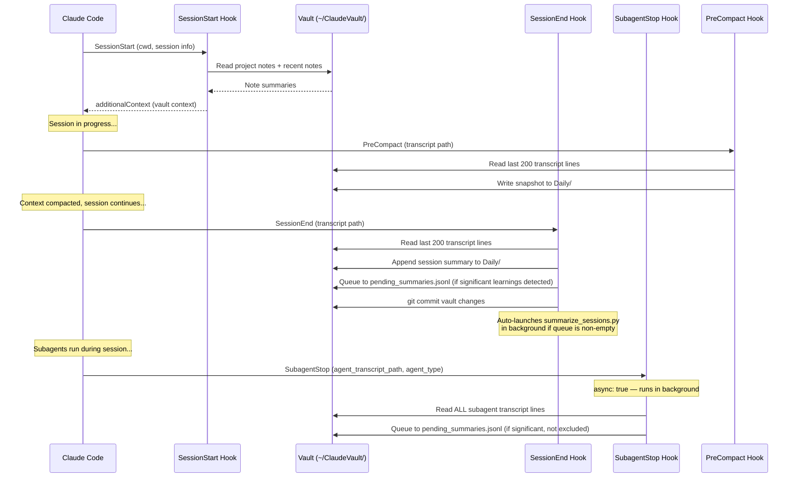
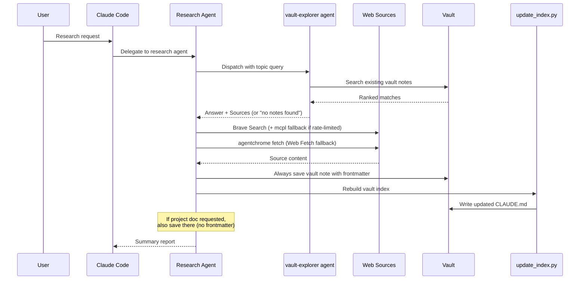
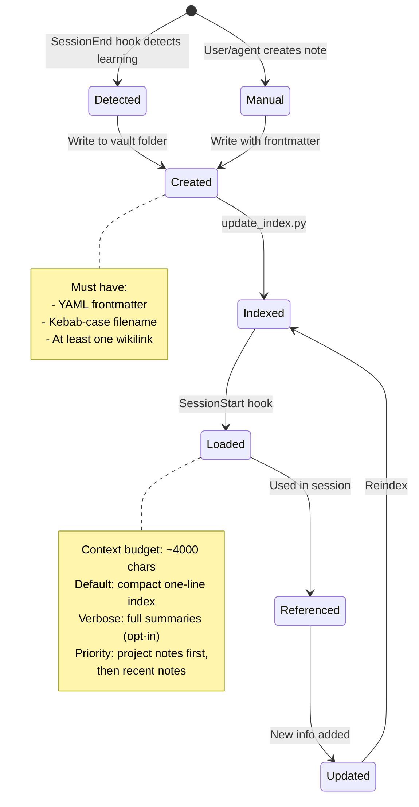

# Parsidion CC Architecture

A Claude Code customization toolkit that replaces built-in auto memory with an Obsidian vault-based knowledge management system, augmented by lifecycle hooks, a research agent, and a graph-colorized vault explorer.

## Table of Contents
- [Overview](#overview)
- [System Architecture](#system-architecture)
- [Component Details](#component-details)
  - [CLAUDE-VAULT.md — Always-On Guidance](#claude-vaultmd--always-on-guidance)
  - [Claude Vault Skill](#claude-vault-skill)
  - [Hook Scripts](#hook-scripts)
  - [SubagentStop Hook](#subagent-stop-hook)
  - [Session Summarizer](#session-summarizer)
  - [Vault Doctor](#vault-doctor)
  - [Graph Coverage Checker](#graph-coverage-checker)
  - [Research Agent](#research-agent)
  - [Vault Explorer Agent](#vault-explorer-agent)
  - [Vault Common Library](#vault-common-library)
  - [Index Generator](#index-generator)
  - [Metadata Query CLI](#metadata-query-cli)
  - [Trigger Evaluation](#trigger-evaluation)
  - [Context Preview Script](#context-preview-script)
  - [Obsidian Integration](#obsidian-integration)
- [Configuration](#configuration)
- [Data Flow](#data-flow)
- [File Layout](#file-layout)
- [Vault Note Lifecycle](#vault-note-lifecycle)
- [Obsidian Graph View](#obsidian-graph-view)
- [Related Documentation](#related-documentation)

## Overview

**Purpose:** Provide a structured, searchable, cross-linked knowledge base that persists across Claude Code sessions, replacing the flat auto memory with richly organized Obsidian notes.

**Key capabilities:**
- Always-on vault-first rule: check the vault before debugging or implementing (via `CLAUDE-VAULT.md`)
- Automatic context loading at session start — compact one-line-per-note index by default; full summaries opt-in via `verbose_mode`
- Automatic learning capture at session stop via transcript analysis
- Automatic learning capture from subagent transcripts via `SubagentStop` hook (vault-explorer and research-documentation-agent excluded to prevent recursion)
- Write-gate filter: transient sessions are skipped rather than saved
- Hierarchical summarization for long transcripts (chunk → haiku summary → Sonnet note)
- Automated bidirectional backlinks injected after each new note write
- Working state snapshots before context compaction
- A dedicated research agent that saves findings to the vault
- Auto-generated root index (`CLAUDE.md`) with tag cloud, staleness markers, and per-folder `MANIFEST.md` files
- Fast metadata search via `note_index` SQLite table in `embeddings.db`, populated on every index rebuild — enables indexed tag/folder/type/project queries without O(n) file walks
- Obsidian graph view with domain-based color grouping

**Runtime requirements:**
- Python 3.13+ (stdlib only -- no third-party packages)
- `uv` for script execution
- Obsidian for vault browsing and graph view (optional but recommended)

**Configuration:** All hooks and the summarizer read `~/ClaudeVault/config.yaml` for tuneable settings. A reference config with all defaults is shipped as `templates/config.yaml`. Precedence: script defaults → config.yaml → CLI arguments.

## System Architecture

```mermaid
graph TB
    subgraph "Claude Code Runtime"
        CC[Claude Code Session]
        Hooks[Hook System]
    end

    subgraph "Parsidion CC"
        CVG[CLAUDE-VAULT.md]
        Skill[Claude Vault Skill]
        Agent[Research Agent]
        VE[Vault Explorer Agent]
        VC[vault_common.py]
        SSH[session_start_hook.py]
        STH[session_stop_hook.py]
        ASH[subagent_stop_hook.py]
        PCH[pre_compact_hook.py]
        SUM[summarize_sessions.py]
        IDX[update_index.py]
        VD[vault_doctor.py]
        CGC[check_graph_coverage.py]
        EVAL[run_trigger_eval.py]
    end

    subgraph "Obsidian Vault ~/ClaudeVault/"
        Config[config.yaml]
        Index[CLAUDE.md Index]
        Pending[pending_summaries.jsonl]
        Daily[Daily/]
        Projects[Projects/]
        Languages[Languages/]
        Frameworks[Frameworks/]
        Patterns[Patterns/]
        Debugging[Debugging/]
        Tools[Tools/]
        Research[Research/]
        Graph[.obsidian/graph.json]
    end

    CC --> Hooks
    Hooks -->|SessionStart| SSH
    Hooks -->|SessionEnd| STH
    Hooks -->|SubagentStop| ASH
    Hooks -->|PreCompact| PCH
    CC -->|invokes| Agent
    CC -->|invokes| VE

    SSH -->|reads| VC
    STH -->|reads| VC
    ASH -->|reads| VC
    PCH -->|reads| VC
    IDX -->|reads| VC
    SUM -->|reads| VC
    VC -->|loads| Config
    Agent -->|saves to| Research
    VE -->|searches| Daily
    VE -->|searches| Projects
    VE -->|searches| Debugging
    VE -->|searches| Patterns
    VE -->|searches| Research

    SSH -->|loads context from| Daily
    SSH -->|loads context from| Projects
    STH -->|writes to| Daily
    STH -->|queues to| Pending
    ASH -->|queues to| Pending
    SUM -->|reads| Pending
    SUM -->|creates notes in| Debugging
    SUM -->|creates notes in| Patterns
    SUM -->|creates notes in| Research
    PCH -->|writes to| Daily
    IDX -->|generates| Index
    CGC -->|reads| Graph

    VD -->|reads| VC
    VD -->|reads/writes| Daily

    CVG -->|always-on vault-first rule| CC
    Skill -->|defines conventions| CC
    EVAL -->|reads description| Skill

    style CVG fill:#004d40,stroke:#00bcd4,stroke-width:2px,color:#ffffff
    style CC fill:#e65100,stroke:#ff9800,stroke-width:3px,color:#ffffff
    style Hooks fill:#e65100,stroke:#ff9800,stroke-width:2px,color:#ffffff
    style Skill fill:#4a148c,stroke:#9c27b0,stroke-width:2px,color:#ffffff
    style Agent fill:#4a148c,stroke:#9c27b0,stroke-width:2px,color:#ffffff
    style VE fill:#4a148c,stroke:#9c27b0,stroke-width:2px,color:#ffffff
    style VC fill:#0d47a1,stroke:#2196f3,stroke-width:2px,color:#ffffff
    style SSH fill:#1b5e20,stroke:#4caf50,stroke-width:2px,color:#ffffff
    style STH fill:#880e4f,stroke:#c2185b,stroke-width:2px,color:#ffffff
    style ASH fill:#880e4f,stroke:#c2185b,stroke-width:2px,color:#ffffff
    style PCH fill:#ff6f00,stroke:#ffa726,stroke-width:2px,color:#ffffff
    style SUM fill:#4a148c,stroke:#9c27b0,stroke-width:2px,color:#ffffff
    style IDX fill:#0d47a1,stroke:#2196f3,stroke-width:2px,color:#ffffff
    style VD fill:#1b5e20,stroke:#4caf50,stroke-width:2px,color:#ffffff
    style CGC fill:#0d47a1,stroke:#2196f3,stroke-width:2px,color:#ffffff
    style EVAL fill:#ff6f00,stroke:#ffa726,stroke-width:2px,color:#ffffff
    style Config fill:#1a237e,stroke:#3f51b5,stroke-width:2px,color:#ffffff
    style Index fill:#1a237e,stroke:#3f51b5,stroke-width:2px,color:#ffffff
    style Pending fill:#1a237e,stroke:#3f51b5,stroke-width:2px,color:#ffffff
    style Daily fill:#37474f,stroke:#78909c,stroke-width:2px,color:#ffffff
    style Projects fill:#37474f,stroke:#78909c,stroke-width:2px,color:#ffffff
    style Languages fill:#37474f,stroke:#78909c,stroke-width:2px,color:#ffffff
    style Frameworks fill:#37474f,stroke:#78909c,stroke-width:2px,color:#ffffff
    style Patterns fill:#37474f,stroke:#78909c,stroke-width:2px,color:#ffffff
    style Debugging fill:#37474f,stroke:#78909c,stroke-width:2px,color:#ffffff
    style Tools fill:#37474f,stroke:#78909c,stroke-width:2px,color:#ffffff
    style Research fill:#37474f,stroke:#78909c,stroke-width:2px,color:#ffffff
    style Graph fill:#37474f,stroke:#78909c,stroke-width:1px,color:#ffffff
```



## Component Details

### CLAUDE-VAULT.md — Always-On Guidance

**Location:** `CLAUDE-VAULT.md` (repo root) → installed to `~/.claude/CLAUDE-VAULT.md`

An unconditional guidance file loaded every Claude Code session via an `@CLAUDE-VAULT.md` import appended to `~/.claude/CLAUDE.md` by the installer. Unlike the claude-vault skill (which requires explicit invocation), this file fires on every session with no trigger needed.

**What it enforces:**

- **Vault-first debugging:** Before diagnosing any error, extract the key signal (exception class, package name, distinctive message phrase) and search `~/ClaudeVault/Debugging/` via Grep. Widen to `Frameworks/`, `Languages/`, `Projects/` if not found. Apply documented fixes when matched; save new solutions when not.
- **Prior-art check:** Before writing non-trivial code, search `Patterns/`, `Frameworks/`, `Languages/`, and `Projects/` for existing implementations. Reuse and adapt proven code from other projects rather than writing from scratch.
- **Vault organization:** Enforces the subfolder rule (3+ notes sharing a prefix → move to a named subfolder; one level only) and reminds when to rebuild the index.
- **Saving solutions:** Specifies target folders by solution type (bug fix → `Debugging/`, reusable pattern → `Patterns/`, framework fix → `Frameworks/`, architectural decision → `Projects/<project>/`).

**Install behavior:** `install.py` copies `CLAUDE-VAULT.md` to `~/.claude/` and idempotently appends `@CLAUDE-VAULT.md` to `~/.claude/CLAUDE.md` if the line is not already present. Uninstall removes the file and strips the import line.

### Claude Vault Skill

**Location:** `skills/claude-vault/SKILL.md`

The skill definition loaded into Claude Code's context. Establishes the philosophy, conventions, and anti-patterns for vault usage. It is not executable code -- it is a prompt artifact that shapes how Claude interacts with the vault.

**Auto-triggering:** The SKILL.md includes YAML frontmatter with a `name` and `description` field that enables Claude Code to automatically invoke the skill when users mention saving knowledge, checking vault notes, or persisting findings across sessions. The description was iteratively optimized using the trigger eval harness (see [Trigger Evaluation](#trigger-evaluation)).

**Key conventions enforced:**
- Search before create (no duplicates)
- Atomic notes (one concept per note)
- Mandatory YAML frontmatter on every note
- Wikilinks for cross-referencing
- Kebab-case filenames

### Hook Scripts

Three Python scripts execute at different points in the Claude Code session lifecycle. All hooks read JSON from stdin, interact with the vault via `vault_common`, and write JSON to stdout. Each hook supports tuneable options via `~/ClaudeVault/config.yaml` and/or CLI arguments (precedence: script defaults → config.yaml → CLI args).

#### SessionStart Hook

**Script:** `skills/claude-vault/scripts/session_start_hook.py`

Fires when a Claude Code session begins. Loads relevant vault context into the conversation so Claude has prior knowledge available immediately.

**CLI flags:** `--ai [MODEL]`, `--max-chars N`, `--verbose`, `--debug`

**Configurable options** (section `session_start_hook` in `config.yaml`):

| Key | Default | Description |
|-----|---------|-------------|
| `ai_model` | `null` (disabled) | Model for AI note selection |
| `max_chars` | `4000` | Maximum characters for injected context |
| `ai_timeout` | `25` | AI call timeout in seconds |
| `recent_days` | `3` | Days to look back for recent notes |
| `debug` | `false` | Append injected context + metadata to debug log in `$TMPDIR` |
| `verbose_mode` | `false` | When true, inject full note summaries; default is compact one-line index |
| `use_embeddings` | `true` | Blend semantic (embedding) matches into context selection; graceful fallback if `embeddings.db` is absent |

**Standard behaviour:**
1. Determines the current project from the working directory
2. Ensures vault directories and today's daily note exist
3. Gathers project-specific notes (by `project` frontmatter field)
4. Gathers recent notes (modified within last `recent_days` days, configurable)
5. Deduplicates and builds context: **compact mode** (default) injects one line per note — `[[stem]] (folder) — \`tags\``; **verbose mode** (`--verbose` or `verbose_mode: true`) injects full note summaries via `build_context_block()`
6. Returns the context as `additionalContext` in the hook output
7. When `debug` is enabled, appends the full context plus quality metadata (project, mode, char count, budget %, note count, elapsed time) to `$TMPDIR/claude-vault-session-start-debug.log`

**AI-powered mode (`--ai [MODEL]`):**

Pass `--ai` (or `--ai <model-id>`) to the hook command, or set `session_start_hook.ai_model` in config.yaml, to enable intelligent note selection via `claude -p`. When enabled:

1. Collects **all** vault notes as candidates — project-tagged notes first, then the rest sorted by mtime descending
2. Builds a summarised candidate block (up to 8000 chars) from note titles and first 6 body lines
3. Runs `claude -p <prompt> --model <model> --no-session-persistence` with `CLAUDECODE` unset so it can be called from within an active session; timeout is controlled by `session_start_hook.ai_timeout` (default 25 s)
4. Claude selects and formats the most relevant notes as context (target ≤ `max_chars - 500` chars)
5. Falls back silently to standard behaviour on timeout, missing binary, or non-zero exit

Default model: `claude-haiku-4-5-20251001`. Override with `--ai claude-sonnet-4-6`, any valid model ID, or `session_start_hook.ai_model` in config.yaml.

**Hook timeout:** The default 10 s hook timeout must be increased to at least `30000` ms when using `--ai`.

```json
{
  "command": "uv run --no-project ~/.claude/skills/claude-vault/scripts/session_start_hook.py --ai",
  "timeout": 30000
}
```

#### SessionEnd Hook

**Script:** `skills/claude-vault/scripts/session_stop_hook.py`

Registered under the `SessionEnd` hook event — fires once when the session terminates (unlike `Stop`, which fires after every agent turn). Analyzes the session transcript to detect learnable content and persists it to the vault.

**Configurable options** (section `session_stop_hook` in `config.yaml`):

| Key | Default | Description |
|-----|---------|-------------|
| `ai_model` | `null` (disabled) | Model for AI classification |
| `ai_timeout` | `25` | AI call timeout in seconds |
| `auto_summarize` | `true` | Auto-launch summarizer when pending entries exist |

**Behavior:**
1. Reads the last 200 lines of the JSONL transcript
2. Extracts assistant message text
3. Resolves AI model: CLI `--ai` → `session_stop_hook.ai_model` config → `null` (disabled)
4. Runs keyword-based heuristics to detect four categories:
   - **Error fixes** (keywords: "fixed", "root cause", "the fix", etc.)
   - **Research findings** (keywords: "found that", "documentation says", etc.)
   - **Patterns** (keywords: "pattern", "best practice", "architecture", etc.)
   - **Config/setup** (keywords: "configured", "installed", "set up", etc.)
5. Appends a session summary to today's daily note under `## Sessions`
6. Queues sessions with significant learnings (error_fix, research, or pattern categories) to `pending_summaries.jsonl` for AI-powered summarization. Uses `fcntl.flock` on macOS/Linux (with a `try/except ImportError` fallback for Windows) for safe concurrent access; deduplicates by `session_id`.
7. Calls `git_commit_vault` to commit the updated daily note to the vault git repository (respects `git.auto_commit` config)
8. Auto-launches `summarize_sessions.py` as a detached background process if there are pending entries in the queue and `session_stop_hook.auto_summarize` is `true` (default)
9. Uses an environment variable guard (`CLAUDE_VAULT_STOP_ACTIVE`) to prevent recursive invocation

**AI-powered mode (`--ai [MODEL]`):**

Pass `--ai` (or `--ai <model-id>`) to the hook command, or set `session_stop_hook.ai_model` in config.yaml, to enable semantic classification via `claude -p`. When enabled:

1. Samples the first 10 assistant messages (up to 1500 chars total)
2. Asks Claude to determine `should_queue`, `categories`, and a one-sentence `summary`; timeout is controlled by `session_stop_hook.ai_timeout` (default 25 s)
3. Skips queuing if `should_queue` is false (avoids storing routine sessions)
4. Falls back silently to keyword heuristics on timeout, missing binary, or non-zero exit

Default model: `claude-haiku-4-5-20251001`. Override with `--ai <model-id>` or `session_stop_hook.ai_model` in config.yaml. Requires increasing the hook timeout in `settings.json` to at least `30000` ms.

#### PreCompact Hook

**Script:** `skills/claude-vault/scripts/pre_compact_hook.py`

Fires before Claude Code compacts the conversation context. Snapshots the current working state so it survives compaction.

**CLI flags:** `--lines N`

**Configurable options** (section `pre_compact_hook` in `config.yaml`):

| Key | Default | Description |
|-----|---------|-------------|
| `lines` | `200` | Number of transcript lines to analyse |

**Behavior:**
1. Reads the last N lines of the JSONL transcript (default 200, configurable via `--lines` or `pre_compact_hook.lines`)
2. Extracts the most recent user message as a task summary
3. Extracts file paths mentioned in the transcript (up to 15)
4. Appends a `## Pre-Compact Snapshot` section to today's daily note
5. Calls `git_commit_vault` to commit the snapshot (respects `git.auto_commit` config)

#### SubagentStop Hook

**Script:** `skills/claude-vault/scripts/subagent_stop_hook.py`

Fires (asynchronously, with `async: true`) when any subagent spawned via the `Agent` tool completes. Reads the subagent's own transcript (`agent_transcript_path`) to detect learnable content and queues it to `pending_summaries.jsonl` for the same AI summarization pipeline used by the SessionEnd hook.

**Configurable options** (section `subagent_stop_hook` in `config.yaml`):

| Key | Default | Description |
|-----|---------|-------------|
| `enabled` | `true` | Set `false` to disable subagent transcript capture entirely |
| `min_messages` | `3` | Minimum assistant message count; filters trivial subagents |
| `excluded_agents` | `"vault-explorer,research-documentation-agent"` | Comma-separated agent types to skip |

**Behavior:**
1. Checks `subagent_stop_hook.enabled` config (default `true`); exits immediately if disabled
2. Checks `agent_type` against the `excluded_agents` list — skips `vault-explorer` and `research-documentation-agent` by default to prevent recursive capture of vault system internals
3. Reads **all** lines of the subagent's `agent_transcript_path` (subagent sessions are short)
4. Skips subagents with fewer than `min_messages` assistant turns (filters trivial one-shot agents)
5. Runs the same keyword heuristics as SessionEnd to detect significant categories
6. Uses `agent_id` as the deduplication key (via a synthetic path stem) when available
7. Queues to `pending_summaries.jsonl` with `source: "subagent"` and `agent_type` metadata
8. Does **not** update the daily note (too noisy for frequent subagent calls)
9. Does **not** launch the summarizer (deferred to the next SessionEnd)
10. Uses `CLAUDE_VAULT_STOP_ACTIVE` environment guard to prevent recursive invocation

**Why `async: true`:** The hook runs in the background without blocking the subagent or the main session. The `pending_summaries.jsonl` queue is the rendezvous point — the SessionEnd hook's summarizer processes all queued entries, including those from subagents.

### Session Summarizer

**Location:** `skills/claude-vault/scripts/summarize_sessions.py`

An on-demand PEP 723 script (requires `claude-agent-sdk`, `anyio`) that processes the `pending_summaries.jsonl` queue and generates structured vault notes using Claude AI.

**CLI flags:** `--sessions FILE`, `--dry-run`, `--model MODEL`, `--persist`

**Configurable options** (section `summarizer` in `config.yaml`):

| Key | Default | Description |
|-----|---------|-------------|
| `model` | `claude-sonnet-4-6` | Model for note generation |
| `max_parallel` | `5` | Concurrent summarization tasks |
| `transcript_tail_lines` | `400` | Transcript lines to read per entry |
| `max_cleaned_chars` | `12000` | Maximum characters after cleaning |
| `persist` | `false` | SDK session persistence (for debugging) |
| `cluster_model` | `claude-haiku-4-5-20251001` | Model for hierarchical chunk summarization |

**Behavior:**
1. Reads entries from `pending_summaries.jsonl`
2. Pre-processes each transcript via `preprocess_transcript_hierarchical()`: if the cleaned dialogue fits within `max_cleaned_chars`, it is used as-is; if it exceeds the limit, it is split into chunks, each chunk is summarized by `cluster_model` (haiku by default), and the chunk summaries are concatenated for the final note prompt
3. **Write-gate filter:** before generating a note, Claude evaluates whether the session contains reusable insight. Transient sessions (dead-ends, routine builds, session-specific context) return `{"decision": "skip"}` and are not saved to the vault
4. Calls Claude (Sonnet by default) via the Agent SDK (up to `max_parallel` parallel sessions) to generate structured notes
5. **Automated backlinks:** after writing a new note, scans existing vault notes for tag overlap and injects bidirectional `[[wikilinks]]` — updating both the new note's `related` field and matching existing notes
6. Saves notes to the appropriate vault subfolder (`Debugging/`, `Patterns/`, `Research/`, etc.) with YAML frontmatter
7. Removes processed entries from the queue, rebuilds the vault index, and commits via `git_commit_vault`

**Must be run from a separate terminal** (or with `env -u CLAUDECODE`) because the Agent SDK cannot be nested inside an active Claude Code session.

### Vault Doctor

**Location:** `skills/claude-vault/scripts/vault_doctor.py`

An on-demand diagnostic and repair tool that scans vault notes for structural issues and fixes them via `claude -p` (haiku model by default).

**Issue codes detected:**

| Code | Severity | Description |
|------|----------|-------------|
| `MISSING_FRONTMATTER` | error | No YAML frontmatter block |
| `MISSING_FIELD` | error | `date`/`type` missing (all notes); `confidence`/`related` missing (non-daily) |
| `INVALID_TYPE` | error | `type` not in allowed set |
| `INVALID_DATE` | warning | `date` not in YYYY-MM-DD format |
| `ORPHAN_NOTE` | warning | No `[[wikilinks]]` in `related` field |
| `BROKEN_WIKILINK` | warning | Link target not found in vault |
| `FLAT_DAILY` | warning | `Daily/YYYY-MM-DD.md` instead of `Daily/YYYY-MM/DD.md` |

Daily notes are exempt from `confidence`, `related`, and orphan checks.

**State file:** `~/ClaudeVault/doctor_state.json` tracks per-note status across runs and the running doctor's PID:
- `pid` — PID of the currently-running doctor; cleared on exit (singleton guard)
- `ok` — no issues; skipped for 7 days before re-checking
- `fixed` — Claude repaired it; re-checked on next run
- `failed` — Claude returned no output; retried next run
- `timeout` — `claude -p` timed out once; retried one more time
- `needs_review` — timed out on retry; skipped indefinitely, flagged for user
- `skipped` — only non-auto-repairable issues (`BROKEN_WIKILINK`, `FLAT_DAILY`); skipped indefinitely

**Behavior:**
1. Checks `doctor_state.json` for a live `pid`; exits if another instance is already running
2. Writes own PID to state file immediately (singleton lock); clears it via `atexit` on exit
3. Auto-commits uncommitted vault files whose mtime is ≥ 15 minutes old (skips deletions; respects `git.auto_commit` config; no-op when vault has no `.git`)
4. Loads `doctor_state.json` and skips notes with `ok`/`skipped`/`needs_review` status
5. Scans remaining notes for issues using stdlib-only checks
6. Records clean notes as `ok` in state (skipped for 7 days)
7. In `--fix` mode: calls `claude -p` per note with haiku to repair repairable issues
8. Saves state after each run; escalates double-timeout to `needs_review`
9. `--no-state` rescans all notes regardless of prior results

The vault health summary (clean count, pending repair, needs review, manual fix) is included in `CLAUDE.md` by `update_index.py` after each index rebuild.

### Graph Coverage Checker

**Location:** `skills/claude-vault/scripts/check_graph_coverage.py`

A utility script that audits vault tags against the Obsidian graph color groups in `.obsidian/graph.json`.

**Behavior:**
1. Collects all tags used across vault notes
2. Compares against tags defined in each graph color group
3. Reports uncovered tags (used in vault but not in any color group)
4. Reports stale entries (in color groups but not used in any note)
5. Supports `--threshold N` to filter by minimum tag usage count and `--json` for scripting

### Research Agent

**Location:** `agents/research-documentation-agent.md`

A Claude Code agent definition (runs on Sonnet) that conducts technical research and saves structured findings to the vault.

**Workflow:**
1. Dispatches `vault-explorer` agent with the research topic to check for existing knowledge — proceeds to web research only for gaps not covered by existing notes
2. Uses NotebookLM (if available) for deep synthesis of source material
3. Uses Brave Search for web research; falls back to `mcpl search "search"` to find alternative search tools when Brave hits rate limits
4. Fetches raw HTML via `agentchrome page html`, pipes through `~/.claude/skills/claude-vault/scripts/html-to-md.py` to get clean noise-free markdown (curl + html-to-md.py as fallback if agentchrome fails)
5. **Always** saves a vault note to the appropriate subfolder with YAML frontmatter — regardless of whether a project-specific destination (e.g. `docs/MCPL.md`) was also requested
6. If a project-specific doc was requested, also saves there (following the project style guide, no frontmatter)
7. Runs `update_index.py` after saving vault notes
8. Provides a summary report of findings and gaps

### Vault Explorer Agent

**Location:** `agents/vault-explorer.md`

A read-only Claude Code agent (runs on Haiku) that searches the vault for relevant notes and returns a synthesized answer. It is the preferred way to query the vault programmatically — callers dispatch it with a natural language query and receive a structured response with a prose answer and source file paths.

**Trigger phrases:** "search the vault for X", "check the vault", "have we seen this before", "find vault notes about X", "check for prior art on X", "what do we know about X".

**Scope:** Read-only. Does not write files, create notes, or run `update_index.py`.

**Workflow (7 steps):**
1. **Semantic search** — runs `vault_search.py` with the full query; if 3+ results with score ≥ 0.35, skips to step 6
2. **Metadata search** — infers filters from the query (`--folder`, `--type`, `--tag`, `--project`, `--recent-days`) and runs `vault-search` with those flags; if 3+ results, skips to step 6; gracefully handles absent DB
3. **Orient** — reads `~/ClaudeVault/CLAUDE.md` to understand available content and folder structure
4. **Extract signals** — identifies key search terms (exception class, package name, feature keyword)
5. **Search by priority folder** — Grep search across folders in priority order by query type:

   | Query type | Folders, in priority order |
   |---|---|
   | Error / exception / bug | `Debugging/` → `Frameworks/` → `Languages/` |
   | Feature / pattern / integration | `Patterns/` → `Frameworks/` → `Projects/` |
   | Cross-project / prior art | `Projects/` → `Patterns/` |
   | Library / tool / CLI | `Tools/` → `Frameworks/` |
   | Research / concepts | `Research/` → all folders |

6. **Rank and read** — ranks candidates by semantic score, then folder priority, then signal frequency; reads top 5 files
7. **Synthesize and return** — returns exactly two sections: `## Answer` (3–7 sentences) and `## Sources` (absolute paths with one-line relevance notes)

**Relationship to other agents:** When the vault has no relevant information, the agent recommends dispatching `research-documentation-agent` to research the topic externally and save findings to the vault.

### Vault Common Library

**Location:** `skills/claude-vault/scripts/vault_common.py`

The shared utility library used by all hook scripts and the index generator. Uses only Python stdlib (no third-party dependencies).

**Key functions:**

| Function | Purpose |
|----------|---------|
| `parse_frontmatter()` | Regex-based YAML frontmatter parser |
| `get_body()` | Returns markdown content after frontmatter |
| `ensure_note_index_schema(conn)` | Creates `note_index` table and 5 indexes in an open SQLite connection |
| `query_note_index(*, tag, folder, note_type, project, recent_days, limit)` | DB-first metadata query; returns `None` (not `[]`) when DB absent to signal file-walk fallback |
| `find_notes_by_project()` | Search by `project` frontmatter field — DB-first, falls back to file walk |
| `find_notes_by_tag()` | Search by tag in `tags` list — DB-first, falls back to file walk |
| `find_notes_by_type()` | Search by `type` frontmatter field — DB-first, falls back to file walk |
| `find_recent_notes()` | Find notes modified within N days — DB-first, falls back to file walk |
| `read_note_summary()` | Extract title + first few body lines |
| `build_context_block()` | Assemble notes into a character-budgeted context string |
| `get_project_name()` | Derive project name from cwd or git root |
| `ensure_vault_dirs()` | Create missing vault directories and Templates symlink |
| `create_daily_note_if_missing()` | Create today's daily note from template |
| `slugify()` | Convert text to kebab-case filename |
| `all_vault_notes()` | Return all `.md` files in the vault (excluding `EXCLUDE_DIRS`) |
| `git_commit_vault()` | Stage and commit vault changes; respects `git.auto_commit` config |
| `load_config()` | Load and cache `config.yaml` from `VAULT_ROOT` |
| `get_config()` | Look up a config value by section/key with fallback default |
| `parse_transcript_lines()` | Extract assistant texts from JSONL transcript lines |
| `detect_categories()` | Keyword heuristic scanner returning category→excerpt mappings |
| `append_to_pending()` | Deduplication-safe queue writer for `pending_summaries.jsonl`; includes `source` and `agent_type` metadata |
| `TRANSCRIPT_CATEGORIES` | Keyword lists for four learning categories (error_fix, research, pattern, config_setup) |
| `TRANSCRIPT_CATEGORY_LABELS` | Human-readable labels for category keys |

**Configuration system:** `load_config()` reads `~/ClaudeVault/config.yaml` on first call and caches the result for the process lifetime. The file is parsed by `_parse_config_yaml()`, a stdlib-only YAML parser that handles one level of nesting (section headers with nested key-value pairs). `_strip_inline_comment()` handles trailing `# comment` syntax. `get_config(section, key, default)` provides the lookup API used by all hooks and the summarizer.

**Design decisions:**
- No external dependencies (stdlib only) for maximum portability in hook contexts
- Custom YAML parser via regex rather than importing `pyyaml`; the config parser (`_parse_config_yaml`) is similarly stdlib-only
- File walking excludes `.obsidian/`, `Templates/`, `.git/`, `.trash/`, `TagsRoutes/`

### Index Generator

**Location:** `skills/claude-vault/scripts/update_index.py`

Rebuilds `~/ClaudeVault/CLAUDE.md` by scanning all vault notes. Includes a PID singleton guard (`~/ClaudeVault/index.pid`) that exits immediately if another instance is already running, preventing concurrent index rebuilds.

**Output:**
- Root `CLAUDE.md` with sections: **Quick Stats** (note count, last updated, vault health, stale count), **Tag Cloud** (frequency-sorted), **Recent Activity** (last 7 days, max 20), **Folders** (per-folder listings with wikilinks and summaries)
- **Staleness markers:** notes with zero incoming wikilinks AND older than 30 days are flagged `[STALE?]` in folder listings and the Quick Stats stale count. Notes are never auto-deleted — only surfaced for review.
- **Per-folder `MANIFEST.md` files:** a table-format index (Note | Tags | Summary) written inside each subfolder after every rebuild, allowing quick orientation within a domain without loading the full root index. Stale notes are marked with ⚠️.
- **`note_index` DB upsert:** after writing `CLAUDE.md`, calls `_write_note_index_to_db()` to upsert all note metadata rows into `embeddings.db` and prune rows for deleted notes. No-op when `embeddings.db` does not yet exist; all DB errors are silently swallowed so a database failure never aborts the indexer.

### Metadata Query (vault-search filter mode)

**Location:** `skills/claude-vault/scripts/vault_search.py` (unified CLI)

`vault-search` operates in two modes depending on arguments:

- **Semantic mode** (positional `QUERY`): embeds the query with fastembed and retrieves top-K notes by cosine similarity. Results include a `score` field.
- **Metadata mode** (filter flags, no `QUERY`): queries the `note_index` table in `embeddings.db` using SQL. Results set `score` to `null`.

Both modes produce the same JSON output structure. The `vault-explorer` agent uses metadata mode as its Tier 2 search step (after semantic, before grep fallback).

**Metadata filter flags:**

| Flag | Description |
|------|-------------|
| `--tag TAG` | Filter by exact tag token (comma-sep list match) |
| `--folder FOLDER` | Filter by exact folder name |
| `--type TYPE` | Filter by `note_type` field |
| `--project PROJECT` | Filter by `project` field |
| `--recent-days N` | Notes modified within N days |
| `--limit N` | Max results for metadata mode (default: 50) |
| `--json` | JSON array output (default) |
| `--text` | Human-readable one-line-per-note output |

**Graceful degradation:** returns `[]` when `embeddings.db` is absent or `note_index` table does not exist.

**Global CLI:** installed via `uv tool install --editable ".[tools]"` from the repo root, or `uv run install.py --install-tools`. Places `vault-search` in `~/.local/bin/` (Linux/macOS) or `%APPDATA%\Python\Scripts` (Windows).

### Trigger Evaluation

**Location:** `skills/claude-vault/scripts/run_trigger_eval.py`, `skills/claude-vault/scripts/run_trigger_eval.sh` (macOS/Linux), `skills/claude-vault/scripts/run_trigger_eval.bat` (Windows)

A standalone eval harness that measures how accurately Claude invokes the skill based on its SKILL.md description. Uses a "skill-selection simulation" approach: presents Claude with the skill description alongside distractor skills and asks whether it would invoke `claude-vault` for each test query.

**How it works:**
1. Parses the `name` and `description` from SKILL.md frontmatter
2. Presents 20 test queries (10 should-trigger, 10 should-not-trigger) to Claude via `claude -p`
3. Each query runs 3 times for statistical reliability (60 total API calls)
4. Uses 6 parallel workers via `ProcessPoolExecutor`
5. Computes precision, recall, accuracy, and per-query pass rates
6. Writes results to `~/.claude/skills/claude-vault/eval_results.json`

**Important:** Must be run from a **separate terminal** (not inside Claude Code) because `claude -p` cannot be nested inside an active session. The shell wrappers `run_trigger_eval.sh` (macOS/Linux) and `run_trigger_eval.bat` (Windows) handle unsetting the `CLAUDECODE` environment variable.

**Distractor skills** (5 real skills from the user's setup) are included in the prompt to simulate realistic skill selection. Without distractors, results would be unrealistically optimistic.

### Context Preview Script

**Location:** `scripts/show-context`

A shell script that previews what vault context would be injected at session start for a given project directory. Useful for debugging the SessionStart hook without launching a full Claude Code session.

**Usage:**
```bash
# Preview context for the current directory
./scripts/show-context

# Preview context for a specific project
./scripts/show-context /path/to/project
```

Requires `jq` to be installed. The script invokes `session_start_hook.py` with a synthetic JSON input and extracts the `additionalContext` field from the hook output.

### Obsidian Integration

The vault is a standard Obsidian vault at `~/ClaudeVault/`. Obsidian provides the graph view, search, and wikilink navigation.

**Templates:** The `Templates/` directory is a symlink to the skill's `templates/` folder, making 8 note templates and the reference `config.yaml` available in Obsidian:

| Template | Note Type |
|----------|-----------|
| `daily.md` | Session summaries |
| `project.md` | Per-project context |
| `language.md` | Language-specific knowledge |
| `framework.md` | Framework knowledge |
| `pattern.md` | Design patterns |
| `debugging.md` | Error patterns and fixes |
| `tool.md` | CLI tools and packages |
| `research.md` | Deep-dive research |
| `config.yaml` | Reference config with all defaults |

## Configuration

All hooks and the summarizer support a centralized configuration file at `~/ClaudeVault/config.yaml`. A reference template with all defaults documented is shipped at `templates/config.yaml` and copied to the vault during installation.

**Precedence:** script defaults → `config.yaml` → CLI arguments.

**Sections:**

```yaml
session_start_hook:  # session_start_hook.py
  ai_model: null     # Model for AI note selection (null = disabled)
  max_chars: 4000    # Max context injection characters
  ai_timeout: 25     # AI call timeout in seconds
  recent_days: 3     # Days to look back for recent notes
  debug: false       # Append injected context + metadata to debug log in $TMPDIR
  verbose_mode: false  # If true, inject full note summaries instead of compact one-line index
  use_embeddings: true  # Blend semantic matches into context; graceful fallback if db absent

session_stop_hook:   # session_stop_hook.py
  ai_model: null     # Model for AI classification (null = disabled)
  ai_timeout: 25     # AI call timeout in seconds
  auto_summarize: true  # Auto-launch summarizer when pending entries exist

subagent_stop_hook:  # subagent_stop_hook.py
  enabled: true      # Set false to disable subagent transcript capture
  min_messages: 3    # Minimum assistant turns before queuing
  excluded_agents: "vault-explorer,research-documentation-agent"  # comma-separated skip list

pre_compact_hook:    # pre_compact_hook.py
  lines: 200         # Transcript lines to analyse

summarizer:          # summarize_sessions.py
  model: claude-sonnet-4-6
  max_parallel: 5
  transcript_tail_lines: 400
  max_cleaned_chars: 12000
  persist: false     # SDK session persistence (for debugging)
  cluster_model: claude-haiku-4-5-20251001  # Model for hierarchical chunk summarization

git:
  auto_commit: true  # Auto-commit vault changes after writes
```

**Model defaults:** Hook scripts (`session_start_hook.py`, `session_stop_hook.py`) default to `claude-haiku-4-5-20251001` when AI mode is enabled. The summarizer defaults to `claude-sonnet-4-6`. Override any model via the corresponding config key or CLI flag. Setting `ai_model` to a model ID in config enables AI mode without needing the `--ai` CLI flag.

**`git.auto_commit`:** When `false`, `git_commit_vault()` returns immediately without staging or committing. This disables all automatic vault git commits across hooks and the summarizer.

## Data Flow

### Session Lifecycle



### Research Flow



## File Layout

### Source Repository (parsidion-cc)

```
parsidion-cc/
├── README.md
├── install.py                       # Installer: syncs skills/agents/hooks to ~/.claude/
├── CLAUDE-VAULT.md                  # Always-on vault-first guidance (installed to ~/.claude/)
├── pyproject.toml
├── Makefile
├── scripts/
│   └── show-context                 # CLI: preview session start context for any project
├── docs/
│   ├── ARCHITECTURE.md              # This document
│   └── DOCUMENTATION_STYLE_GUIDE.md
├── agents/
│   ├── research-documentation-agent.md
│   └── vault-explorer.md                # Read-only vault search agent (Haiku)
├── tests/
│   └── test_vault_common.py
└── skills/claude-vault/
    ├── SKILL.md                     # Skill definition
    ├── scripts/
    │   ├── vault_common.py          # Shared library (includes ensure_note_index_schema, query_note_index)
    │   ├── vault_search.py          # Unified search CLI: semantic (QUERY) or metadata (--tag/--folder/...)
    │   ├── html-to-md.py            # HTML → clean markdown (PEP 723; used by research agent)
    │   ├── session_start_hook.py    # SessionStart hook
    │   ├── session_stop_wrapper.sh  # SessionEnd hook wrapper (immediate ack + nohup detach)
    │   ├── session_stop_hook.py     # SessionEnd hook (queues to pending_summaries.jsonl)
    │   ├── subagent_stop_hook.py    # SubagentStop hook (async, captures subagent learnings)
    │   ├── pre_compact_hook.py      # PreCompact hook
    │   ├── summarize_sessions.py    # On-demand AI summarizer (PEP 723)
    │   ├── update_index.py          # Index generator + note_index DB upsert
    │   ├── vault_doctor.py          # Vault note issue scanner and repair tool
    │   ├── check_graph_coverage.py  # Graph color group coverage audit
    │   ├── run_trigger_eval.py      # Trigger accuracy eval
    │   ├── run_trigger_eval.sh      # Shell wrapper for eval (macOS/Linux)
    │   ├── run_trigger_eval.bat     # Batch wrapper for eval (Windows)
    │   ├── build_embeddings.py      # Builds fastembed vectors into embeddings.db
    │   ├── embed_eval.py            # Evaluates embedding search quality
    │   ├── migrate_research.py      # One-time migration
    │   └── migrate_memory.py        # One-time migration
    └── templates/
        ├── config.yaml              # Reference config with all defaults
        ├── daily.md
        ├── project.md
        ├── language.md
        ├── framework.md
        ├── pattern.md
        ├── debugging.md
        ├── tool.md
        └── research.md
```

### Installed Locations

```
~/.claude/
├── CLAUDE.md                        # Global instructions (@imports CLAUDE-VAULT.md)
├── CLAUDE-VAULT.md                  # Always-on vault-first guidance
├── settings.json                    # Hook registrations
├── agents/
│   ├── research-documentation-agent.md
│   └── vault-explorer.md                # Read-only vault search agent (Haiku)
└── skills/claude-vault/
    ├── SKILL.md
    ├── eval_results.json            # Trigger eval results
    ├── scripts/
    └── templates/

~/ClaudeVault/                       # Obsidian vault
├── .obsidian/
│   └── graph.json                   # Graph view color config
├── config.yaml                      # User config (copied from templates/config.yaml)
├── CLAUDE.md                        # Auto-generated root index (rebuilt by update_index.py)
├── embeddings.db                    # SQLite: note_embeddings (vectors) + note_index (metadata)
├── Daily/
│   ├── MANIFEST.md                  # Auto-generated folder index (rebuilt by update_index.py)
│   └── YYYY-MM/DD.md                # e.g. 2026-03/13.md
├── Projects/
│   └── MANIFEST.md
├── Languages/
│   └── MANIFEST.md
├── Frameworks/
│   └── MANIFEST.md
├── Patterns/
│   └── MANIFEST.md
├── Debugging/
│   └── MANIFEST.md
├── Tools/
│   └── MANIFEST.md
├── Research/
│   └── MANIFEST.md
├── History/
└── Templates/ -> ~/.claude/skills/claude-vault/templates/
```

## Vault Note Lifecycle



## Obsidian Graph View

The graph view uses domain-based color groups configured in `.obsidian/graph.json`. Since Obsidian applies **first-match-wins** coloring and 57% of vault notes have multiple tags, colors represent semantic categories rather than individual tags.

### Color Groups (Priority Order)

| Priority | Category | Color | Hex | Tags |
|----------|----------|-------|-----|------|
| 1 | Projects | Cyan | `#00BCD4` | synknot, fractal-flythroughs, parvitar, parsistant, termflix, parvault, cctmux, parsidion-cc |
| 2 | Debugging | Red/Orange | `#FF5722` | debugging |
| 3 | Patterns | Green | `#4CAF50` | memory, migration, sync |
| 4 | Research | Purple | `#9C27B0` | research, e2b, qdrant, pkm-apps-comparison |
| 5 | Tools & SDKs | Blue | `#2196F3` | claude-code, claude-agent-sdk, claude, rich, mcp, ollama, maturin, redis, websockets, sentry, mermaid-cli, custom-tools, acp-protocol, tool, api, encryption |
| 6 | Languages | Amber | `#FFC107` | rust, python, swift, swiftui, typescript, nextjs, react, macos, macos-26, rust-packages |
| 7 | Terminal | Teal | `#009688` | terminal, par-term, par-term-emu-core-rust |
| 8 | Graphics / 3D | Pink | `#E91E63` | wgpu, sdf, sdf-terrain, voxel, fractals, mandel, vrm, avatar, face-tracking |

Nodes with no matching tags remain the default gray. The priority order means a debugging note tagged with a project name appears as Cyan (project), since project membership is the highest-priority grouping. RGB colors are stored as decimal integers in `graph.json` (e.g., `int("FF5722", 16)` → `16733986`).

## Related Documentation

- [README.md](../README.md) - Project overview and quick reference
- [DOCUMENTATION_STYLE_GUIDE.md](DOCUMENTATION_STYLE_GUIDE.md) - Documentation formatting standards
- [SKILL.md](../skills/claude-vault/SKILL.md) - Vault philosophy, conventions, and anti-patterns
