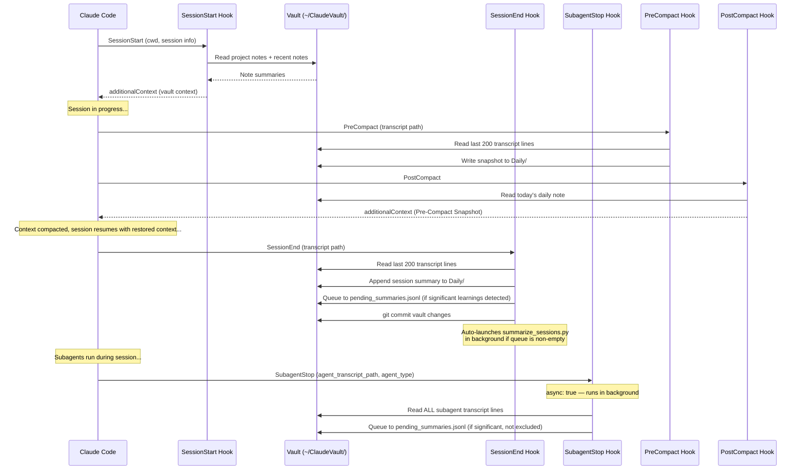
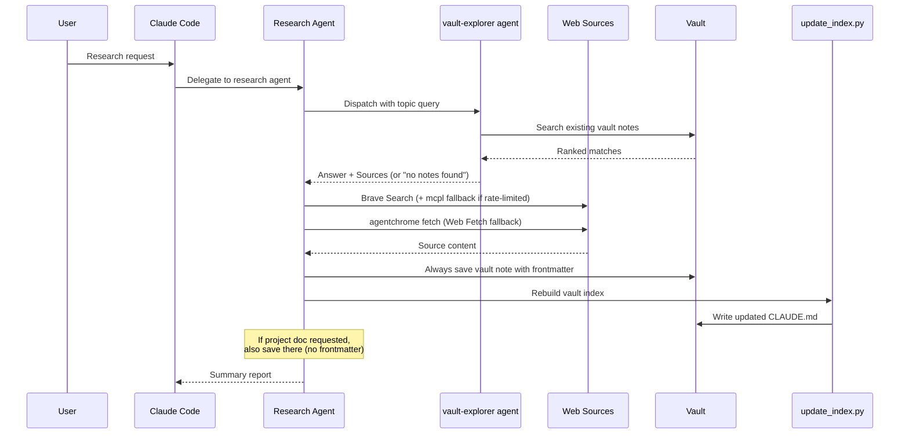
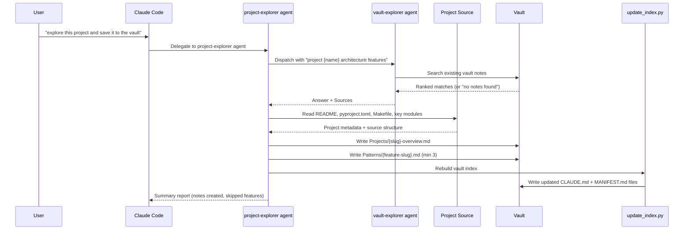
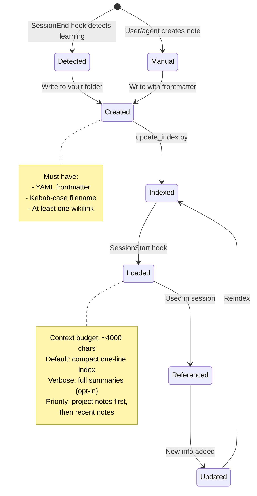

# Parsidion Architecture

A Claude Code customization toolkit that replaces built-in auto memory with a markdown vault-based knowledge management system, augmented by lifecycle hooks, a research agent, a graph-colorized vault explorer, and a project explorer that catalogs cross-project patterns. [Obsidian](https://obsidian.md/) is **not required** — it is an optional viewer for graph visualization and note browsing.

## Table of Contents
- [Overview](#overview)
- [System Architecture](#system-architecture)
- [Component Details](#component-details)
  - [CLAUDE-VAULT.md — Always-On Guidance](#claude-vaultmd--always-on-guidance)
  - [Parsidion vault Skill](#claude-vault-skill)
  - [Hook Scripts](#hook-scripts)
  - [SubagentStop Hook](#subagent-stop-hook)
  - [Session Summarizer](#session-summarizer)
  - [Vault Doctor](#vault-doctor)
  - [Graph Coverage Checker](#graph-coverage-checker)
  - [Research Agent](#research-agent)
  - [Vault Explorer Agent](#vault-explorer-agent)
  - [Project Explorer Agent](#project-explorer-agent)
  - [Vault Deduplicator Agent](#vault-deduplicator-agent)
  - [Vault Common Library](#vault-common-library)
  - [Index Generator](#index-generator)
  - [Metadata Query CLI](#metadata-query-cli)
  - [Vault Links Library](#vault-links-library)
  - [CLI Utilities](#cli-utilities)
  - [Trigger Evaluation](#trigger-evaluation)
  - [Context Preview Script](#context-preview-script)
  - [Obsidian Integration](#obsidian-integration)
  - [Vault Visualizer](#vault-visualizer)
  - [parsidion-mcp](#parsidion-mcp)
- [Configuration](#configuration)
- [Data Flow](#data-flow)
- [File Layout](#file-layout)
- [Vault Note Lifecycle](#vault-note-lifecycle)
- [Obsidian Graph View](#obsidian-graph-view)
- [Related Documentation](#related-documentation)

## Overview

**Purpose:** Provide a structured, searchable, cross-linked knowledge base that persists across Claude Code sessions, replacing the flat auto memory with richly organized markdown notes.

**Key capabilities:**
- Always-on vault-first rule: check the vault before debugging or implementing (via `CLAUDE-VAULT.md`)
- Automatic context loading at session start — compact one-line-per-note index by default; full summaries opt-in via `verbose_mode`
- Automatic learning capture at session stop via transcript analysis
- Automatic learning capture from subagent transcripts via `SubagentStop` hook (vault-explorer and research-agent excluded to prevent recursion)
- Write-gate filter: transient sessions are skipped rather than saved
- Hierarchical summarization for long transcripts (chunk → haiku summary → Sonnet note)
- Automated bidirectional backlinks injected after each new note write
- Working state snapshots before context compaction; snapshot restored automatically after compaction via PostCompact hook
- A dedicated research agent that saves findings to the vault
- Auto-generated root index (`CLAUDE.md`) with tag cloud, staleness markers, and per-folder `MANIFEST.md` files
- Fast metadata search via `note_index` SQLite table in `embeddings.db`, populated on every index rebuild — enables indexed tag/folder/type/project queries without O(n) file walks
- Obsidian graph view with domain-based color grouping

**Runtime requirements:**
- Python 3.13+ (stdlib only -- no third-party packages)
- `uv` for script execution
- [Obsidian](https://obsidian.md/) for vault browsing and graph view (optional; not required for any core functionality)

**Configuration:** All hooks and the summarizer read `~/ClaudeVault/config.yaml` for tuneable settings. A reference config with all defaults is shipped as `templates/config.yaml`. Precedence: script defaults → config.yaml → CLI arguments.

## System Architecture

```mermaid
graph TB
    subgraph "Claude Code Runtime"
        CC[Claude Code Session]
        Hooks[Hook System]
    end

    subgraph "Parsidion"
        CVG[CLAUDE-VAULT.md]
        Skill[Parsidion vault Skill]
        Agent[Research Agent]
        VE[Vault Explorer Agent]
        PE[Project Explorer Agent]
        DD[Vault Deduplicator Agent]
        VC[vault_common.py]
        SSH[session_start_hook.py]
        STH[session_stop_hook.py]
        ASH[subagent_stop_hook.py]
        PCH[pre_compact_hook.py]
        POCH[post_compact_hook.py]
        SUM[summarize_sessions.py]
        IDX[update_index.py]
        VD[vault_doctor.py]
        CGC[check_graph_coverage.py]
        EVAL[run_trigger_eval.py]
        BG[build_graph.py]
        VIZ[Vault Visualizer]
        MCP[parsidion-mcp]
    end

    subgraph "Obsidian Vault ~/ClaudeVault/"
        Config[config.yaml]
        Index[CLAUDE.md Index]
        Pending[pending_summaries.jsonl]
        Daily[Daily/]
        Projects[Projects/]
        Languages[Languages/]
        Frameworks[Frameworks/]
        Patterns[Patterns/]
        Debugging[Debugging/]
        Tools[Tools/]
        Research[Research/]
        History[History/]
        Graph[.obsidian/graph.json]
    end

    CC --> Hooks
    Hooks -->|SessionStart| SSH
    Hooks -->|SessionEnd| STH
    Hooks -->|SubagentStop| ASH
    Hooks -->|PreCompact| PCH
    Hooks -->|PostCompact| POCH
    CC -->|invokes| Agent
    CC -->|invokes| VE
    CC -->|invokes| PE
    CC -->|invokes| DD

    SSH -->|reads| VC
    STH -->|reads| VC
    ASH -->|reads| VC
    PCH -->|reads| VC
    POCH -->|reads| VC
    IDX -->|reads| VC
    SUM -->|reads| VC
    VC -->|loads| Config
    Agent -->|saves to| Research
    VE -->|searches| Daily
    VE -->|searches| Projects
    VE -->|searches| Debugging
    VE -->|searches| Patterns
    VE -->|searches| Research
    PE -->|dispatches| VE
    PE -->|writes to| Projects
    PE -->|writes to| Patterns
    DD -->|scans| VC

    SSH -->|loads context from| Daily
    SSH -->|loads context from| Projects
    STH -->|writes to| Daily
    STH -->|queues to| Pending
    ASH -->|queues to| Pending
    SUM -->|reads| Pending
    SUM -->|creates notes in| Debugging
    SUM -->|creates notes in| Patterns
    SUM -->|creates notes in| Research
    PCH -->|writes to| Daily
    POCH -->|reads from| Daily
    IDX -->|generates| Index
    CGC -->|reads| Graph

    VD -->|reads| VC
    VD -->|reads/writes| Daily

    CVG -->|always-on vault-first rule| CC
    Skill -->|defines conventions| CC
    EVAL -->|reads description| Skill
    BG -->|reads| Graph
    BG -->|reads embeddings| Graph
    VIZ -->|serves| BG
    MCP -->|reads/writes| VC

    style CVG fill:#004d40,stroke:#00bcd4,stroke-width:2px,color:#ffffff
    style CC fill:#e65100,stroke:#ff9800,stroke-width:3px,color:#ffffff
    style Hooks fill:#e65100,stroke:#ff9800,stroke-width:2px,color:#ffffff
    style Skill fill:#4a148c,stroke:#9c27b0,stroke-width:2px,color:#ffffff
    style Agent fill:#4a148c,stroke:#9c27b0,stroke-width:2px,color:#ffffff
    style VE fill:#4a148c,stroke:#9c27b0,stroke-width:2px,color:#ffffff
    style PE fill:#1b5e20,stroke:#4caf50,stroke-width:2px,color:#ffffff
    style DD fill:#4a148c,stroke:#9c27b0,stroke-width:2px,color:#ffffff
    style VC fill:#0d47a1,stroke:#2196f3,stroke-width:2px,color:#ffffff
    style SSH fill:#1b5e20,stroke:#4caf50,stroke-width:2px,color:#ffffff
    style STH fill:#880e4f,stroke:#c2185b,stroke-width:2px,color:#ffffff
    style ASH fill:#880e4f,stroke:#c2185b,stroke-width:2px,color:#ffffff
    style PCH fill:#ff6f00,stroke:#ffa726,stroke-width:2px,color:#ffffff
    style POCH fill:#ff6f00,stroke:#ffa726,stroke-width:2px,color:#ffffff
    style SUM fill:#4a148c,stroke:#9c27b0,stroke-width:2px,color:#ffffff
    style IDX fill:#0d47a1,stroke:#2196f3,stroke-width:2px,color:#ffffff
    style VD fill:#1b5e20,stroke:#4caf50,stroke-width:2px,color:#ffffff
    style CGC fill:#0d47a1,stroke:#2196f3,stroke-width:2px,color:#ffffff
    style EVAL fill:#ff6f00,stroke:#ffa726,stroke-width:2px,color:#ffffff
    style BG fill:#0d47a1,stroke:#2196f3,stroke-width:2px,color:#ffffff
    style VIZ fill:#006064,stroke:#00bcd4,stroke-width:2px,color:#ffffff
    style MCP fill:#4a148c,stroke:#9c27b0,stroke-width:2px,color:#ffffff
    style Config fill:#1a237e,stroke:#3f51b5,stroke-width:2px,color:#ffffff
    style Index fill:#1a237e,stroke:#3f51b5,stroke-width:2px,color:#ffffff
    style Pending fill:#1a237e,stroke:#3f51b5,stroke-width:2px,color:#ffffff
    style Daily fill:#37474f,stroke:#78909c,stroke-width:2px,color:#ffffff
    style Projects fill:#37474f,stroke:#78909c,stroke-width:2px,color:#ffffff
    style Languages fill:#37474f,stroke:#78909c,stroke-width:2px,color:#ffffff
    style Frameworks fill:#37474f,stroke:#78909c,stroke-width:2px,color:#ffffff
    style Patterns fill:#37474f,stroke:#78909c,stroke-width:2px,color:#ffffff
    style Debugging fill:#37474f,stroke:#78909c,stroke-width:2px,color:#ffffff
    style Tools fill:#37474f,stroke:#78909c,stroke-width:2px,color:#ffffff
    style Research fill:#37474f,stroke:#78909c,stroke-width:2px,color:#ffffff
    style History fill:#37474f,stroke:#78909c,stroke-width:2px,color:#ffffff
    style Graph fill:#37474f,stroke:#78909c,stroke-width:1px,color:#ffffff
```



## Component Details

### CLAUDE-VAULT.md — Always-On Guidance

**Location:** `CLAUDE-VAULT.md` (repo root) → installed to `~/.claude/CLAUDE-VAULT.md`

An unconditional guidance file loaded every Claude Code session via an `@CLAUDE-VAULT.md` import appended to `~/.claude/CLAUDE.md` by the installer. Unlike the parsidion skill (which requires explicit invocation), this file fires on every session with no trigger needed.

**What it enforces:**

- **Vault-first debugging:** Before diagnosing any error, extract the key signal (exception class, package name, distinctive message phrase) and search `~/ClaudeVault/Debugging/` via Grep. Widen to `Frameworks/`, `Languages/`, `Projects/` if not found. Apply documented fixes when matched; save new solutions when not.
- **Prior-art check:** Before writing non-trivial code, search `Patterns/`, `Frameworks/`, `Languages/`, and `Projects/` for existing implementations. Reuse and adapt proven code from other projects rather than writing from scratch.
- **Vault organization:** Enforces the subfolder rule (3+ notes sharing a prefix → move to a named subfolder; one level only) and reminds when to rebuild the index.
- **Saving solutions:** Specifies target folders by solution type (bug fix → `Debugging/`, reusable pattern → `Patterns/`, framework fix → `Frameworks/`, architectural decision → `Projects/<project>/`).

**Install behavior:** `install.py` copies `CLAUDE-VAULT.md` to `~/.claude/` and idempotently appends `@CLAUDE-VAULT.md` to `~/.claude/CLAUDE.md` if the line is not already present. Uninstall removes the file and strips the import line.

### Parsidion vault Skill

**Location:** `skills/parsidion/SKILL.md`

The skill definition loaded into Claude Code's context. Establishes the philosophy, conventions, and anti-patterns for vault usage. It is not executable code -- it is a prompt artifact that shapes how Claude interacts with the vault.

**Auto-triggering:** The SKILL.md includes YAML frontmatter with a `name` and `description` field that enables Claude Code to automatically invoke the skill when users mention saving knowledge, checking vault notes, or persisting findings across sessions. The description was iteratively optimized using the trigger eval harness (see [Trigger Evaluation](#trigger-evaluation)).

**Key conventions enforced:**
- Search before create (no duplicates)
- Atomic notes (one concept per note)
- Mandatory YAML frontmatter on every note
- Wikilinks for cross-referencing
- Kebab-case filenames

### Hook Scripts

Four Python scripts execute at different points in the Claude Code session lifecycle (and can also be driven from pi via adapter extensions). All hooks read JSON from stdin, interact with the vault via `vault_common`, and write JSON to stdout. Each hook supports tuneable options via `~/ClaudeVault/config.yaml` and/or CLI arguments (precedence: script defaults → config.yaml → CLI args).

Transcript compatibility:
- Claude Code JSONL (`type: "assistant" | "user"`)
- pi JSONL (`type: "message"` with `message.role: "assistant" | "user"`)

#### SessionStart Hook

**Script:** `skills/parsidion/scripts/session_start_hook.py`

Fires when a Claude Code session begins. Loads relevant vault context into the conversation so Claude has prior knowledge available immediately.

**CLI flags:** `--ai [MODEL]`, `--max-chars N`, `--verbose`, `--debug`

**Configurable options** (section `session_start_hook` in `config.yaml`):

| Key | Default | Description |
|-----|---------|-------------|
| `ai_model` | `null` (disabled) | Model for AI note selection |
| `max_chars` | `4000` | Maximum characters for injected context |
| `ai_timeout` | `25` | AI call timeout in seconds |
| `recent_days` | `3` | Days to look back for recent notes |
| `debug` | `false` | Append injected context + metadata to debug log in `$TMPDIR` |
| `verbose_mode` | `false` | When true, inject full note summaries; default is compact one-line index |
| `use_embeddings` | `true` | Blend semantic (embedding) matches into context selection; graceful fallback if `embeddings.db` is absent |
| `track_delta` | `true` | Prepend a "Since last session" delta of new/modified notes per project |

**Standard behaviour:**
1. Determines the current project from the working directory
2. Ensures vault directories and today's daily note exist
3. Gathers project-specific notes (by `project` frontmatter field)
4. Gathers recent notes (modified within last `recent_days` days, configurable)
5. Deduplicates and builds context: **compact mode** (default) injects one line per note — `[[stem]] (folder) — \`tags\``; **verbose mode** (`--verbose` or `verbose_mode: true`) injects full note summaries via `build_context_block()`
6. Returns the context as `additionalContext` in the hook output
7. When `debug` is enabled, appends the full context plus quality metadata (project, mode, char count, budget %, note count, elapsed time) to `$TMPDIR/parsidion-session-start-debug.log`

**AI-powered mode (`--ai [MODEL]`):**

Pass `--ai` (or `--ai <model-id>`) to the hook command, or set `session_start_hook.ai_model` in config.yaml, to enable intelligent note selection via `claude -p`. When enabled:

1. Collects **all** vault notes as candidates — project-tagged notes first, then the rest sorted by mtime descending
2. Builds a summarised candidate block (up to 8000 chars) from note titles and first 6 body lines
3. Runs `claude -p <prompt> --model <model> --no-session-persistence` with `CLAUDECODE` unset so it can be called from within an active session; timeout is controlled by `session_start_hook.ai_timeout` (default 25 s)
4. Claude selects and formats the most relevant notes as context (target ≤ `max_chars - 500` chars)
5. Falls back silently to standard behaviour on timeout, missing binary, or non-zero exit

Default model: `claude-haiku-4-5-20251001`. Override with `--ai claude-sonnet-4-6`, any valid model ID, or `session_start_hook.ai_model` in config.yaml.

**Hook timeout:** The default 10 s hook timeout must be increased to at least `30000` ms when using `--ai`.

```json
{
  "command": "uv run --no-project ~/.claude/skills/parsidion/scripts/session_start_hook.py --ai",
  "timeout": 30000
}
```

#### SessionEnd Hook

**Script:** `skills/parsidion/scripts/session_stop_hook.py`

Registered under the `SessionEnd` hook event — fires once when the session terminates (unlike `Stop`, which fires after every agent turn). Analyzes the session transcript to detect learnable content and persists it to the vault.

**Configurable options** (section `session_stop_hook` in `config.yaml`):

| Key | Default | Description |
|-----|---------|-------------|
| `ai_model` | `null` (disabled) | Model for AI classification |
| `ai_timeout` | `25` | AI call timeout in seconds |
| `auto_summarize` | `true` | Auto-launch summarizer when pending entries exist |
| `auto_summarize_after` | `1` | Queue threshold to trigger auto-summarizer (0 = always) |
| `transcript_tail_lines` | `200` | Default transcript tail lines to parse |
| `pi_transcript_tail_lines` | `1000` | Fallback pi tail lines when default tail contains no assistant text |

**Behavior:**
1. Reads a configurable transcript tail (`transcript_tail_lines`, default `200`)
2. Extracts assistant message text (Claude and pi JSONL formats)
3. If no assistant text is found and the transcript is under a pi root (`~/.pi` or `<cwd>/.pi`), retries with `pi_transcript_tail_lines` (default `1000`)
4. Resolves AI model: CLI `--ai` → `session_stop_hook.ai_model` config → `null` (disabled)
5. Runs keyword-based heuristics to detect four categories:
   - **Error fixes** (keywords: "fixed", "root cause", "the fix", etc.)
   - **Research findings** (keywords: "found that", "documentation says", etc.)
   - **Patterns** (keywords: "pattern", "best practice", "architecture", etc.)
   - **Config/setup** (keywords: "configured", "installed", "set up", etc.)
6. Appends a session summary to today's daily note under `## Sessions`
7. Queues sessions with significant learnings (error_fix, research, or pattern categories) to `pending_summaries.jsonl` for AI-powered summarization. Uses `vault_common.flock_exclusive` (backed by `fcntl.flock` on macOS/Linux; no-op fallback on Windows) for safe concurrent access; deduplicates by `session_id`.
8. Calls `git_commit_vault` to commit the updated daily note to the vault git repository (respects `git.auto_commit` config)
9. Auto-launches `summarize_sessions.py` as a detached background process if there are pending entries in the queue and `session_stop_hook.auto_summarize` is `true` (default)
10. Uses an environment variable guard (`CLAUDE_VAULT_STOP_ACTIVE`) to prevent recursive invocation

**AI-powered mode (`--ai [MODEL]`):**

Pass `--ai` (or `--ai <model-id>`) to the hook command, or set `session_stop_hook.ai_model` in config.yaml, to enable semantic classification via `claude -p`. When enabled:

1. Samples the first 10 assistant messages (up to 1500 chars total)
2. Asks Claude to determine `should_queue`, `categories`, and a one-sentence `summary`; timeout is controlled by `session_stop_hook.ai_timeout` (default 25 s)
3. Skips queuing if `should_queue` is false (avoids storing routine sessions)
4. Falls back silently to keyword heuristics on timeout, missing binary, or non-zero exit

Default model: `claude-haiku-4-5-20251001`. Override with `--ai <model-id>` or `session_stop_hook.ai_model` in config.yaml. Requires increasing the hook timeout in `settings.json` to at least `30000` ms.

#### PreCompact Hook

**Script:** `skills/parsidion/scripts/pre_compact_hook.py`

Fires before Claude Code compacts the conversation context. Snapshots the current working state so it survives compaction.

**CLI flags:** `--lines N`

**Configurable options** (section `pre_compact_hook` in `config.yaml`):

| Key | Default | Description |
|-----|---------|-------------|
| `lines` | `200` | Number of transcript lines to analyse |

**Behavior:**
1. Reads the last N lines of the JSONL transcript (default 200, configurable via `--lines` or `pre_compact_hook.lines`)
2. Extracts the most recent user message as a task summary
3. Extracts file paths mentioned in the transcript (up to 15)
4. Appends a `## Pre-Compact Snapshot` section to today's daily note
5. Calls `git_commit_vault` to commit the snapshot (respects `git.auto_commit` config)

#### PostCompact Hook

**Script:** `skills/parsidion/scripts/post_compact_hook.py`

Fires after Claude Code compacts the conversation context. Restores the pre-compaction working state so Claude can resume the session without manually re-reading files.

**Behavior:**
1. Reads today's daily note (`Daily/YYYY-MM/DD-{username}.md`)
2. Scans backwards for the most recent `## Pre-Compact Snapshot` section written by `pre_compact_hook.py`
3. Returns the snapshot content as `additionalContext` in the hook output
4. If no snapshot is found (e.g. first compact of a session), returns an empty context gracefully

#### SubagentStop Hook

**Script:** `skills/parsidion/scripts/subagent_stop_hook.py`

Fires (asynchronously, with `async: true`) when any subagent spawned via the `Agent` tool completes. Reads the subagent's own transcript (`agent_transcript_path`) to detect learnable content and queues it to `pending_summaries.jsonl` for the same AI summarization pipeline used by the SessionEnd hook.

**Configurable options** (section `subagent_stop_hook` in `config.yaml`):

| Key | Default | Description |
|-----|---------|-------------|
| `enabled` | `true` | Set `false` to disable subagent transcript capture entirely |
| `min_messages` | `3` | Minimum assistant message count; for pi transcripts the unset default is `1` |
| `excluded_agents` | `"vault-explorer,research-agent"` | Comma-separated agent types to skip |

**Behavior:**
1. Checks `subagent_stop_hook.enabled` config (default `true`); exits immediately if disabled
2. Checks `agent_type` against the `excluded_agents` list — skips `vault-explorer` and `research-agent` by default to prevent recursive capture of vault system internals
3. Reads **all** lines of the subagent's `agent_transcript_path` (subagent sessions are short)
4. Skips subagents with fewer than `min_messages` assistant turns (for pi transcripts, the unset default floor is 1)
5. Runs the same keyword heuristics as SessionEnd to detect significant categories
6. Uses `agent_id` as the deduplication key (via a synthetic path stem) when available
7. Queues to `pending_summaries.jsonl` with `source: "subagent"` and `agent_type` metadata
8. Does **not** update the daily note (too noisy for frequent subagent calls)
9. Does **not** launch the summarizer (deferred to the next SessionEnd)
10. Uses `CLAUDE_VAULT_STOP_ACTIVE` environment guard to prevent recursive invocation

**Why `async: true`:** The hook runs in the background without blocking the subagent or the main session. The `pending_summaries.jsonl` queue is the rendezvous point — the SessionEnd hook's summarizer processes all queued entries, including those from subagents.

### Session Summarizer

**Location:** `skills/parsidion/scripts/summarize_sessions.py`

An on-demand PEP 723 script (requires `anyio`) that processes the `pending_summaries.jsonl` queue and generates structured vault notes using the configured prompt AI backend. Claude-backed runs use `claude -p`; Codex-backed runs use `codex exec`. No Claude Agent SDK or Codex SDK is required for this path.

**CLI flags:** `--sessions FILE`, `--dry-run`, `--model MODEL`, `--persist`

**Configurable options** (section `summarizer` in `config.yaml`):

| Key | Default | Description |
|-----|---------|-------------|
| `model` | `null` | Explicit large-model override; `null` uses `ai_models.<backend>.large` |
| `max_parallel` | `5` | Concurrent summarization tasks |
| `transcript_tail_lines` | `400` | Transcript lines to read per entry |
| `max_cleaned_chars` | `12000` | Maximum characters after cleaning |
| `persist` | `false` | Accepted for backwards compatibility; CLI backends control persistence via backend config |
| `cluster_model` | `null` | Explicit chunk-model override; `null` uses `ai_models.<backend>.small` |
| `dedup_threshold` | `0.80` | Cosine similarity above which a note is considered a near-duplicate and skipped |

**Behavior:**
1. Reads entries from `pending_summaries.jsonl`
2. Pre-processes each transcript via `preprocess_transcript_hierarchical()`: if the cleaned dialogue fits within `max_cleaned_chars`, it is used as-is; if it exceeds the limit, it is split into chunks, each chunk is summarized by the backend small model (or explicit `cluster_model`), and the chunk summaries are concatenated for the final note prompt
3. **Write-gate filter:** before generating a note, the configured backend evaluates whether the session contains reusable insight. Transient sessions (dead-ends, routine builds, session-specific context) return `{"decision": "skip"}` and are not saved to the vault
4. **Semantic dedup:** before writing a note, runs `vault_search.py` to check for near-duplicate existing notes (cosine similarity ≥ `dedup_threshold`); skips writing if a near-duplicate is found
5. Calls the configured prompt AI backend (Claude CLI or Codex CLI; up to `max_parallel` parallel tasks) to generate structured notes
6. **Automated backlinks:** after writing a new note, delegates to `vault_links.add_backlinks_to_existing()` to inject bidirectional `[[wikilinks]]` — updating both the new note's `related` field and matching existing notes
7. Saves notes to the appropriate vault subfolder (`Debugging/`, `Patterns/`, `Research/`, etc.) with YAML frontmatter
8. Removes processed entries from the queue, rebuilds the vault index, and commits via `git_commit_vault`

**When using `ai.backend: claude-cli`, run from a separate terminal** (or with `env -u CLAUDECODE`) because nested Claude CLI invocations are blocked inside Claude Code. Codex-backed summarization uses `codex exec` and does not require the Claude Agent SDK.

### Vault Doctor

**Location:** `skills/parsidion/scripts/vault_doctor.py`

An on-demand diagnostic and repair tool that scans vault notes for structural issues and fixes them via `claude -p` (haiku model by default).

**Issue codes detected:**

| Code | Severity | Description |
|------|----------|-------------|
| `MISSING_FRONTMATTER` | error | No YAML frontmatter block |
| `MISSING_FIELD` | error | `date`/`type` missing (all notes); `confidence`/`related` missing (non-daily) |
| `INVALID_TYPE` | error | `type` not in allowed set |
| `INVALID_DATE` | warning | `date` not in YYYY-MM-DD format |
| `ORPHAN_NOTE` | warning | No `[[wikilinks]]` in `related` field; repaired with semantic candidates from `vault-search` |
| `BROKEN_WIKILINK` | warning | Link target not found in vault; auto-repaired via exact stem match or `vault-search` semantic lookup; removed if no match found |
| `FLAT_DAILY` | warning | `Daily/YYYY-MM-DD.md` instead of `Daily/YYYY-MM/DD.md` |
| `PREFIX_CLUSTER` | info | 3+ flat notes share a common prefix and could be reorganized into a subfolder |
| `MISSING_H1` | warning | No `# heading` in body; first `##` heading promoted to `#` when `--fix-headings` is enabled (default) |

Daily notes are exempt from `confidence`, `related`, and orphan checks.

**Prefix-cluster reorganization:** In `--fix` mode, after per-note repairs, the doctor also scans for groups of flat notes that share a common prefix and should be moved into a subfolder. Two cluster types are detected:
- **Exact-stem clusters:** one note's stem is the exact prefix of 2+ sibling notes (e.g. `gpu-voxel-ray-marching-optimizations`, `gpu-voxel-ray-marching-optimizations-0853`, …) — relationship is unambiguous, so these bypass Claude filtering and are moved immediately.
- **First-word clusters:** 3+ notes share the same first `-`-delimited word; these are sent to Claude (haiku) to filter out generic words before moves are applied.

Notes are moved, wikilinks in all vault notes are updated, `doctor_state.json` is wiped for moved notes, and the vault index is rebuilt. Requires `PREFIX_CLUSTER_MIN = 3` notes per cluster (configurable in source).

**State file:** `~/ClaudeVault/doctor_state.json` tracks per-note status across runs and the running doctor's PID:
- `pid` — PID of the currently-running doctor; cleared on exit (singleton guard)
- `ok` — no issues; skipped for 7 days before re-checking
- `fixed` — Claude repaired it; re-checked on next run
- `failed` — Claude returned no output; retried next run
- `timeout` — `claude -p` timed out once; retried one more time
- `needs_review` — timed out on retry; skipped indefinitely, flagged for user
- `skipped` — only non-auto-repairable issues (`FLAT_DAILY`); skipped indefinitely

**Additional CLI flags:**

| Flag | Default | Description |
|------|---------|-------------|
| `--fix-frontmatter` | off | Apply Claude-suggested frontmatter repairs |
| `--fix-all` | off | Run all fix steps (frontmatter, tags, subfolders) |
| `--fix-tags` | off | Detect and merge duplicate tags; use `--execute` to apply |
| `--fix-headings` | on | Promote first `##` to `#` when no `#` heading exists |
| `--no-fix-headings` | — | Disable heading promotion |
| `--strip-prefixes` | off | Strip redundant subfolder prefixes from filenames |
| `--migrate-subfolders` | off | Detect prefix clusters; use `--execute` to move files |
| `--execute` | off | Apply changes for `--migrate-subfolders` and `--fix-tags` |
| `--jobs N` | `3` | Number of parallel repair workers |
| `--timeout SECS` | `30` | Timeout per Claude repair call |
| `--limit N` | `0` | Max notes to repair (0 = unlimited) |
| `--errors-only` | off | Only report/repair notes with errors (skip warnings) |
| `--no-state` | off | Ignore state file and rescan all notes |

**Behavior:**
1. Checks `doctor_state.json` for a live `pid`; exits if another instance is already running
2. Writes own PID to state file immediately (singleton lock); clears it via `atexit` on exit
3. Auto-commits uncommitted vault files whose mtime is >= 15 minutes old (skips deletions; respects `git.auto_commit` config; no-op when vault has no `.git`)
4. Loads `doctor_state.json` and skips notes with `ok`/`skipped`/`needs_review` status
5. Scans remaining notes for issues using stdlib-only checks
6. Records clean notes as `ok` in state (skipped for 7 days)
7. In `--fix-frontmatter` mode: for `BROKEN_WIKILINK` issues, performs Python-only repair — tries exact stem match first, then `vault-search` semantic lookup; replaces the link if a match is found or strips brackets if not. If removing broken links empties the `related` field, injects semantic candidates (orphan repair). For `ORPHAN_NOTE` and other repairable issues, queries `vault-search` semantically to find up to 5 real candidate wikilinks, injects them into the Claude prompt, then calls `claude -p` per note with haiku to apply repairs. Falls back gracefully when `vault-search` is not installed or `embeddings.db` is absent. Uses `--jobs` parallel workers (default 3).
8. Saves state after each run; escalates double-timeout to `needs_review`
9. `--no-state` rescans all notes regardless of prior results

The vault health summary (clean count, pending repair, needs review, manual fix) is included in `CLAUDE.md` by `update_index.py` after each index rebuild.

### Graph Coverage Checker

**Location:** `skills/parsidion/scripts/check_graph_coverage.py`

A utility script that audits vault tags against the Obsidian graph color groups in `.obsidian/graph.json`.

**Behavior:**
1. Collects all tags used across vault notes
2. Compares against tags defined in each graph color group
3. Reports uncovered tags (used in vault but not in any color group)
4. Reports stale entries (in color groups but not used in any note)
5. Supports `--threshold N` to filter by minimum tag usage count and `--json` for scripting

### Research Agent

**Location:** `agents/research-agent.md`

A Claude Code agent definition (runs on Sonnet) that conducts technical research and saves structured findings to the vault.

**Workflow:**
1. Dispatches `vault-explorer` agent with the research topic to check for existing knowledge — proceeds to web research only for gaps not covered by existing notes
2. Uses NotebookLM (if available) for deep synthesis of source material
3. Uses Brave Search for web research; falls back to `mcpl search "search"` to find alternative search tools when Brave hits rate limits
4. Fetches raw HTML via `agentchrome page html`, pipes through `~/.claude/skills/parsidion/scripts/html-to-md.py` to get clean noise-free markdown (curl + html-to-md.py as fallback if agentchrome fails)
5. **Always** saves a vault note to the appropriate subfolder with YAML frontmatter — regardless of whether a project-specific destination (e.g. `docs/MCPL.md`) was also requested
6. If a project-specific doc was requested, also saves there (following the project style guide, no frontmatter)
7. Runs `update_index.py` after saving vault notes
8. Provides a summary report of findings and gaps

### Vault Explorer Agent

**Location:** `agents/vault-explorer.md`

A read-only Claude Code agent (runs on Haiku) that searches the vault for relevant notes and returns a synthesized answer. It is the preferred way to query the vault programmatically — callers dispatch it with a natural language query and receive a structured response with a prose answer and source file paths.

**Trigger phrases:** "search the vault for X", "check the vault", "have we seen this before", "find vault notes about X", "check for prior art on X", "what do we know about X".

**Scope:** Read-only. Does not write files, create notes, or run `update_index.py`.

**Workflow (7 steps):**
1. **Semantic search** — runs `vault_search.py` with the full query; if 3+ results with score ≥ 0.35, skips to step 6
2. **Metadata search** — infers filters from the query (`--folder`, `--type`, `--tag`, `--project`, `--recent-days`) and runs `vault-search` with those flags; if 3+ results, skips to step 6; gracefully handles absent DB
3. **Orient** — reads `~/ClaudeVault/CLAUDE.md` to understand available content and folder structure
4. **Extract signals** — identifies key search terms (exception class, package name, feature keyword)
5. **Search by priority folder** — Grep search across folders in priority order by query type:

   | Query type | Folders, in priority order |
   |---|---|
   | Error / exception / bug | `Debugging/` → `Frameworks/` → `Languages/` |
   | Feature / pattern / integration | `Patterns/` → `Frameworks/` → `Projects/` |
   | Cross-project / prior art | `Projects/` → `Patterns/` |
   | Library / tool / CLI | `Tools/` → `Frameworks/` |
   | Research / concepts | `Research/` → `Knowledge/` → all folders |
   | General knowledge / reference | `Knowledge/` → `Research/` → all folders |

6. **Rank and read** — ranks candidates by semantic score, then folder priority, then signal frequency; reads top 5 files
7. **Synthesize and return** — returns exactly two sections: `## Answer` (3–7 sentences) and `## Sources` (absolute paths with one-line relevance notes)

**Relationship to other agents:** When the vault has no relevant information, the agent recommends dispatching `research-agent` to research the topic externally and save findings to the vault.

### Project Explorer Agent

**Location:** `agents/project-explorer.md`

A Claude Code agent definition (runs on Sonnet) that deeply analyzes a software project and saves structured notes to the vault for cross-project pattern reuse.

**Trigger phrases:** "explore project", "analyze project", "document this project", "save project to vault", "catalog project features", "document project features".

**Scope:** Read-only analysis followed by vault writes. Does not modify project source files. Writes exclusively to `~/ClaudeVault/Projects/` and `~/ClaudeVault/Patterns/`.

**Workflow (9 steps):**
1. **Vault check** — semantic search + dispatches `vault-explorer` with `"project {name} architecture features"`; if notes exist, reads them, fills gaps, and cleans up outdated info (updates or deletes)
2. **Metadata discovery** — reads `README.md`, `CLAUDE.md`, `pyproject.toml`/`Cargo.toml`/`package.json`/`go.mod`, and `Makefile` to extract project name, language, frameworks, key deps, and entry points
3. **Architecture exploration** — Glob + Read to map top-level directory structure, identify key modules and their responsibilities, locate main entry points, note distinctive structural choices
4. **Feature extraction** — identifies 3–8 reusable features via README sections, `{binary} --help`, module filenames, and Makefile targets; for each: what it does, which files implement it, why it's reusable
5. **Pattern identification** — looks for project-level patterns: config handling, error handling, logging, design patterns (plugin, event-driven, strategy), testing approach, CLI conventions
6. **Write overview note** → `~/ClaudeVault/Projects/{project-slug}-overview.md` (creates or updates): summary, tech stack, 2-level architecture tree, features with wikilinks, key conventions
7. **Write feature pattern notes** → `~/ClaudeVault/Patterns/{feature-slug}.md` for each reusable feature (minimum 3): summary, implementation with file:line refs, replication steps, key learnings
8. **Rebuild index** — runs `update_index.py` so all new notes are immediately searchable via `vault-search`
9. **Summary report** — paths created/updated, skipped features with reasons, index status

**Quality rules enforced:**
- No orphan notes — every `related` field must contain at least one `[[wikilink]]`
- No empty sections — omit headings rather than leaving them blank
- Absolute source paths in the `sources` frontmatter field (never `~`-prefixed)
- Kebab-case filenames without date suffixes (date goes in frontmatter)
- Search before create — updates existing pattern notes rather than creating duplicates

**Relationship to other agents:** Dispatches `vault-explorer` as sub-step 1 for the vault check. Pattern notes written in step 7 become available to future `vault-explorer` queries, closing the cross-project knowledge loop.

### Vault Deduplicator Agent

**Location:** `agents/vault-deduplicator.md`

A Claude Code agent definition (runs on Haiku) that scans `~/ClaudeVault/` for near-duplicate note pairs, evaluates each pair, merges confirmed duplicates, and rebuilds the vault index when done.

**Trigger phrases:** "deduplicate the vault", "find duplicate notes", "merge duplicate vault notes", "clean up vault duplicates", "vault has duplicates", "run vault-merge --scan", any request to find or consolidate near-duplicate notes.

**Scope:** Read-only scan followed by selective vault writes (merges) and trash moves. Does not modify project source files. Does not handle single targeted merges — use `vault-merge` directly for those.

**Workflow (4 steps):**
1. **Scan** — runs `vault-merge --scan` to list near-duplicate pairs sorted by cosine similarity
2. **Identify chains** — inspects for chain dependencies (a stem appearing as both NOTE_A in one pair and NOTE_B in another); chains must be processed sequentially within a single agent
3. **Batch into parallel groups** — groups independent pairs (no shared stems) into batches of up to 5, dispatched as parallel subagents (Haiku); for each pair: reads both notes, evaluates overlap (same `session_id`, timestamped variant, body subset), executes `vault-merge NOTE_A NOTE_B --no-index --execute` if confirmed, or skips if content is genuinely distinct
4. **Rebuild index** — after all subagents complete, runs `update_index.py` once

**Default scan threshold:** `0.92` (higher than the `vault-merge --scan` default of `0.85` to avoid false positives).

**Relationship to other tools:** Delegates the actual merge and index operations to `vault-merge` and `update_index.py`. Preferred NOTE_A is the base name (no timestamp suffix) so it survives the merge.

### Vault Common Library

**Location:** `skills/parsidion/scripts/vault_common.py`

The shared utility library used by all hook scripts and the index generator. Uses only Python stdlib (no third-party dependencies).

**Key functions:**

| Function | Purpose |
|----------|---------|
| `parse_frontmatter()` | Regex-based YAML frontmatter parser |
| `get_body()` | Returns markdown content after frontmatter |
| `extract_title()` | Extract H1 heading or stem as the note title |
| `get_embeddings_db_path()` | Return the path to `embeddings.db` |
| `ensure_note_index_schema(conn)` | Creates `note_index` table and 5 indexes in an open SQLite connection |
| `query_note_index(*, tag, folder, note_type, project, recent_days, limit)` | DB-first metadata query; returns `None` (not `[]`) when DB absent to signal file-walk fallback |
| `find_notes_by_project()` | Search by `project` frontmatter field — DB-first, falls back to file walk |
| `find_notes_by_tag()` | Search by tag in `tags` list — DB-first, falls back to file walk |
| `find_notes_by_type()` | Search by `type` frontmatter field — DB-first, falls back to file walk |
| `find_recent_notes()` | Find notes modified within N days — DB-first, falls back to file walk |
| `read_note_summary()` | Extract title + first few body lines |
| `build_compact_index()` | Build a compact one-line-per-note index string for context injection; moved here from `session_start_hook.py` and also used by `parsidion-mcp` |
| `build_context_block()` | Assemble notes into a character-budgeted context string (verbose mode) |
| `get_project_name()` | Derive project name from cwd or git root |
| `ensure_vault_dirs()` | Create missing vault directories and Templates symlink |
| `today_daily_path()` | Return the `Daily/YYYY-MM/DD-{username}.md` path for today |
| `create_daily_note_if_missing()` | Create today's daily note from template |
| `slugify()` | Convert text to kebab-case filename |
| `all_vault_notes()` | Return all `.md` files in the vault (excluding `EXCLUDE_DIRS`) |
| `git_commit_vault()` | Stage and commit vault changes; respects `git.auto_commit` config |
| `load_config()` | Load and cache `config.yaml` from `VAULT_ROOT` |
| `get_config()` | Look up a config value by section/key with fallback default |
| `env_without_claudecode()` | Return `os.environ` copy with `CLAUDECODE` unset (for nested `claude -p` calls); `_SAFE_ENV_KEYS` allowlist forwards `ANTHROPIC_API_KEY`, `ANTHROPIC_AUTH_TOKEN`, `ANTHROPIC_BASE_URL`, `ANTHROPIC_CUSTOM_HEADERS`, `ANTHROPIC_DEFAULT_{HAIKU,SONNET,OPUS}_MODEL`, `API_TIMEOUT_MS`, and `HTTPS_PROXY`/`HTTP_PROXY` so proxy/org/Bedrock configurations reach subprocesses |
| `apply_configured_env_defaults()` | Populate missing Anthropic-compatible runtime env vars from `~/ClaudeVault/config.yaml` `anthropic_env`; real environment variables still win |
| `flock_exclusive()` | Acquire an exclusive file lock (`fcntl.flock` on POSIX; no-op on Windows) |
| `flock_shared()` | Acquire a shared file lock (`fcntl.flock` on POSIX; no-op on Windows) |
| `funlock()` | Release a file lock |
| `parse_transcript_lines()` | Extract assistant texts from JSONL transcript lines |
| `detect_categories()` | Keyword heuristic scanner returning category→excerpt mappings |
| `append_to_pending()` | Deduplication-safe queue writer for `pending_summaries.jsonl`; includes `source` and `agent_type` metadata |
| `write_hook_event()` | Append a structured JSON event to `hook_events.log` with rotation |
| `validate_config()` | Validate `config.yaml` and return a list of warning messages |
| `get_last_seen_path()` | Return path to `last_seen.json` (per-project session timestamp tracking) |
| `load_last_seen()` | Load per-project last-seen timestamps |
| `save_last_seen()` | Save a last-seen timestamp for a project |
| `extract_text_from_content()` | Extract plain text from a string or list-of-dicts content block |
| `read_last_n_lines()` | Efficiently read the last N lines of a file |
| `migrate_pending_paths()` | Migrate old-format pending entries to current schema |
| `get_usefulness_path()` | Return path to `usefulness.json` (adaptive context scoring) |
| `load_usefulness_scores()` | Load per-note usefulness scores for adaptive context |
| `get_injected_stems()` | Get list of note stems injected in the last session for a project |
| `save_injected_notes()` | Save the list of injected note stems for a project |
| `update_usefulness_scores()` | Update usefulness scores based on which injected notes were referenced |
| `TRANSCRIPT_CATEGORIES` | Keyword lists for four learning categories (error_fix, research, pattern, config_setup) |
| `TRANSCRIPT_CATEGORY_LABELS` | Human-readable labels for category keys |

**Configuration system:** `load_config()` reads `~/ClaudeVault/config.yaml` on first call and caches the result for the process lifetime. The file is parsed by `_parse_config_yaml()`, a stdlib-only YAML parser that handles one level of nesting (section headers with nested key-value pairs). `_strip_inline_comment()` handles trailing `# comment` syntax. `get_config(section, key, default)` provides the lookup API used by all hooks and the summarizer. Anthropic-compatible transport settings can also be defined in `anthropic_env` using their real env var names (for example `ANTHROPIC_AUTH_TOKEN`, `ANTHROPIC_BASE_URL`, and `API_TIMEOUT_MS`), with precedence **environment > `anthropic_env` > default behavior**.

**Design decisions:**
- No external dependencies (stdlib only) for maximum portability in hook contexts
- Custom YAML parser via regex rather than importing `pyyaml`; the config parser (`_parse_config_yaml`) is similarly stdlib-only
- File walking excludes `.obsidian/`, `Templates/`, `.git/`, `.trash/`, `TagsRoutes/`

### Index Generator

**Location:** `skills/parsidion/scripts/update_index.py`

Rebuilds `~/ClaudeVault/CLAUDE.md` by scanning all vault notes. Includes a PID singleton guard (`~/ClaudeVault/index.pid`) that exits immediately if another instance is already running, preventing concurrent index rebuilds.

**Output:**
- Root `CLAUDE.md` with sections: **Quick Stats** (note count, last updated, vault health, stale count), **Tag Cloud** (frequency-sorted), **Recent Activity** (last 7 days, max 20), **Folders** (per-folder listings with wikilinks and summaries)
- **Staleness markers:** notes with zero incoming wikilinks AND older than 30 days are flagged `[STALE?]` in folder listings and the Quick Stats stale count. Notes are never auto-deleted — only surfaced for review.
- **Per-folder `MANIFEST.md` files:** a table-format index (Note | Tags | Summary) written inside each subfolder after every rebuild, allowing quick orientation within a domain without loading the full root index. Stale notes are marked with ⚠️.
- **`note_index` DB upsert:** after writing `CLAUDE.md`, calls `_write_note_index_to_db()` to upsert all note metadata rows into `embeddings.db` and prune rows for deleted notes. No-op when `embeddings.db` does not yet exist; all DB errors are silently swallowed so a database failure never aborts the indexer.

### Metadata Query (vault-search filter mode)

**Location:** `skills/parsidion/scripts/vault_search.py` (unified CLI)

`vault-search` operates in four modes depending on arguments:

- **Semantic mode** (positional `QUERY`): embeds the query with fastembed and retrieves top-K notes by cosine similarity. Results include a `score` field.
- **Metadata mode** (filter flags, no `QUERY`): queries the `note_index` table in `embeddings.db` using SQL. Results set `score` to `null`.
- **Full-text body search** (`--grep`/`-G` flag): scans note bodies for a regex/literal pattern. `--grep-case` enables case-sensitive matching. Results set `score` to `null`. Can be combined with metadata filters (e.g. `vault-search --grep "pattern" -f Patterns`).
- **Interactive TUI** (`--interactive`/`-i`): curses-based interface with real-time search results, keyboard navigation, and editor integration. Results update as you type.

All modes produce the same JSON output structure. The `vault-explorer` agent uses metadata mode as its Tier 2 search step (after semantic, before grep fallback).

**Output formats** (all modes):

| Flag | Short | Description |
|------|-------|-------------|
| `--json` | `-j` | JSON array output (default) |
| `--text` | `-t` | Human-readable one-line-per-note output |
| `--rich` | `-r` | Rich-colorized one-line-per-note (score green/yellow/red, folder cyan, tags dim) |

**Full-text search flags:**

| Flag | Short | Description |
|------|-------|-------------|
| `--grep PATTERN` | `-G` | Search note bodies for a regex/literal pattern (case-insensitive by default) |
| `--grep-case` | — | Make `--grep` matching case-sensitive |

**Metadata filter flags:**

| Flag | Short | Description |
|------|-------|-------------|
| `--tag TAG` | `-T` | Filter by exact tag token (comma-sep list match) |
| `--folder FOLDER` | `-f` | Filter by exact folder name |
| `--type TYPE` | `-k` | Filter by `note_type` field |
| `--project PROJECT` | `-p` | Filter by `project` field |
| `--recent-days N` | `-d` | Notes modified within N days |
| `--limit N` | `-l` | Max results for metadata mode (default: 50) |

**Semantic-mode flags:**

| Flag | Short | Description |
|------|-------|-------------|
| `--top N` | `-n` | Max results (default: `embeddings.top_k` in config) |
| `--min-score F` | `-s` | Minimum cosine similarity threshold |
| `--model ID` | `-m` | fastembed model ID |

**Environment variables** (`VAULT_SEARCH_*` prefix; precedence: CLI flag > env var > config.yaml > default):

| Variable | Description |
|---|---|
| `VAULT_SEARCH_FORMAT` | Default output format: `json`, `text`, or `rich` |
| `VAULT_SEARCH_MIN_SCORE` | Minimum cosine similarity threshold |
| `VAULT_SEARCH_TOP` | Max semantic results |
| `VAULT_SEARCH_LIMIT` | Max metadata results |
| `VAULT_SEARCH_MODEL` | fastembed model ID |

**Graceful degradation:** returns `[]` when `embeddings.db` is absent or `note_index` table does not exist.

**Global CLI:** installed via `uv tool install --editable ".[tools]"` from the repo root, or `uv run install.py --install-tools`. Places `vault-search` in `~/.local/bin/` (Linux/macOS) or `%APPDATA%\Python\Scripts` (Windows).

### Vault Links Library

**Location:** `skills/parsidion/scripts/vault_links.py`

A shared stdlib-only module that encapsulates all backlink operations. Refactored out of `summarize_sessions.py` so the same logic is available to `parsidion-mcp` without code duplication.

**Key functions:**

| Function | Purpose |
|----------|---------|
| `find_related_by_tags(note_path, vault_root, limit)` | Returns candidate wikilinks by tag overlap with the given note |
| `find_related_by_semantic(title, vault_root, limit)` | Returns candidate wikilinks using `vault-search` semantic query; falls back gracefully when `embeddings.db` is absent |
| `inject_related_links(note_path, links)` | Adds wikilinks to the `related` frontmatter field of a note, avoiding duplicates |
| `add_backlinks_to_existing(new_note_path, vault_root)` | After writing a new note, scans existing vault notes for tag overlap and injects bidirectional `[[wikilinks]]` into both the new note and matching existing notes |

**Design:** stdlib-only for maximum portability. Falls back gracefully when `vault-search` is not installed or `embeddings.db` is absent.

### CLI Utilities

#### vault-new

**Location:** `skills/parsidion/scripts/vault_new.py` · Global command: `vault-new` (after `--install-tools`)

Scaffolds a new vault note from the appropriate template, pre-populating frontmatter fields. Eliminates the need to manually copy templates and fill in boilerplate.

**CLI flags:**

| Flag | Description |
|------|-------------|
| `--type TYPE` | Note type: `pattern`, `debugging`, `research`, `tool`, `language`, `framework`, `project`, `knowledge` |
| `--title TITLE` | Note title (used as H1 heading and to derive the kebab-case filename) |
| `--project PROJECT` | Optional project tag |
| `--tags TAGS` | Comma-separated tag list |
| `--open` | Open the new note in `$EDITOR` after creation |

**Behavior:** Selects the matching template from `TEMPLATES_DIR`, writes the file to the correct vault subfolder, and optionally opens it. Uses `slugify()` from `vault_common` to derive the filename from the title.

#### vault-stats

**Location:** `skills/parsidion/scripts/vault_stats.py` · Global command: `vault-stats` (after `--install-tools`)

Analytics CLI for vault health and activity. All modes output to stdout; Rich formatting is used when available.

**CLI modes:**

| Flag | Description |
|------|-------------|
| `--summary` | Note counts, most active folders, top tags, growth trend |
| `--stale` | Notes with no incoming wikilinks that are older than 30 days |
| `--top-linked` | Most-referenced notes (by incoming wikilink count) |
| `--by-project` | Note count per project tag |
| `--growth` | Notes added per week (rolling 8-week window) |
| `--tags` | Tag frequency cloud |
| `--dashboard` | All modes combined into a full report |
| `--pending` | Pending queue status (count, source breakdown, estimated token cost) |
| `--graph` | Knowledge graph metrics (average degree, hub notes, isolated clusters, orphans) |
| `--hooks N` | Last N hook events from `hook_events.log` (default: 20) |
| `--weekly` | Generate weekly rollup note from daily notes for the current ISO week |
| `--monthly` | Generate monthly rollup note from daily notes for the current month |
| `--timeline N` | Activity bar chart of notes created per day for last N days (default: 30) |
| `--summarizer-progress` | Live feedback from a running `summarize_sessions.py` |

#### vault-export

**Location:** `skills/parsidion/scripts/vault_export.py` · Global command: `vault-export` (after `--install-tools`)

Exports vault notes to different formats. Uses the `note_index` DB when available; falls back to a file walk.

**CLI modes (mutually exclusive; default is `--list`):**

| Flag | Description |
|------|-------------|
| `--html [OUTPUT_DIR]` | Export notes as static HTML files |
| `--zip [OUTPUT_FILE]` | Zip export of `.md` files |
| `--list` | List what would be exported (default) |

**Filter flags (all modes):**

| Flag | Description |
|------|-------------|
| `--project PROJECT` | Only export notes for this project |
| `--folder FOLDER` | Only export notes from this folder |
| `--tag TAG` | Only export notes with this tag |

#### vault-merge

**Location:** `skills/parsidion/scripts/vault_merge.py` · Global command: `vault-merge` (after `--install-tools`)

Merges two vault notes into one. Accepts either absolute paths or stem names (case-insensitive search across the vault).

**Merge usage:** `vault-merge NOTE_A NOTE_B [--output OUTPUT] [--dry-run] [--execute]`

Without `--execute`, prints the proposed merged content and exits. With `--execute`, writes the merged note, moves `NOTE_B` to `.trash/`, and updates all wikilinks across the vault.

**Scan usage:** `vault-merge --scan [--threshold SCORE] [--top N]`

Scans all vault notes for near-duplicate pairs using embedding similarity. Reports candidate pairs above `--threshold` (default `0.85`), limited to `--top` pairs (default `10`).

#### vault-review

**Location:** `skills/parsidion/scripts/vault_review.py` · Global command: `vault-review` (after `--install-tools`)

Curses TUI for reviewing entries in `pending_summaries.jsonl` before they are processed by the summarizer.

**CLI modes:**

| Flag | Description |
|------|-------------|
| (none) | Launch interactive curses TUI |
| `--list` | Print pending sessions without TUI |
| `--clear` | Remove all entries from queue (with confirmation) |

**TUI key bindings:**

| Key | Action |
|-----|--------|
| `j` / Down | Move selection down |
| `k` / Up | Move selection up |
| `d` | Dump transcript excerpt (first 20 lines) |
| `y` | Approve entry (adds `"status": "approved"`) |
| `n` | Reject entry (removes from queue) |
| `s` | Skip entry (no change) |
| `q` | Quit |

### Trigger Evaluation

**Location:** `skills/parsidion/scripts/run_trigger_eval.py`, `skills/parsidion/scripts/run_trigger_eval.sh` (macOS/Linux), `skills/parsidion/scripts/run_trigger_eval.bat` (Windows)

A standalone eval harness that measures how accurately Claude invokes the skill based on its SKILL.md description. Uses a "skill-selection simulation" approach: presents Claude with the skill description alongside distractor skills and asks whether it would invoke `parsidion` for each test query.

**How it works:**
1. Parses the `name` and `description` from SKILL.md frontmatter
2. Presents 20 test queries (10 should-trigger, 10 should-not-trigger) to Claude via `claude -p`
3. Each query runs 3 times for statistical reliability (60 total API calls)
4. Uses 6 parallel workers via `ProcessPoolExecutor`
5. Computes precision, recall, accuracy, and per-query pass rates
6. Writes results to `~/.claude/skills/parsidion/eval_results.json`

**Important:** Must be run from a **separate terminal** (not inside Claude Code) because `claude -p` cannot be nested inside an active session. The shell wrappers `run_trigger_eval.sh` (macOS/Linux) and `run_trigger_eval.bat` (Windows) handle unsetting the `CLAUDECODE` environment variable.

**Distractor skills** (5 real skills from the user's setup) are included in the prompt to simulate realistic skill selection. Without distractors, results would be unrealistically optimistic.

### Context Preview Script

**Location:** `scripts/show-context`

A shell script that previews what vault context would be injected at session start for a given project directory. Useful for debugging the SessionStart hook without launching a full Claude Code session.

**Usage:**
```bash
# Preview context for the current directory
./scripts/show-context

# Preview context for a specific project
./scripts/show-context /path/to/project
```

Requires `jq` to be installed. The script invokes `session_start_hook.py` with a synthetic JSON input and extracts the `additionalContext` field from the hook output.

### Vault Visualizer

**Location:** `visualizer/` (Next.js app) · `skills/parsidion/scripts/build_graph.py` (graph data builder)

An interactive browser-based interface for reading and navigating vault notes through dual-mode viewing. Documented in detail in [VISUALIZER.md](VISUALIZER.md).

**Key features:**
- **Read mode:** Markdown rendering with multi-tab browsing and persistent state
- **Graph mode:** Force-directed visualization powered by pre-computed semantic embeddings and explicit wikilinks
- **Unified search** (⌘K) across titles, tags, and folders
- **File Explorer sidebar** with hierarchical folder navigation; clicking a file in sidebar opens it in Read mode and flies to its node in Graph mode

**Build pipeline:**

```bash
# 1. Build embeddings (if not already built)
uv run --no-project ~/.claude/skills/parsidion/scripts/build_embeddings.py

# 2. Build graph.json from embeddings.db
uv run --no-project ~/.claude/skills/parsidion/scripts/build_graph.py

# 3. Run the dev server
cd visualizer && bun dev
```

`skills/parsidion/scripts/build_graph.py` is a PEP 723 script (depends on `numpy`). It reads `embeddings.db`, computes pairwise cosine similarity between note vectors, extracts wikilink edges from `related` frontmatter fields, and writes `graph.json` into the vault root (e.g. `~/ClaudeVault/graph.json`). Each vault owns its own `graph.json`; the file is gitignored in the vault (rebuilt locally, not synced). The visualizer serves it via the `GET /api/graph?vault=` API route.

The `update_index.py` indexer and `summarize_sessions.py` summarizer both accept a `--rebuild-graph` flag to rebuild `graph.json` after each vault write. The nightly scheduler can also be configured with `--rebuild-graph` to keep the graph current automatically.

### parsidion-mcp

**Location:** `parsidion-mcp/` · Python package

A [FastMCP](https://github.com/jlowin/fastmcp)-based MCP server that exposes vault read, write, search, and maintenance operations to Claude Desktop and any MCP-capable client. Documented in detail in [MCP.md](MCP.md).

**Purpose:** Claude Desktop has no native mechanism to access the vault. `parsidion-mcp` bridges this gap by running as a local stdio MCP server, wrapping `vault_common` and `vault_search` behind six MCP tools.

**Six tools exposed:**

| Tool | Description |
|------|-------------|
| `vault_search` | Semantic vector search and structured metadata filtering |
| `vault_read` | Read a note by stem or absolute path (path-containment enforced) |
| `vault_write` | Write or update a vault note with frontmatter validation |
| `vault_context` | Session-start-style context injection (compact index or full summaries) |
| `rebuild_index` | Trigger `update_index.py` from within a conversation |
| `vault_doctor` | Run vault health scan and automated repair |

**Installation:**

```bash
cd parsidion-mcp
uv tool install --editable .
# Then add to Claude Desktop's MCP config: parsidion-mcp stdio
```

### Obsidian Integration

The vault at `~/ClaudeVault/` is plain markdown — no Obsidian required. If you open it in [Obsidian](https://obsidian.md/), you get graph view, search, and wikilink navigation, but all core functionality (hooks, search, summarizer) works without it.

**Templates:** The `Templates/` directory is a symlink to the skill's `templates/` folder, making 8 note templates and the reference `config.yaml` available:

| Template | Note Type |
|----------|-----------|
| `daily.md` | Session summaries |
| `project.md` | Per-project context |
| `language.md` | Language-specific knowledge |
| `framework.md` | Framework knowledge |
| `pattern.md` | Design patterns |
| `debugging.md` | Error patterns and fixes |
| `tool.md` | CLI tools and packages |
| `research.md` | Deep-dive research |
| `config.yaml` | Reference config with all defaults |

## Configuration

All hooks and the summarizer support a centralized configuration file at `~/ClaudeVault/config.yaml`. A reference template with all defaults documented is shipped at `templates/config.yaml` and copied to the vault during installation. The pi adapter extension may inspect `anthropic_env` for `/parsidion-vault` status display, but it does not apply runtime overrides itself; Python remains the runtime authority.

**Precedence:** script defaults → `config.yaml` → CLI arguments.

**Sections:**

```yaml
session_start_hook:  # session_start_hook.py
  ai_model: null     # Model for AI note selection (null = disabled)
  max_chars: 4000    # Max context injection characters
  ai_timeout: 25     # AI call timeout in seconds
  recent_days: 3     # Days to look back for recent notes
  debug: false       # Append injected context + metadata to debug log in $TMPDIR
  verbose_mode: false  # If true, inject full note summaries instead of compact one-line index
  use_embeddings: true  # Blend semantic matches into context; graceful fallback if db absent
  track_delta: true  # Prepend "Since last session" delta of new/updated notes per project

session_stop_hook:   # session_stop_hook.py
  ai_model: null     # Model for AI classification (null = disabled)
  ai_timeout: 25     # AI call timeout in seconds
  auto_summarize: true  # Auto-launch summarizer when pending entries exist
  auto_summarize_after: 1  # Queue threshold to trigger auto-summarizer (0 = always)
  transcript_tail_lines: 200      # Default tail lines to parse
  pi_transcript_tail_lines: 1000  # Fallback pi tail when default tail has no assistant text

subagent_stop_hook:  # subagent_stop_hook.py
  enabled: true      # Set false to disable subagent transcript capture
  min_messages: 3    # Minimum assistant turns before queuing (pi default is 1 when unset)
  excluded_agents: "vault-explorer,research-agent"  # comma-separated skip list

pre_compact_hook:    # pre_compact_hook.py
  lines: 200         # Transcript lines to analyse

summarizer:          # summarize_sessions.py
  model: null          # null = ai_models.<backend>.large
  max_parallel: 5
  transcript_tail_lines: 400
  max_cleaned_chars: 12000
  persist: false     # accepted for backwards compatibility
  cluster_model: null  # null = ai_models.<backend>.small
  dedup_threshold: 0.80  # Cosine similarity above which a near-duplicate note is detected and skipped

defaults:            # Centralized model IDs; all scripts fall back to these
  haiku_model: claude-haiku-4-5-20251001
  sonnet_model: claude-sonnet-4-6

embeddings:          # build_embeddings.py, vault_search.py
  enabled: true                    # Set false to disable embedding builds and note_index writes
  model: BAAI/bge-small-en-v1.5   # ~67 MB ONNX model, cached after first run
  min_score: 0.45                  # Minimum cosine similarity for search results
  top_k: 10                        # Default result count for vault_search.py

git:
  auto_commit: true  # Auto-commit vault changes after writes

event_log:           # all hooks — structured JSON event log
  enabled: true      # Write hook events to hook_events.log
  path: null         # Override log path (null = ~/ClaudeVault/hook_events.log)

adaptive_context:    # session_start_hook.py — derank notes never referenced by Claude
  enabled: false     # Track per-note usefulness; derank unreferenced notes over time
  decay_days: 30     # Days without reference before score decays

vault:               # Vault identity — used for per-user daily note filenames (team vault sharing)
  username: ""       # Username suffix for daily notes (DD-{username}.md). Defaults to $USER if blank.
```

**Model defaults:** Prompt-style AI scripts use backend-aware defaults from `ai_models.<backend>`. Hook scripts (`session_start_hook.py`, `session_stop_hook.py`) use the backend small tier when AI mode is enabled unless `ai_model` is explicitly set. The summarizer uses the backend large tier for final notes and the backend small tier for chunk summaries unless `summarizer.model`, `summarizer.cluster_model`, or `--model` explicitly override them.

**`git.auto_commit`:** When `false`, `git_commit_vault()` returns immediately without staging or committing. This disables all automatic vault git commits across hooks and the summarizer.

## Data Flow

### Session Lifecycle



### Research Flow



### Project Exploration Flow



## File Layout

### Source Repository (parsidion)

```
parsidion/
├── README.md
├── install.py                       # Installer: symlinks skills/agents/hooks to ~/.claude/ (copies on Windows)
├── CLAUDE-VAULT.md                  # Always-on vault-first guidance (installed to ~/.claude/)
├── pyproject.toml
├── Makefile
├── scripts/
│   └── show-context                 # CLI: preview session start context for any project
├── visualizer/                      # Next.js vault visualizer (bun dev)
│   ├── app/                         # Next.js App Router pages and API routes
│   ├── components/                  # ReadingPane, GraphCanvas, FileExplorer, UnifiedSearch, TabBar, Toolbar, ViewToggle, HUDPanel, FrontmatterEditor, NewNoteDialog, ConfirmDialog, TemperatureBar, DiffViewer, CommitList, HistoryView, ConflictDialog
│   ├── lib/                         # Shared hooks, utilities, graph helpers, and Sigma color mapping
│   └── public/
│       └── graph.json               # Pre-computed graph data (generated by build_graph.py in skill scripts)
├── parsidion-mcp/                   # FastMCP server: vault access for Claude Desktop
│   ├── src/parsidion_mcp/           # MCP tool implementations
│   └── pyproject.toml
├── docs/
│   ├── ARCHITECTURE.md              # This document
│   └── DOCUMENTATION_STYLE_GUIDE.md
├── agents/
│   ├── research-agent.md
│   ├── vault-explorer.md                # Read-only vault search agent (Haiku)
│   ├── project-explorer.md              # Project analysis + vault pattern capture (Sonnet)
│   └── vault-deduplicator.md            # Near-duplicate note scanner and merger (Haiku)
├── tests/
│   ├── test_vault_common.py
│   ├── test_vault_dirs_sync.py
│   ├── test_update_index.py
│   ├── test_session_stop_hook.py
│   ├── test_pre_compact_hook.py
│   └── test_hook_integration.py
└── skills/parsidion/
    ├── SKILL.md                     # Skill definition
    ├── scripts/
    │   ├── vault_common.py          # Shared library (includes ensure_note_index_schema, query_note_index, build_compact_index)
    │   ├── vault_links.py           # Shared backlink module (find_related_*, inject_related_links, add_backlinks_to_existing)
    │   ├── vault_search.py          # Unified search CLI: semantic (QUERY), metadata (--tag/--folder/...), or body search (--grep)
    │   ├── vault_new.py             # CLI to scaffold vault notes from templates (vault-new)
    │   ├── vault_stats.py           # Analytics CLI for vault health and activity (vault-stats)
    │   ├── vault_export.py          # CLI to export notes as HTML or zip (vault-export)
    │   ├── vault_merge.py           # CLI to merge two vault notes (vault-merge)
    │   ├── vault_review.py          # Curses TUI to review pending_summaries.jsonl (vault-review)
    │   ├── html-to-md.py            # HTML → clean markdown (PEP 723; used by research agent)
    │   ├── session_start_hook.py    # SessionStart hook
    │   ├── session_stop_wrapper.sh  # SessionEnd hook wrapper (immediate ack + nohup detach)
    │   ├── session_stop_hook.py     # SessionEnd hook (queues to pending_summaries.jsonl)
    │   ├── subagent_stop_hook.py    # SubagentStop hook (async, captures subagent learnings)
    │   ├── pre_compact_hook.py      # PreCompact hook
    │   ├── post_compact_hook.py     # PostCompact hook (restores Pre-Compact Snapshot as additionalContext)
    │   ├── summarize_sessions.py    # On-demand AI summarizer (PEP 723; semantic dedup via vault_search)
    │   ├── update_index.py          # Index generator + note_index DB upsert
    │   ├── vault_doctor.py          # Vault note issue scanner and repair tool
    │   ├── check_graph_coverage.py  # Graph color group coverage audit
    │   ├── run_trigger_eval.py      # Trigger accuracy eval
    │   ├── run_trigger_eval.sh      # Shell wrapper for eval (macOS/Linux)
    │   ├── run_trigger_eval.bat     # Batch wrapper for eval (Windows)
    │   ├── build_embeddings.py      # Builds fastembed vectors into embeddings.db
    │   ├── embed_eval.py            # Evaluates embedding search quality
    │   ├── migrate_research.py      # One-time migration
    │   └── migrate_memory.py        # One-time migration
    └── templates/
        ├── config.yaml              # Reference config with all defaults
        ├── daily.md
        ├── project.md
        ├── language.md
        ├── framework.md
        ├── pattern.md
        ├── debugging.md
        ├── tool.md
        └── research.md
```

### Installed Locations

```
~/.claude/
├── CLAUDE.md                        # Global instructions (@imports CLAUDE-VAULT.md)
├── CLAUDE-VAULT.md                  # Always-on vault-first guidance
├── settings.json                    # Hook registrations
├── agents/
│   ├── research-agent.md
│   ├── vault-explorer.md                # Read-only vault search agent (Haiku)
│   ├── project-explorer.md              # Project analysis + vault pattern capture (Sonnet)
│   └── vault-deduplicator.md            # Near-duplicate note scanner and merger (Haiku)
└── skills/parsidion/
    ├── SKILL.md
    ├── eval_results.json            # Trigger eval results
    ├── scripts/
    └── templates/

~/ClaudeVault/                       # Markdown vault (open in Obsidian for graph view — optional)
├── .obsidian/
│   └── graph.json                   # Graph view color config
├── config.yaml                      # User config (copied from templates/config.yaml)
├── CLAUDE.md                        # Auto-generated root index (rebuilt by update_index.py)
├── embeddings.db                    # SQLite: note_embeddings (vectors) + note_index (metadata)
├── Daily/
│   ├── MANIFEST.md                  # Auto-generated folder index (rebuilt by update_index.py)
│   └── YYYY-MM/DD-{username}.md    # e.g. 2026-03/23-probello.md
├── Projects/
│   └── MANIFEST.md
├── Languages/
│   └── MANIFEST.md
├── Frameworks/
│   └── MANIFEST.md
├── Patterns/
│   └── MANIFEST.md
├── Debugging/
│   └── MANIFEST.md
├── Tools/
│   └── MANIFEST.md
├── Research/
│   └── MANIFEST.md
├── History/
│   └── MANIFEST.md
└── Templates/ -> ~/.claude/skills/parsidion/templates/
```

## Vault Note Lifecycle



## Obsidian Graph View

> **Optional:** The graph view requires [Obsidian](https://obsidian.md/). It is not needed for any core functionality.

The graph view uses domain-based color groups configured in `.obsidian/graph.json`. Since Obsidian applies **first-match-wins** coloring and 57% of vault notes have multiple tags, colors represent semantic categories rather than individual tags.

### Color Groups (Priority Order)

| Priority | Category | Color | Hex | Tags |
|----------|----------|-------|-----|------|
| 1 | Projects | Cyan | `#00BCD4` | synknot, fractal-flythroughs, parvitar, parsistant, termflix, parvault, cctmux, parsidion |
| 2 | Debugging | Red/Orange | `#FF5722` | debugging |
| 3 | Patterns | Green | `#4CAF50` | memory, migration, sync |
| 4 | Research | Purple | `#9C27B0` | research, e2b, qdrant, pkm-apps-comparison |
| 5 | Tools & SDKs | Blue | `#2196F3` | claude-code, claude-agent-sdk, claude, rich, mcp, ollama, maturin, redis, websockets, sentry, mermaid-cli, custom-tools, acp-protocol, tool, api, encryption |
| 6 | Languages | Amber | `#FFC107` | rust, python, swift, swiftui, typescript, nextjs, react, macos, macos-26, rust-packages |
| 7 | Terminal | Teal | `#009688` | terminal, par-term, par-term-emu-core-rust |
| 8 | Graphics / 3D | Pink | `#E91E63` | wgpu, sdf, sdf-terrain, voxel, fractals, mandel, vrm, avatar, face-tracking |

Nodes with no matching tags remain the default gray. The priority order means a debugging note tagged with a project name appears as Cyan (project), since project membership is the highest-priority grouping. RGB colors are stored as decimal integers in `graph.json` (e.g., `int("FF5722", 16)` → `16733986`).

## Related Documentation

- [README.md](../README.md) - Project overview and quick reference
- [VISUALIZER.md](VISUALIZER.md) - Vault Visualizer: architecture, features, and running instructions
- [MCP.md](MCP.md) - parsidion-mcp: MCP server tools reference and installation
- [AGENTCHROME.md](AGENTCHROME.md) - AgentChrome browser CLI: installation and integration with the research agent
- [EMBEDDINGS.md](EMBEDDINGS.md) - Embedding system: build pipeline, search, and evaluation
- [EMBEDDINGS_EVAL.md](EMBEDDINGS_EVAL.md) - Embedding search quality evaluation results
- [MCPL.md](MCPL.md) - MCP Launchpad integration and usage
- [VAULT_SYNC.md](VAULT_SYNC.md) - Multi-machine vault sync: git-based setup and conflict handling
- [DOCUMENTATION_STYLE_GUIDE.md](DOCUMENTATION_STYLE_GUIDE.md) - Documentation formatting standards
- [SKILL.md](../skills/parsidion/SKILL.md) - Vault philosophy, conventions, and anti-patterns
