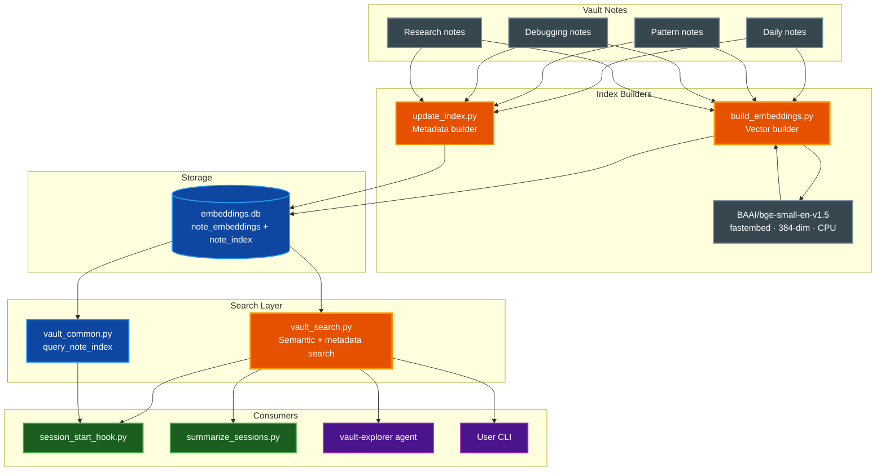

# Local Vector Embeddings

Semantic search for the Claude Vault — find relevant notes by meaning rather than by keyword,
using the `fastembed` library with a CPU-only embedding model that runs entirely on your machine.

## Table of Contents

- [Overview](#overview)
- [Architecture](#architecture)
- [Quick Start](#quick-start)
- [Building the Index](#building-the-index)
  - [Full Rebuild](#full-rebuild)
  - [Incremental Update](#incremental-update)
  - [Dry Run](#dry-run)
  - [Model Selection](#model-selection)
- [Searching the Vault](#searching-the-vault)
  - [CLI Usage](#cli-usage)
  - [JSON Mode](#json-mode)
  - [Filtering by Score](#filtering-by-score)
  - [Controlling Result Count](#controlling-result-count)
- [Metadata Index (note_index)](#metadata-index-note_index)
- [Integration](#integration)
  - [Session Start Hook](#session-start-hook)
  - [Session Summarizer](#session-summarizer)
  - [Research Agent](#research-agent)
  - [Automatic Index Rebuild](#automatic-index-rebuild)
- [Configuration Reference](#configuration-reference)
- [Installation Notes](#installation-notes)
- [Performance and Limits](#performance-and-limits)
- [Troubleshooting](#troubleshooting)
- [Related Documentation](#related-documentation)

---

## Overview

Keyword search across vault notes works well for exact terms but fails when you need to find a
note by concept. A debugging note titled "sqlalchemy-connection-pooling" will not surface for
the query "database pool timeout" unless those exact words appear in it.

The embeddings subsystem solves this by encoding each vault note into a 384-dimensional vector
and storing those vectors in a local SQLite database (`embeddings.db`). At query time, the
search script encodes the query with the same model and ranks notes by cosine similarity — no
internet connection required.

**Key capabilities:**

- Purely local: model weights are downloaded once (~67 MB) and cached; no data leaves the machine
- CPU-only: no GPU required; built on `fastembed` and `sqlite-vec`
- Fast enough for ~10 K notes with a brute-force scan (no external vector database needed)
- Incremental builds: re-embeds only notes whose `mtime` has changed
- Importable `search()` function for use by hooks and agents without spawning a subprocess loop
- Graceful degradation: every integration silently falls back when `embeddings.db` is absent

---

## Architecture

`embeddings.db` is a single SQLite file that stores two tables:

| Table | Populated by | Purpose |
|-------|-------------|---------|
| `note_embeddings` | `build_embeddings.py` | 384-dim float32 vectors for cosine similarity search |
| `note_index` | `update_index.py` | Per-note metadata (folder, tags, type, project, mtime, staleness) for indexed queries |

Both tables are created on first open: `build_embeddings.py` calls `vault_common.ensure_note_index_schema()` in `open_db()`, so the schema is guaranteed even if `update_index.py` hasn't run yet.



**Data flow:**

1. `build_embeddings.py` walks `~/ClaudeVault/`, encodes each note with the `fastembed` model, and upserts the vector into `note_embeddings` via `sqlite-vec`. It also ensures `note_index` schema exists via `ensure_note_index_schema()`.
2. `update_index.py` walks the vault, extracts per-note metadata, and upserts rows into `note_index` on every index rebuild. This keeps metadata (folder, tags, mtime, staleness, incoming links) current without requiring a re-embedding run.
3. `vault_search.py` loads the same `fastembed` model, encodes the query, and runs a cosine similarity scan against `note_embeddings` via `sqlite-vec`, returning ranked results as a JSON array. It also supports a metadata-only mode (filter flags without a query) that queries `note_index` directly without loading the model.
4. `vault_common.query_note_index()` runs indexed SQL queries against `note_index` for fast metadata filtering — no model loading, no file walking.
5. Hook scripts and agents use both search paths: semantic for conceptual relevance, metadata for structural filters (folder, tag, recency).

The `vault_common.py` module exposes `get_embeddings_db_path()` so every script resolves the
database path consistently without hardcoding it.

---

## Metadata Index (note_index)

The `note_index` table in `embeddings.db` provides fast metadata-based search without loading the
embedding model. It is populated by `update_index.py` on every index rebuild and queried via
`vault_search.py` (metadata filter flags) or `vault_common.query_note_index()` from Python.

### Schema

```sql
CREATE TABLE note_index (
    stem           TEXT    NOT NULL PRIMARY KEY,
    path           TEXT    NOT NULL,
    folder         TEXT    NOT NULL DEFAULT '',
    title          TEXT    NOT NULL DEFAULT '',
    summary        TEXT    NOT NULL DEFAULT '',
    tags           TEXT    NOT NULL DEFAULT '',     -- comma-separated: "python, sqlite"
    note_type      TEXT    NOT NULL DEFAULT '',
    project        TEXT    NOT NULL DEFAULT '',
    confidence     TEXT    NOT NULL DEFAULT '',
    mtime          REAL    NOT NULL DEFAULT 0.0,
    related        TEXT    NOT NULL DEFAULT '',     -- comma-separated stems
    is_stale       INTEGER NOT NULL DEFAULT 0,
    incoming_links INTEGER NOT NULL DEFAULT 0
);
-- Secondary indexes on folder, note_type, project, mtime, tags
```

### Querying via CLI

Metadata queries use `vault_search.py` with filter flags and no positional query argument:

```bash
# All notes in the Patterns folder
uv run ~/.claude/skills/claude-vault/scripts/vault_search.py --folder Patterns
uv run ~/.claude/skills/claude-vault/scripts/vault_search.py -f Patterns   # short form

# Notes tagged "python" modified in the last 7 days
uv run ~/.claude/skills/claude-vault/scripts/vault_search.py --tag python --recent-days 7
uv run ~/.claude/skills/claude-vault/scripts/vault_search.py -T python -d 7  # short form

# Human-readable text output
uv run ~/.claude/skills/claude-vault/scripts/vault_search.py --project parsidion-cc --text
uv run ~/.claude/skills/claude-vault/scripts/vault_search.py -p parsidion-cc -t

# Rich-colorized output
uv run ~/.claude/skills/claude-vault/scripts/vault_search.py -f Debugging -r
```

### Querying via Python

```python
import sys; sys.path.insert(0, '~/.claude/skills/claude-vault/scripts')
import vault_common

# DB-first: returns None if DB absent (signal to fall back to file walk)
paths = vault_common.query_note_index(tag="python", recent_days=7)
if paths is None:
    paths = vault_common.find_notes_by_tag("python")  # file walk fallback
```

The four `find_notes_by_*` functions in `vault_common` already apply this pattern automatically.

### Relationship to Embeddings

The two tables serve complementary roles:

| | `note_embeddings` | `note_index` |
|--|---|---|
| **Built by** | `build_embeddings.py` | `update_index.py` |
| **Query type** | Semantic (cosine similarity via `sqlite-vec`) | Metadata (folder, tag, type, recency) |
| **Speed** | ~100 ms (brute-force scan) | < 1 ms (indexed SQL) |
| **Requires model** | Yes | No |
| **Updated** | On demand / background | Every index rebuild |

Use semantic search for "find notes related to this concept"; use metadata search for "find all
debugging notes tagged sqlite from the last week".

---

## Quick Start

```bash
# Step 1 — build the full index (first run downloads the model, ~67 MB)
uv run ~/.claude/skills/claude-vault/scripts/build_embeddings.py

# Step 2 — run your first search
uv run ~/.claude/skills/claude-vault/scripts/vault_search.py "sqlite vector search" --top 5
```

The first run takes roughly 30 seconds (model download + encoding all notes). Subsequent full
rebuilds are faster because the model is cached locally. Incremental updates are faster still —
only changed notes are re-encoded.

> **Note:** The model cache lives in `~/.cache/fastembed/`. This directory is managed
> automatically by the `fastembed` library and does not require any environment variable changes.

---

## Building the Index

### Full Rebuild

A full rebuild encodes every note in the vault and replaces the database:

```bash
uv run ~/.claude/skills/claude-vault/scripts/build_embeddings.py
```

Use a full rebuild after bulk note reorganizations, subfolder moves, or when you want to ensure
the database is in a clean state.

### Incremental Update

An incremental update compares each note's `mtime` against the stored value and re-encodes only
notes that are new or modified:

```bash
uv run ~/.claude/skills/claude-vault/scripts/build_embeddings.py --incremental
```

This is the recommended mode for routine use. It is safe to run after every vault-writing session
without incurring the cost of a full rebuild.

### Dry Run

Preview which notes would be (re-)encoded without writing anything to disk:

```bash
uv run ~/.claude/skills/claude-vault/scripts/build_embeddings.py --dry-run
```

Combine with `--incremental` to preview what an incremental update would touch:

```bash
uv run ~/.claude/skills/claude-vault/scripts/build_embeddings.py --incremental --dry-run
```

### Model Selection

The default model is `BAAI/bge-small-en-v1.5`. Override it via config (see
[Configuration Reference](#configuration-reference)) or by passing `--model`:

```bash
uv run ~/.claude/skills/claude-vault/scripts/build_embeddings.py --model BAAI/bge-small-en-v1.5
```

> **⚠️ Warning:** Switching models invalidates all stored vectors — the cosine similarity scores
> across models are not comparable. Run a full rebuild (without `--incremental`) after changing
> the model.

---

## Searching the Vault

### CLI Usage

The basic search command returns a ranked list of matching notes:

```bash
uv run ~/.claude/skills/claude-vault/scripts/vault_search.py "sqlite vector search" -n 5
```

Each result line shows the similarity score, note stem, title, folder, tags, and absolute path.

### Output Formats

`vault-search` supports three output formats, selectable via flag or environment variable:

```bash
# JSON array (default) — consumed by hook integrations and agents
vault-search "hook patterns" --json     # long form
vault-search "hook patterns" -j         # short form

# Human-readable one-line-per-note text
vault-search "hook patterns" --text     # long form
vault-search "hook patterns" -t         # short form

# Rich-colorized one-line-per-note (score colored green/yellow/red, folder cyan, tags dim)
vault-search "hook patterns" --rich     # long form
vault-search "hook patterns" -r         # short form
vault-search "hook patterns" -n 5 -r   # top 5, rich output
```

Set a permanent default with the `VAULT_SEARCH_FORMAT` environment variable:

```bash
VAULT_SEARCH_FORMAT=rich vault-search "query"
```

The JSON output format is the one consumed by hook integrations. Each element contains these fields:

| Field | Description |
|---|---|
| `score` | Cosine similarity (0.0 – 1.0; higher is more similar) |
| `stem` | Filename without extension |
| `title` | Note title from frontmatter (falls back to stem) |
| `folder` | Vault subfolder (e.g. `Patterns`, `Debugging`) |
| `tags` | Space-separated tag string from frontmatter |
| `path` | Absolute path to the note file |

### Filtering by Score

Use `--min-score` / `-s` to exclude results below a similarity threshold:

```bash
uv run ~/.claude/skills/claude-vault/scripts/vault_search.py "qdrant embeddings" --min-score 0.4
uv run ~/.claude/skills/claude-vault/scripts/vault_search.py "qdrant embeddings" -s 0.4
```

The global default minimum score is controlled by `embeddings.min_score` in `config.yaml`
(default `0.35`). The CLI flag overrides it for a single invocation. You can also set it via
environment variable: `VAULT_SEARCH_MIN_SCORE=0.5 vault-search "query"`.

> **Tip:** A score above `0.5` indicates strong topical overlap. Use `--min-score 0.5` when
> you want only high-confidence matches. Use the default `0.35` when exploring a new topic where
> the vault may have only tangentially related notes.

### Controlling Result Count

Use `--top N` / `-n N` to control how many results are returned (default is set by `embeddings.top_k` in
config, which defaults to `10`):

```bash
uv run ~/.claude/skills/claude-vault/scripts/vault_search.py "fastapi middleware" --top 3
uv run ~/.claude/skills/claude-vault/scripts/vault_search.py "fastapi middleware" -n 3
```

### Environment Variables

All `vault-search` defaults can be set via `VAULT_SEARCH_*` environment variables. Precedence:
**CLI flag > env var > config.yaml > built-in default**.

| Variable | Flag equivalent | Description |
|---|---|---|
| `VAULT_SEARCH_FORMAT` | `--json` / `--text` / `--rich` | Default output format: `json`, `text`, or `rich` |
| `VAULT_SEARCH_MIN_SCORE` | `--min-score` / `-s` | Minimum cosine similarity threshold (0.0–1.0) |
| `VAULT_SEARCH_TOP` | `--top` / `-n` | Max semantic results |
| `VAULT_SEARCH_LIMIT` | `--limit` / `-l` | Max metadata results |
| `VAULT_SEARCH_MODEL` | `--model` / `-m` | fastembed model ID |

Example:

```bash
VAULT_SEARCH_FORMAT=rich VAULT_SEARCH_MIN_SCORE=0.5 vault-search "sqlite patterns"
```

---

## Integration

### Session Start Hook

`session_start_hook.py` uses semantic search to blend relevant notes into the context it injects
at the start of each Claude Code session.

After deduplicating project-specific and recently-active notes, the hook queries
`vault_search.py` with the current project name as the search term and blends in the top 5
semantic matches. This surfaces notes from other projects or topic areas that happen to be
relevant to the current one.

Enable or disable this behavior via `config.yaml`:

```yaml
session_start_hook:
  use_embeddings: true
```

When `embeddings.db` is absent, the hook silently skips the semantic blend step. No error is
raised and the session starts normally with keyword-based context only.

### Session Summarizer

`summarize_sessions.py` uses semantic search during the backlink-injection step that runs after
each new vault note is written.

The function `_find_related_by_semantic()` calls `vault_search.py` as a subprocess, passing the
new note's title and tags as the query. Any returned notes with a score above `embeddings.min_score`
are injected as bidirectional wikilinks in the `related` frontmatter field.

If the semantic search returns no results (or if `embeddings.db` is absent), the summarizer falls
back to `_find_related_by_tags()`, which performs the existing tag-overlap scan. The two
strategies are complementary: semantic search catches conceptually related notes that share no
tags, while tag-overlap catches notes with explicit shared labels.

### Research Agent

`research-documentation-agent.md` integrates semantic search as the first step of its vault
lookup sequence.

When `embeddings.db` exists, Step 1 of the agent now runs:

```bash
uv run ~/.claude/skills/claude-vault/scripts/vault_search.py "QUERY" --top 10
```

Notes returned with a score above `0.5` are read directly by the agent without invoking the
vault-explorer. The vault-explorer agent handles any remaining gaps — notes that semantic search
did not surface with high confidence.

This reduces the number of vault-explorer invocations for topics that are well-represented in the
vault, while preserving full coverage for novel topics.

### Automatic Index Rebuild

`update_index.py` automatically triggers an incremental embeddings rebuild in the background
after every vault index regeneration:

```
Note written → update_index.py runs → embeddings rebuild launched (background)
```

This means `embeddings.db` stays current without any manual intervention. The rebuild is
fire-and-forget: `update_index.py` returns immediately and the embedding runs in a separate
process. Only new or changed notes are re-embedded — a typical post-session rebuild takes
a few seconds for a handful of new notes.

The automatic rebuild is skipped silently when `embeddings.db` does not yet exist. To create
the database for the first time, run `build_embeddings.py` manually (see [Quick Start](#quick-start)).

**Triggers that indirectly kick off an incremental rebuild:**

| Trigger | Via |
|---|---|
| `summarize_sessions.py` completes | calls `update_index.py` → incremental rebuild |
| `research-documentation-agent` saves a note | calls `update_index.py` → incremental rebuild |
| Manual `uv run update_index.py` | → incremental rebuild |

---

## Configuration Reference

All embeddings settings live under the `embeddings:` section in `~/ClaudeVault/config.yaml`.
The `use_embeddings` flag for the session start hook lives under `session_start_hook:`.

```yaml
embeddings:
  model: BAAI/bge-small-en-v1.5
  min_score: 0.35
  top_k: 10

session_start_hook:
  use_embeddings: true
```

| Key | Section | Type | Default | Description |
|---|---|---|---|---|
| `model` | `embeddings` | string | `BAAI/bge-small-en-v1.5` | fastembed model ID for the embedding model |
| `min_score` | `embeddings` | float | `0.35` | Global minimum cosine similarity threshold; results below this are excluded |
| `top_k` | `embeddings` | integer | `10` | Default number of results returned per search |
| `use_embeddings` | `session_start_hook` | boolean | `true` | Enable semantic blending in the session start hook |

> **Note:** CLI flags override `config.yaml` values for a single invocation without modifying
> the stored configuration. Environment variables (`VAULT_SEARCH_*`) sit between config.yaml
> and CLI flags in the precedence chain: **CLI flag > env var > config.yaml > built-in default**.

---

## Installation Notes

### Gitignore

`install.py` automatically adds `embeddings.db` to `~/ClaudeVault/.gitignore` during installation
via `configure_vault_gitignore()`. This prevents the binary database file from being committed to
vault git history. The file is reproducible from vault notes at any time by running a full rebuild.

If you manage the vault gitignore manually, add this line:

```text
embeddings.db
```

### Post-Install Step

The standard post-install next steps now include a fourth step: build the initial embedding index.
After running `install.py`, complete setup with:

```bash
# Steps 1–3: existing setup (create vault, copy config, initialize git)

# Step 4: build the embedding index
uv run ~/.claude/skills/claude-vault/scripts/build_embeddings.py
```

The index only needs to be built once. After that, the session start hook and summarizer maintain
it automatically via incremental updates.

---

## Performance and Limits

**Brute-force scan:** `vault_search.py` computes cosine similarity against every row in
`note_embeddings` on every query. There is no approximate nearest-neighbor index. This is
intentional — for up to approximately 10,000 notes the scan completes in well under one second
on modern hardware, and it eliminates the dependency on a vector database server.

> **⚠️ Warning:** If your vault grows beyond 10,000 notes, query latency will increase noticeably.
> At that scale, consider migrating to a dedicated vector store such as Qdrant or Chroma.

**Model size:** The BAAI/bge-small-en-v1.5 model is approximately 67 MB. It is downloaded once
on the first run and cached in `~/.cache/fastembed/`. The embedding dimension is 384, so each
stored vector occupies 1,536 bytes (384 × 4-byte floats). A 10,000-note vault produces a
database of roughly 20 MB including the metadata columns.

**Build time:** A full rebuild of 1,000 notes takes approximately 30 seconds on a modern laptop
CPU. Incremental updates are proportional to the number of changed notes and are typically
sub-second for routine sessions.

**CPU only:** `fastembed` runs on CPU by default. There is no GPU acceleration path required.
For a personal vault this is not a bottleneck.

---

## Troubleshooting

### Database not found

**Symptom:** `vault_search.py` exits with an error referencing a missing `embeddings.db`, or the
session start hook silently loads fewer notes than expected.

**Cause:** The index has not been built yet, or `embeddings.db` was deleted.

**Fix:**

```bash
uv run ~/.claude/skills/claude-vault/scripts/build_embeddings.py
```

### Slow first run

**Symptom:** `build_embeddings.py` takes several minutes on the first invocation.

**Cause:** The model weights are being downloaded by `fastembed` on first use (~67 MB).

**Fix:** Wait for the download to complete. Subsequent runs use the cached weights and are
significantly faster.

### Poor search results

**Symptom:** Searches return low-scoring or clearly irrelevant notes.

**Cause:** Common causes include a stale index (notes have changed since the last build), a
`min_score` threshold set too low (admitting noise), or vault notes with very sparse content
(frontmatter only, no body text).

**Fix:**

```bash
# Rebuild the full index to ensure all notes are current
uv run ~/.claude/skills/claude-vault/scripts/build_embeddings.py

# Raise the minimum score threshold for a single search
uv run ~/.claude/skills/claude-vault/scripts/vault_search.py "my query" --min-score 0.5
```

For sparse notes, adding a one-paragraph summary to the note body significantly improves recall.

### Score mismatch after model change

**Symptom:** Scores appear inconsistent or searches return unexpected results after updating
the `embeddings.model` config key.

**Cause:** Old vectors in the database were encoded with the previous model. The stored vectors
are not compatible with the new model's embedding space.

**Fix:** Run a full rebuild (not incremental) after any model change:

```bash
uv run ~/.claude/skills/claude-vault/scripts/build_embeddings.py
```

### fastembed or sqlite-vec missing

**Symptom:** `build_embeddings.py` or `vault_search.py` fail with an import error referencing
`fastembed` or `sqlite_vec`.

**Cause:** Both scripts are PEP 723 scripts with inline dependency declarations (`fastembed`,
`sqlite-vec`). Running them without `uv run` skips dependency installation.

**Fix:** Always use `uv run` to invoke these scripts:

```bash
uv run ~/.claude/skills/claude-vault/scripts/build_embeddings.py
uv run ~/.claude/skills/claude-vault/scripts/vault_search.py "query"
```

---

## Related Documentation

- [ARCHITECTURE.md](ARCHITECTURE.md) — full system architecture including hook lifecycle and vault structure
- [EMBEDDINGS_EVAL.md](EMBEDDINGS_EVAL.md) — evaluation harness for benchmarking embedding models and chunking strategies against your vault
- [CLAUDE.md](../CLAUDE.md) — vault note conventions, frontmatter schema, and subfolder rules
- `~/ClaudeVault/config.yaml` — live configuration file (copy from `templates/config.yaml` to get started)
- `~/.claude/skills/claude-vault/templates/config.yaml` — reference config with all defaults and comments
