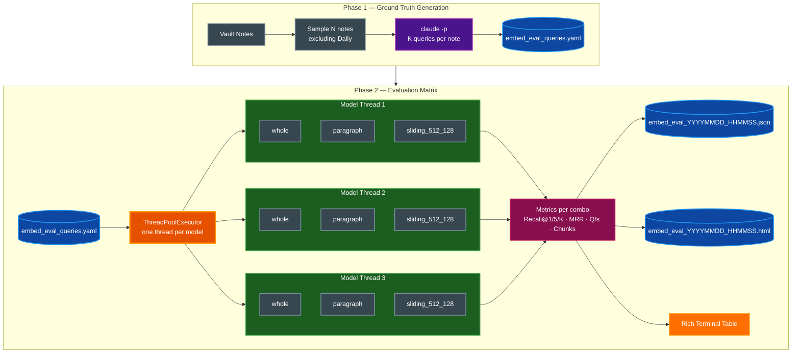
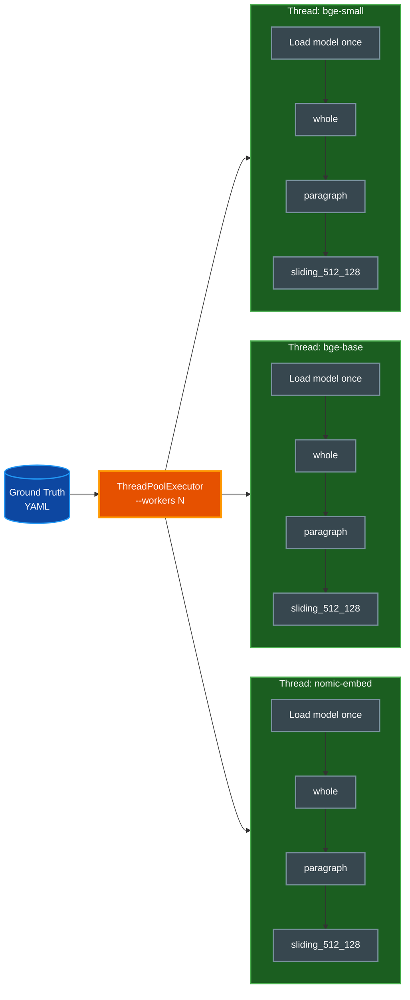

# Embedding Evaluation Harness

Benchmarks embedding model and chunking strategy combinations against Claude-generated ground-truth
queries, producing a Rich terminal table, a timestamped JSON results file, and a self-contained
interactive HTML report.

## Table of Contents

- [Overview](#overview)
- [Architecture](#architecture)
- [Quick Start](#quick-start)
- [Phase 1: Ground Truth Generation](#phase-1-ground-truth-generation)
  - [How Claude Generates Queries](#how-claude-generates-queries)
  - [Ground Truth File Format](#ground-truth-file-format)
  - [Reusing Cached Queries](#reusing-cached-queries)
- [Phase 2: Evaluation Matrix](#phase-2-evaluation-matrix)
  - [Parallel Execution Model](#parallel-execution-model)
  - [Per-Combo Flow](#per-combo-flow)
- [Chunking Strategies](#chunking-strategies)
  - [Whole-Note Chunking](#whole-note-chunking)
  - [Paragraph Chunking](#paragraph-chunking)
  - [Sliding Window Chunking](#sliding-window-chunking)
  - [Deduplication for Multi-Chunk Strategies](#deduplication-for-multi-chunk-strategies)
- [Metrics Reference](#metrics-reference)
- [Output Files](#output-files)
  - [JSON Results File](#json-results-file)
  - [HTML Report](#html-report)
- [CLI Reference](#cli-reference)
- [Performance Guide](#performance-guide)
  - [Time Estimates](#time-estimates)
  - [Worker Tuning](#worker-tuning)
  - [Quick Test Recipe](#quick-test-recipe)
- [Benchmark Results](#benchmark-results)
- [Interpreting Results](#interpreting-results)
  - [Reading MRR and Recall](#reading-mrr-and-recall)
  - [Quality vs Speed Tradeoff](#quality-vs-speed-tradeoff)
  - [When Paragraph Beats Whole](#when-paragraph-beats-whole)
- [Troubleshooting](#troubleshooting)
- [Related Documentation](#related-documentation)

---

## Overview

The default embedding pipeline encodes each vault note as a single chunk (title + tags + body,
truncated to 1500 chars). That approach is fast and simple, but it is not necessarily optimal.
A note covering multiple techniques may rank poorly for a query targeting only one of them;
a shorter note with dense technical content may outrank a richer but wordier one.

`embed_eval.py` answers the question: **which model and chunking strategy best retrieves the right
note for a given query against this specific vault?**

**Key capabilities:**

- Two-phase pipeline: ground truth generation via Claude, then offline evaluation matrix
- Ground-truth queries are saved to YAML and reused across runs — Claude is called only once
- Parallel evaluation: one thread per model, all chunking strategies serially per thread
- In-memory sqlite-vec index per combo — no persistent database required during evaluation
- Rich terminal table for quick comparison; JSON + HTML for sharing and archiving

**Script location:** `~/.claude/skills/parsidion-cc/scripts/embed_eval.py`

> **📝 Note:** `embed_eval.py` is a PEP 723 script with inline dependency declarations. Always
> invoke it with `uv run` so dependencies are installed automatically into an isolated environment.

---

## Architecture



**Data flow summary:**

1. Phase 1 samples vault notes, calls `claude -p` once per note to generate varied natural-language
   queries, and saves the result to `embed_eval_queries.yaml`. This file is reusable: subsequent
   runs skip Phase 1 entirely unless `--generate` is passed.
2. Phase 2 loads the YAML, spins up one thread per model via `ThreadPoolExecutor`, and runs all
   chunking strategies serially within each thread. Each (model, chunking) combination builds an
   in-memory sqlite-vec index, runs all ground-truth queries against it, and records retrieval
   metrics. Results are written as JSON and HTML on completion.

---

## Quick Start

```bash
# Full pipeline: generate queries then evaluate (default settings, ~10-15 min)
uv run ~/.claude/skills/parsidion-cc/scripts/embed_eval.py

# Re-run evaluation with cached queries (fast, no Claude API calls)
uv run ~/.claude/skills/parsidion-cc/scripts/embed_eval.py --eval
```

The first run:
1. Samples 100 vault notes (excluding Daily notes)
2. Calls `claude -p` once per note to generate 3 queries — approximately 5 minutes
3. Saves queries to `~/ClaudeVault/embed_eval_queries.yaml`
4. Runs the evaluation matrix across 3 models × 3 chunking strategies (9 combos) — approximately
   18 minutes with default settings (`--workers 1`, `--max-index-notes 200`). Omit `paragraph`
   from `--chunking` to cut this to ~4 minutes.

Results appear in the terminal as a Rich table and are saved as timestamped JSON and HTML files in
`~/ClaudeVault/`.

> **✅ Tip:** On the first run, use `--notes 20 --queries-per-note 2` to get a quick smoke-test
> result before committing to a full 100-note evaluation. See [Quick Test Recipe](#quick-test-recipe).

---

## Phase 1: Ground Truth Generation

### How Claude Generates Queries

For each sampled vault note, the harness calls `claude -p` with the note's title, tags, and body.
Claude returns K natural-language search queries (default 3) that cover a range of specificity:

- **Broad queries** — describe the general topic without using exact terms from the note title
  (e.g., "how to handle database connection timeouts")
- **Specific queries** — target a precise detail or technique mentioned in the note
  (e.g., "SQLAlchemy pool_pre_ping keepalive setting")

This range ensures the evaluation exercises both semantic recall (broad) and precision (specific).
A model that only scores well on specific queries may be over-fitting to surface-level keyword
matches rather than capturing meaning.

Daily notes are excluded from sampling because they record session activity rather than
distilled knowledge, making them poor ground-truth candidates.

> **⚠️ Warning:** Ground truth generation makes one Claude API call per note. For 100 notes at 3
> queries each, expect approximately 300 API calls. Run with `--eval` on subsequent runs to avoid
> repeated charges.

### Ground Truth File Format

Queries are saved to `~/ClaudeVault/embed_eval_queries.yaml` as a list of entries:

```yaml
- stem: sqlalchemy-connection-pooling
  path: /Users/you/ClaudeVault/Debugging/sqlalchemy-connection-pooling.md
  queries:
    - how to handle database connection timeouts in Python
    - pool_pre_ping SQLAlchemy keepalive
    - fix stale connections after network interruption
- stem: fastapi-middleware-patterns
  path: /Users/you/ClaudeVault/Patterns/fastapi-middleware-patterns.md
  queries:
    - request lifecycle hooks in FastAPI
    - add logging to all FastAPI routes
    - middleware order dependency injection
```

Each entry contains:

| Field | Description |
|---|---|
| `stem` | Filename without extension — used as the canonical note identifier during eval |
| `path` | Absolute path to the note at generation time |
| `queries` | List of natural-language search queries generated by Claude |

### Reusing Cached Queries

The YAML file persists across runs. When you invoke `embed_eval.py` without `--generate`, Phase 1
is skipped and the existing file is loaded directly. This lets you:

- Re-run the evaluation matrix with different models or chunking strategies without paying for
  Claude API calls again
- Share the query file with collaborators so they evaluate against the same ground truth
- Version-control the query file to track how vault retrieval quality evolves over time

Force regeneration at any time with:

```bash
uv run ~/.claude/skills/parsidion-cc/scripts/embed_eval.py --generate
```

Use `--queries-file` to point to a different YAML file:

```bash
uv run ~/.claude/skills/parsidion-cc/scripts/embed_eval.py \
  --eval --queries-file ~/my-custom-queries.yaml
```

---

## Phase 2: Evaluation Matrix

### Parallel Execution Model

Phase 2 uses `ThreadPoolExecutor` with one thread per model (controlled by `--workers`, default 1).
Each thread loads its embedding model **once**, then iterates through all configured chunking
strategies serially. This design avoids the cost of loading the same model multiple times — a
significant saving for larger models that take several seconds to initialize.



### Per-Combo Flow

For each (model, chunking) combination:

1. **Build index** — encode all notes (or note chunks) into an in-memory sqlite-vec table and
   record `index_time_s` (wall-clock seconds)
2. **Run queries** — for each ground-truth query, retrieve the top-K results from the index
3. **Score** — check whether the correct note stem appears in the returned results at rank 1,
   rank 5, and rank K; record the reciprocal rank (1/rank, or 0 if not found in top K)
4. **Aggregate** — compute Recall@1, Recall@5, Recall@K, MRR, `queries_per_sec`, and `chunk_count`
5. **Store** — append the combo result to the in-memory results list

After all combos complete, the harness writes `embed_eval_YYYYMMDD_HHMMSS.json` and
`embed_eval_YYYYMMDD_HHMMSS.html`, then renders the Rich terminal table.

---

## Chunking Strategies

Chunking determines how each note is split (or not) before being encoded into vectors. The choice
affects both the granularity of what is indexed and the number of chunks stored.

### Whole-Note Chunking

**Strategy name:** `whole`

The full note (title + tags + body) is treated as a single chunk, truncated to 1500 characters.
This is the **current production approach** used by `build_embeddings.py`.

- One vector per note
- Simple to reason about: note rank equals chunk rank
- May underperform on long, multi-topic notes where the query targets one specific section

### Paragraph Chunking

**Strategy name:** `paragraph`

The note body is split on two or more consecutive newlines (`\n\n+`). Each paragraph is embedded
separately with the note title prepended as context. A note is considered a match if **any** of its
paragraph chunks ranks in the top-K results.

- Multiple vectors per note (one per paragraph)
- Better precision for notes covering multiple distinct techniques
- Increases `chunk_count` proportionally to note length

### Sliding Window Chunking

**Strategy name:** `sliding_SIZE_OVERLAP` (e.g., `sliding_512_128`)

The full note text (title + tags + body) is concatenated into a single string, then segmented into
overlapping windows of SIZE characters with OVERLAP characters of context carried over between
windows. A note matches if any window ranks in the top-K results.

Common configurations:

| Name | Window size | Overlap | Use case |
|---|---|---|---|
| `sliding_512_128` | 512 chars | 128 chars | General purpose |
| `sliding_256_64` | 256 chars | 64 chars | Short, dense notes |
| `sliding_1024_256` | 1024 chars | 256 chars | Long notes with extended prose |

### Deduplication for Multi-Chunk Strategies

For paragraph and sliding strategies, the raw cosine-similarity scan returns chunk-level rows —
multiple rows per note are possible. Deduplication is performed **inline during retrieval** inside
`retrieve_stems`: the SQL query fetches `top_k * 5` raw results, then a `seen` set filters them to
the first occurrence of each stem (i.e., the highest-ranked chunk for that note), stopping once
`top_k` unique stems are collected. This converts chunk-level rankings into note-level rankings,
which is what Recall and MRR measure.

> **📝 Note:** Deduplication means the effective retrieval list may be shorter than top-K if
> multiple chunks from the same note dominate the raw results. The harness handles this correctly
> when computing Recall@K.

---

## Metrics Reference

| Metric | Formula / Description | Interpretation |
|---|---|---|
| **Recall@1** | Fraction of queries where the correct note ranked first | Perfect first-hit rate. A score of 1.0 means the correct note was always the top result. |
| **Recall@5** | Fraction of queries where the correct note ranked in the top 5 | Measures whether the note is reachable with minimal scrolling. |
| **Recall@K** | Fraction of queries where the correct note ranked in the top K (configurable, default 10) | Upper-bound recall for the configured retrieval depth. |
| **MRR** | Mean of 1/rank across all queries (0 if not found in top K) | Captures rank quality, not just hit/miss. A note always at rank 1 gives MRR=1.0; always at rank 2 gives MRR=0.5. Higher is better. |
| **Index time (s)** | Wall-clock seconds to encode all notes/chunks for this combo | Measures the upfront cost of building the index. Dominated by model inference time. |
| **Q/s** | Queries per second during the evaluation phase | Retrieval throughput — queries are fast (brute-force cosine scan over the in-memory index). |
| **Chunks** | Total number of chunk vectors indexed for this combo | Greater than the note count for paragraph and sliding strategies; equals note count for `whole`. |

> **✅ Tip:** MRR is the most informative single metric for comparing combos. It rewards putting
> the right answer at rank 1 more than any other position, making it a reliable proxy for
> real-world search experience.

---

## Output Files

### JSON Results File

Saved as `~/ClaudeVault/embed_eval_YYYYMMDD_HHMMSS.json`. The file contains top-level metadata
and a results array:

```json
{
  "metadata": {
    "generated_at": "2026-03-14T10:23:47",
    "notes_sampled": 100,
    "total_queries": 300,
    "models": ["BAAI/bge-small-en-v1.5"],
    "chunking_strategies": ["whole", "paragraph", "sliding_512_128"],
    "top_k": 10,
    "workers": 1
  },
  "results": [
    {
      "model": "BAAI/bge-small-en-v1.5",
      "chunking": "whole",
      "recall_at_1": 0.71,
      "recall_at_5": 0.89,
      "recall_at_10": 0.93,
      "mrr": 0.79,
      "total_queries": 300,
      "top_k": 10,
      "index_time_s": 18.4,
      "query_time_s": 1.2,
      "queries_per_sec": 250,
      "chunk_count": 100
    }
  ]
}
```

| Field | Description |
|---|---|
| `metadata.generated_at` | ISO 8601 timestamp of when the eval was run |
| `metadata.notes_sampled` | Number of notes included in ground truth |
| `metadata.total_queries` | Total ground-truth queries evaluated |
| `metadata.models` | List of model IDs evaluated |
| `metadata.chunking_strategies` | List of chunking strategy names evaluated |
| `metadata.top_k` | Recall@K cutoff used |
| `metadata.workers` | Number of parallel worker threads used |
| `results` | Array of per-combo metric objects |

Use `--output` to override the auto-timestamped default path:

```bash
uv run ~/.claude/skills/parsidion-cc/scripts/embed_eval.py \
  --output ~/Desktop/my_eval_run
# Writes: ~/Desktop/my_eval_run.json + ~/Desktop/my_eval_run.html
```

### HTML Report

Saved alongside the JSON file as `embed_eval_YYYYMMDD_HHMMSS.html`. The report requires no
server to view but loads Chart.js from `cdn.jsdelivr.net` — an internet connection is needed
to render the charts.

**Contents:**

- **Top-3 ranking cards** — the three best-performing combos shown with medal indicators,
  displaying MRR, Recall@1, and Q/s at a glance
- **Seven Chart.js charts** (loaded from CDN — requires network access to view):
  - MRR bar chart (all combos)
  - Recall@1 bar chart (all combos)
  - Recall@5 bar chart (all combos)
  - Recall@K bar chart (all combos)
  - Queries per second bar chart (all combos)
  - Index time bar chart (all combos)
  - Quality vs Speed scatter plot (MRR on Y-axis, Q/s on X-axis) — lets you identify the
    Pareto-optimal combo for your use case
- **Full results table** — all metrics for every combo, sortable by column

---

## CLI Reference

| Flag | Default | Description |
|---|---|---|
| `--generate` | off | Force regenerate ground truth even if the queries file already exists |
| `--eval` | off | Run evaluation only — skip ground truth generation |
| `--notes N` | `100` | Number of vault notes to sample for ground truth |
| `--queries-per-note K` | `3` | Number of queries Claude generates per note |
| `--queries-file FILE` | `~/ClaudeVault/embed_eval_queries.yaml` | Path to read/write the YAML ground-truth file |
| `--models M1,M2,...` | three defaults | Comma-separated list of fastembed model IDs to evaluate |
| `--chunking C1,C2,...` | `whole,paragraph,sliding_512_128` | Comma-separated chunking strategies |
| `--top-k K` | `10` | Recall@K cutoff for evaluation |
| `--workers N` | `1` | Number of parallel threads (one per model). Values >1 limit ONNX threads to `cpu_count // workers` to prevent oversubscription. |
| `--max-index-notes N` | `200` | Cap total notes indexed (0 = all vault notes). Eval notes always included; remaining slots filled with random distractors. |
| `--seed N` | `42` | Random seed for reproducible note sampling and distractor selection |
| `--output FILE` | auto-timestamped | Base path for output files (`.json` and `.html` appended) |

**Default models evaluated:**

> **📝 Note:** The model IDs shown below are the harness defaults at the time of writing.
> Pass `--models` to override them with any fastembed-compatible model ID. The production
> embedding model used by `build_embeddings.py` is set via `embeddings.model` in
> `~/ClaudeVault/config.yaml` (see [EMBEDDINGS.md](EMBEDDINGS.md#configuration-reference)).

| Model | Dimensions | Description |
|---|---|---|
| `BAAI/bge-small-en-v1.5` | 384-dim | Fast, lightweight (~67 MB) — current production model |
| `BAAI/bge-base-en-v1.5` | 768-dim | Higher quality at moderate size |
| `nomic-ai/nomic-embed-text-v1.5` | 768-dim | Strong general-purpose model |

---

## Performance Guide

### Time Estimates

Index time scales linearly with note count and with model embedding dimension.
With the default `--max-index-notes 200` and `--workers 1`:

| Phase | Approximate duration | Notes |
|---|---|---|
| Ground truth generation | ~3 s per note | Dominated by Claude API call latency; 100 notes ≈ 5 min |
| bge-small + whole | ~6 s | 200 notes × 384-dim |
| bge-small + sliding_512_128 | ~48 s | 3654 chunks × 384-dim |
| bge-small + paragraph | ~2.5 min | 7302 chunks × 384-dim |
| bge-base + whole | ~12 s | 200 notes × 768-dim |
| bge-base + sliding_512_128 | ~1.7 min | 3654 chunks × 768-dim |
| bge-base + paragraph | ~5.4 min | 7302 chunks × 768-dim |
| nomic + whole | ~17 s | 200 notes × 768-dim |
| nomic + sliding_512_128 | ~2 min | 3654 chunks × 768-dim |
| nomic + paragraph | ~6.4 min | 7302 chunks × 768-dim |
| **Full 9-combo run (sequential)** | **~18 min** | All combos, 200 notes, `--workers 1` |

Omit paragraph from `--chunking` to reduce total time to ~4 minutes.

### Worker Tuning

`--workers` controls how many models evaluate in parallel. Fastembed's ONNX Runtime uses all
available CPU cores by default — running N workers simultaneously causes N-way CPU
oversubscription and is significantly **slower** than sequential execution.

The harness automatically limits each model to `cpu_count // workers` ONNX threads when
`--workers > 1`, keeping total CPU usage at 100% instead of N×100%.

- **Default (1):** Each model uses all CPU cores uncontested. Fastest total wall time.
- **Set to 2 or 3:** Total wall time may be similar or slower than `--workers 1` due to
  cache contention and memory pressure, but can be useful on machines with many idle cores
  and ample RAM.
- **Increase beyond 3:** Only useful if evaluating more than 3 models.

> **⚠️ Warning:** Running multiple 768-dim models concurrently is memory-intensive. If your machine
> has less than 16 GB of RAM, keep `--workers 1` when evaluating `bge-base` or `nomic-embed`.

### Quick Test Recipe

Before a full evaluation, validate the harness with a minimal run:

```bash
uv run ~/.claude/skills/parsidion-cc/scripts/embed_eval.py \
  --notes 20 --queries-per-note 2 \
  --models "BAAI/bge-small-en-v1.5" \
  --chunking "whole" --top-k 5
```

This samples 20 notes, generates 2 queries each (40 total), evaluates a single combo, and
completes in roughly 2 minutes. It confirms the pipeline runs end-to-end without committing to a
multi-hour full run.

---

## Benchmark Results

Results from a representative eval run against a ~716-note vault. Ground truth: 3 notes × 2
queries each (6 total), 200-note index with random distractors, `--workers 1`.

| Rank | Model | Chunking | MRR | R@1 | R@5 | R@10 | Index time | Q/s |
|---|---|---|---|---|---|---|---|---|
| 🥇 | bge-base | whole | **0.889** | **0.833** | 1.0 | 1.0 | 11.8 s | 156 |
| 🥈 | bge-small | sliding_512_128 | 0.783 | 0.667 | 1.0 | 1.0 | 47.5 s | 251 |
| 🥉 | bge-small | whole | 0.700 | 0.500 | 1.0 | 1.0 | **5.8 s** | **302** |
| 4 | bge-base | sliding_512_128 | 0.690 | 0.500 | 0.833 | 1.0 | 101.9 s | 112 |
| 5 | nomic | sliding_512_128 | 0.681 | 0.500 | 1.0 | 1.0 | 121.0 s | 70 |
| 6 | nomic | whole | 0.667 | 0.500 | 1.0 | 1.0 | 16.7 s | 113 |
| 7–9 | all models | paragraph | ~0.583 | 0.500 | 0.667 | 0.667 | 150–381 s | 74–194 |

**Key findings:**

- **`bge-base` + `whole` is the top performer** — MRR 0.889 vs 0.700 for `bge-small` + `whole`,
  with R@1 of 0.833 (correct note at rank 1 in 83% of queries). Index time of 12 s for 200 notes
  is still fast enough for production use.
- **`bge-small` + `whole` is the best speed/quality tradeoff** — 2× faster to build (6 s),
  highest Q/s (302), and R@5 = 1.0 (correct note always in top 5).
- **Paragraph chunking hurts both quality and speed** — R@10 only 0.667 means 2 of 6 queries
  never found the right note even in the top 10. Fragmentation breaks the holistic semantic signal
  that whole-note encoding preserves. Index time is 10–30× worse with no quality benefit.
- **Sliding windows offer modest gains** — `bge-small` + `sliding` beats `bge-small` + `whole` on
  MRR (0.783 vs 0.700) but at 8× the index time. Only worthwhile for long, multi-topic notes.
- **nomic underperforms** consistently across all strategies vs the BAAI models.

> **📝 Note:** This eval used only 6 queries (3 notes × 2 each). Results are directionally clear
> but noisy. Run with `--notes 30 --queries-per-note 3` for more reliable conclusions.

---

## Interpreting Results

### Reading MRR and Recall

**MRR (Mean Reciprocal Rank)** is the primary signal. It captures not just whether the right note
was retrieved, but how highly it ranked:

| MRR range | Interpretation |
|---|---|
| 0.85 – 1.0 | Excellent — right note is almost always the top result |
| 0.70 – 0.85 | Good — right note is consistently in the top 2 or 3 |
| 0.50 – 0.70 | Acceptable — right note is usually in the top 5 |
| Below 0.50 | Poor — users would need to scroll to find the right note |

**Recall@1 vs Recall@5:** A large gap between Recall@1 and Recall@5 means the model retrieves the
right note but not at the top. This often indicates the model captures topic relevance but struggles
with fine-grained ranking. Chunking strategy changes tend to close this gap by surfacing the most
relevant passage rather than the note as a whole.

**Recall@K** is the ceiling — if it is significantly below 1.0, the model is failing to retrieve
the correct note within the top K results at all. This is the most severe failure mode.

### Quality vs Speed Tradeoff

The scatter plot in the HTML report (MRR on Y-axis, Q/s on X-axis) makes the tradeoff explicit.
Look for combos in the **upper-right quadrant** — high MRR and high Q/s. Combos in the upper-left
are high quality but slow; combos in the lower-right are fast but low quality.

For a production session start hook, the hook timeout constrains acceptable Q/s. A combo with
MRR=0.82 and Q/s=400 is preferable to one with MRR=0.85 and Q/s=40 if the hook must complete
within a 10-second budget.

### When Paragraph Beats Whole

Paragraph chunking tends to outperform whole-note chunking when:

- Your vault contains long notes that cover multiple distinct subtopics in separate sections
- Ground-truth queries target specific subsections rather than the overall note topic
- The note's title and tags do not adequately represent all the knowledge in the body

Paragraph chunking tends to **underperform** when:

- Notes are short and tightly focused (one paragraph chunks reduce to nearly the same representation
  as whole-note)
- Queries are broad and thematic, matching the overall topic better than any single paragraph
- The vault has many notes with sparse content (frontmatter-only, minimal body)

If paragraph chunking consistently outperforms whole-note across your vault, consider running
`build_embeddings.py` with paragraph chunking as the production strategy.

> **✅ Tip:** After changing the production chunking strategy, run a full rebuild of
> `embeddings.db` without `--incremental`. Old vectors from the previous strategy are not
> compatible with the new chunking scheme.

---

## Troubleshooting

### Ground truth generation is slow or hangs

**Symptom:** Phase 1 takes much longer than 3 seconds per note, or appears to stall.

**Cause:** The `claude -p` subprocess is waiting for a slow API response or hitting rate limits.

**Fix:**

```bash
# Use --eval to skip Phase 1 entirely if a queries file already exists
uv run ~/.claude/skills/parsidion-cc/scripts/embed_eval.py --eval

# Reduce the sample size to finish faster
uv run ~/.claude/skills/parsidion-cc/scripts/embed_eval.py --notes 30
```

### Import error on first run

**Symptom:** `ModuleNotFoundError` referencing `fastembed`, `sqlite_vec`, or another dependency.

**Cause:** The script was invoked with `python` directly instead of `uv run`, so the inline PEP 723
dependency declarations were not processed.

**Fix:** Always use `uv run`:

```bash
uv run ~/.claude/skills/parsidion-cc/scripts/embed_eval.py
```

### Memory pressure during evaluation

**Symptom:** The system becomes unresponsive or shows high swap usage during the index build phase.

**Cause:** Multiple large embedding models are loaded simultaneously by the thread pool.

**Fix:** Reduce `--workers` to serialize model loading:

```bash
uv run ~/.claude/skills/parsidion-cc/scripts/embed_eval.py --eval --workers 1
```

### Recall@K is unexpectedly low

**Symptom:** The evaluation reports a Recall@K below 0.50 for all combos.

**Cause:** Several possibilities — sampled notes may have sparse content, ground-truth queries may
have been generated poorly, or the note set being evaluated has changed since the queries were
generated.

**Fix:**

```bash
# Regenerate ground truth from the current vault state
uv run ~/.claude/skills/parsidion-cc/scripts/embed_eval.py --generate --notes 50

# Inspect the queries file to verify quality
# Open ~/ClaudeVault/embed_eval_queries.yaml and review a few entries
```

Also check that the notes sampled have substantive body text. Frontmatter-only notes produce weak
embeddings because there is little semantic content to encode.

### Scores differ between runs with the same settings

**Symptom:** Two runs with `--eval` and identical flags produce slightly different metric values.

**Cause:** If `--seed` was not set, note sampling is non-deterministic. Notes added or modified
between runs also shift the index.

**Fix:** Always set `--seed` for reproducible comparisons:

```bash
uv run ~/.claude/skills/parsidion-cc/scripts/embed_eval.py --eval --seed 42
```

---

## Related Documentation

- [EMBEDDINGS.md](EMBEDDINGS.md) — production embedding index: build, search, configuration,
  and integration with hooks and agents
- [ARCHITECTURE.md](ARCHITECTURE.md) — full system architecture including hook lifecycle,
  vault structure, and session summarizer
- [CLAUDE.md](../CLAUDE.md) — vault note conventions, frontmatter schema, and subfolder rules
- `~/ClaudeVault/config.yaml` — live configuration file (copy from `templates/config.yaml`)
- `~/.claude/skills/parsidion-cc/templates/config.yaml` — reference config with all defaults
