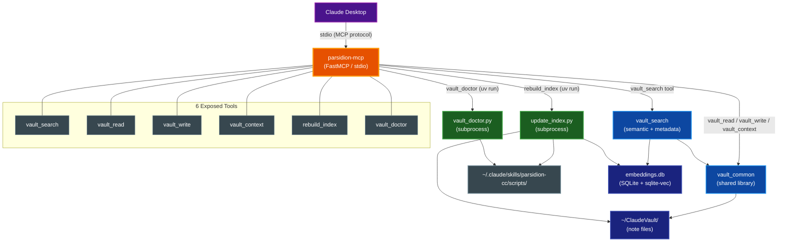

# parsidion-mcp

A FastMCP-based MCP server that exposes the Claude Vault knowledge management system to Claude Desktop and any MCP-capable client, enabling vault read, write, search, and maintenance operations from within AI assistant conversations.

## Table of Contents

- [Overview](#overview)
- [Architecture](#architecture)
- [Installation](#installation)
  - [Prerequisites](#prerequisites)
  - [Install from Repository](#install-from-repository)
  - [Verify Installation](#verify-installation)
- [Configuration](#configuration)
- [Tools Reference](#tools-reference)
  - [vault\_search](#vault_search)
  - [vault\_read](#vault_read)
  - [vault\_write](#vault_write)
  - [vault\_context](#vault_context)
  - [rebuild\_index](#rebuild_index)
  - [vault\_doctor](#vault_doctor)
- [Security](#security)
- [Development](#development)
  - [Running Tests](#running-tests)
  - [Checkall](#checkall)
  - [Package Structure](#package-structure)
- [Related Documentation](#related-documentation)

## Overview

`parsidion-mcp` solves the problem of Claude Desktop agents being unable to directly access the Claude Vault. The Claude Vault accumulates project knowledge, debugging solutions, architectural decisions, and reusable patterns across sessions — but Claude Desktop has no native mechanism to read or write those notes.

`parsidion-mcp` bridges this gap by running as a local stdio MCP server. It wraps `vault_common` (the vault's shared library) and `vault_search` (the semantic and metadata search engine) behind six MCP tools, giving Claude Desktop the same vault access that Claude Code hook scripts enjoy.

Key capabilities:

- Semantic vector search and structured metadata filtering across all vault notes
- Direct note read and write with path-containment safety enforcement
- Session-start-style context injection — project notes and recent activity surfaced as a compact index or full summaries
- Index rebuild triggering from within a conversation
- Vault health scanning and automated repair via `vault_doctor`

The server runs locally only. It makes no external network calls and requires no API keys beyond the Claude API key already used by Claude Desktop.

## Architecture

The diagram below shows the full component topology: Claude Desktop communicates with `parsidion-mcp` over stdio; the server delegates to `vault_common`, `vault_search`, and subprocess-invoked scripts to fulfil each tool call.



The server entry point in `server.py` creates a `FastMCP` application, registers each tool function, and calls `mcp.run()` which handles the stdio transport required by Claude Desktop.

Script paths for `rebuild_index` and `vault_doctor` are derived from `vault_common.TEMPLATES_DIR` — a constant patched by the installer that always resolves to `~/.claude/skills/parsidion-cc/templates/`. The scripts directory is one level up: `TEMPLATES_DIR.parent / "scripts"`. This invariant holds regardless of custom vault path configuration.

## Installation

### Prerequisites

- Python 3.13 or later
- `uv` (the package manager — install from [docs.astral.sh/uv](https://docs.astral.sh/uv))
- `parsidion-cc` installed as an editable package with the `[search]` extra (this brings in `vault_common`, `vault_search`, `fastembed`, and `sqlite-vec`)

> **Note:** Both `parsidion-cc` and `parsidion-mcp` must be editable installs. Non-editable installs are not supported due to the `py-modules` layout of `parsidion-cc`.

### Install from Repository

```bash
# Step 1 — Install parsidion-cc[search] editably (skip if already done)
cd parsidion-cc/
uv tool install --editable ".[tools]"

# Step 2 — Install the MCP server
cd parsidion-mcp/
uv tool install --editable .
```

`uv tool install` places the `parsidion-mcp` binary in `~/.local/bin/` (or the equivalent `uv` tool bin directory on your platform).

> **First-run note:** On the first `vault_search` call with a query, `fastembed` downloads the `BAAI/bge-small-en-v1.5` ONNX model (~67 MB) and caches it. This initial download can take 30–60 seconds. Subsequent calls are fast. If the embeddings database does not yet exist, the tool returns a clear error message prompting you to run `rebuild_index` first.

### Verify Installation

```bash
which parsidion-mcp
# Expected: /Users/<username>/.local/bin/parsidion-mcp

parsidion-mcp --help
```

## Configuration

Add the server to Claude Desktop's configuration file at `~/Library/Application Support/Claude/claude_desktop_config.json`:

```json
{
  "mcpServers": {
    "parsidion": {
      "command": "/Users/<username>/.local/bin/parsidion-mcp"
    }
  }
}
```

Replace `<username>` with the output of `which parsidion-mcp`. Use the full absolute path rather than a bare command name — Claude Desktop launches processes with a minimal `PATH` that may not include `~/.local/bin/`, so the bare `parsidion-mcp` command may not resolve.

After saving the file, restart Claude Desktop for the change to take effect.

## Tools Reference

All tools return plain strings. On failure, the string begins with `ERROR:` followed by a description. On success, the string contains the result content.

| Error condition | Message |
|---|---|
| Path escapes vault root | `ERROR: path escapes vault root` |
| Vault root directory missing | `ERROR: vault root not found at <path>` |
| Embeddings DB missing (semantic search) | `ERROR: embeddings DB not found — run rebuild_index first` |
| Subprocess timeout | `ERROR: command timed out after <N>s` |
| Subprocess non-zero exit | `ERROR: <stderr from subprocess>` |

### vault_search

Searches vault notes using semantic vector similarity or structured metadata filtering.

**Semantic mode** activates when `query` is provided. It calls the fastembed cosine similarity search against `embeddings.db`. **Metadata mode** activates when `query` is omitted; it runs a SQL query against the `note_index` table filtered by whichever metadata parameters are supplied.

#### Parameters

| Parameter | Type | Default | Description |
|---|---|---|---|
| `query` | `str \| None` | `None` | Natural language query (enables semantic mode) |
| `tag` | `str \| None` | `None` | Filter by exact tag token |
| `folder` | `str \| None` | `None` | Filter by folder name |
| `note_type` | `str \| None` | `None` | Filter by note type (e.g. `pattern`, `debugging`) |
| `project` | `str \| None` | `None` | Filter by project name |
| `recent_days` | `int \| None` | `None` | Only notes modified within N days |
| `top_k` | `int` | `10` | Maximum number of results |
| `min_score` | `float` | `0.35` | Minimum cosine similarity threshold (semantic mode only) |

#### Return Value

JSON array of note objects. Each object contains: `score` (float or null), `stem`, `title`, `folder`, `tags`, `path`, `summary`, `note_type`, `project`, `confidence`, `mtime`, `related`, `is_stale`, `incoming_links`.

#### Examples

```python
# Semantic search
vault_search(query="fastembed cosine similarity python")

# Metadata search — all debugging notes modified in last 7 days
vault_search(tag="python", folder="Debugging", recent_days=7)

# Semantic search with tighter relevance threshold
vault_search(query="vault hook session stop", min_score=0.5, top_k=5)
```

---

### vault_read

Reads a vault note by path and returns its full content including YAML frontmatter and body.

#### Parameters

| Parameter | Type | Description |
|---|---|---|
| `path` | `str` | Path relative to vault root (e.g. `Patterns/my-note.md`) or absolute path |

#### Return Value

Full note content as a string, or an `ERROR:` string if the path escapes the vault root, the note does not exist, or an OS error occurs.

#### Example

```python
vault_read("Patterns/fastmcp-mcp-server.md")
vault_read("Debugging/sqlite-vec-install.md")
```

---

### vault_write

Creates or overwrites a vault note. Parent directories are created automatically.

#### Parameters

| Parameter | Type | Description |
|---|---|---|
| `path` | `str` | Path relative to vault root |
| `content` | `str` | Full note content including YAML frontmatter |

The tool does not validate frontmatter. The caller is responsible for supplying valid frontmatter per vault conventions. Any structural issues are detectable via `vault_doctor` on the next scan.

#### Return Value

`Written: <absolute_path>` on success, or an `ERROR:` string on failure.

#### Example

```python
vault_write(
    path="Patterns/fastmcp-tool-registration.md",
    content="""---
date: 2026-03-16
type: pattern
tags: [fastmcp, mcp, python]
project: parsidion-mcp
confidence: high
sources: []
related: ["[[parsidion-mcp-design]]"]
---

# FastMCP Tool Registration Pattern

Register tools by calling `mcp.tool()(fn)` after defining the FastMCP instance.
""",
)
```

---

### vault_context

Returns vault context in the same format as the session start hook. This tool is intended for injection into a system prompt at the start of a Claude Desktop conversation.

By default it produces a compact one-line-per-note index (title, folder, tags) that minimises token consumption. When `verbose=True` it returns full note summaries.

**Note selection algorithm:**

1. If `project` is set, collect notes tagged or associated with that project via `vault_common.find_notes_by_project()`
2. Collect recently modified notes via `vault_common.find_recent_notes(recent_days)`
3. Merge both sets, deduplicating by path (project notes appear first)
4. Format as compact index (default) or full summaries (verbose)

The compact index is truncated at 2000 characters with a "N more notes" indicator.

#### Parameters

| Parameter | Type | Default | Description |
|---|---|---|---|
| `project` | `str \| None` | `None` | Project name to prioritise context for |
| `recent_days` | `int` | `3` | Include notes modified within this many days |
| `verbose` | `bool` | `False` | Return full summaries instead of compact index |

#### Return Value

A formatted context string ready for system prompt injection.

#### Example

```python
# Compact context for a specific project
vault_context(project="parsidion-mcp", recent_days=7)

# Full summaries for recent notes
vault_context(recent_days=5, verbose=True)
```

---

### rebuild_index

Rebuilds the vault index by running `update_index.py` as a subprocess. This regenerates:

- `~/ClaudeVault/CLAUDE.md` — the root index
- Per-folder `MANIFEST.md` files
- The `note_index` table in `embeddings.db`

Run this after creating, renaming, or deleting notes to ensure search results and context generation reflect the current vault state.

#### Parameters

None.

#### Return Value

Combined stdout and stderr from `update_index.py` on success, or an `ERROR:` string on failure. Times out after 30 seconds.

#### Example

```python
rebuild_index()
# Returns something like: "Indexed 142 notes. CLAUDE.md written."
```

---

### vault_doctor

Scans all vault notes for structural issues — missing frontmatter fields, invalid note types, broken wikilinks, orphan notes, and similar problems. Optionally repairs repairable issues using Claude haiku.

#### Parameters

| Parameter | Type | Default | Description |
|---|---|---|---|
| `fix` | `bool` | `False` | When `True`, attempt repairs via Claude haiku; when `False`, scan and report only |
| `errors_only` | `bool` | `False` | When `True`, suppress warnings and report errors only |
| `limit` | `int \| None` | `None` | Maximum notes to repair (only relevant when `fix=True`) |

The following `vault_doctor.py` flags are not exposed: `--dry-run`, `--model`, `--no-state`, `--jobs`, `--timeout`. The server uses the defaults (3 parallel workers, 120-second per-repair timeout).

#### Return Value

Combined stdout and stderr from `vault_doctor.py` on success, or an `ERROR:` string on failure. Times out after 120 seconds.

#### Examples

```python
# Scan only — report all issues
vault_doctor()

# Scan, errors only
vault_doctor(errors_only=True)

# Repair up to 10 notes
vault_doctor(fix=True, limit=10)

# Repair all, errors only
vault_doctor(fix=True, errors_only=True)
```

## Security

`parsidion-mcp` enforces two security boundaries.

**Path containment.** Both `vault_read` and `vault_write` resolve the caller-supplied path against `vault_common.VAULT_ROOT` using `Path.resolve()` and `Path.is_relative_to()`. Any path that resolves outside the vault root — including traversal sequences such as `../../etc/passwd` — is rejected immediately with `ERROR: path escapes vault root`. No file system access occurs for rejected paths.

**No external network calls.** The server and all six tools operate entirely on the local file system and local SQLite database. The subprocess calls to `update_index.py` and `vault_doctor.py` are also local-only (except when `vault_doctor` is run with `fix=True`, in which case `vault_doctor.py` itself contacts the Claude API using the system's existing Claude credentials — this is the same behaviour as running `vault_doctor.py` manually from the terminal).

The server has no authentication layer of its own because it is transport-bound to stdio. Only Claude Desktop (or another local process with stdio access) can communicate with it.

## Development

### Running Tests

```bash
cd parsidion-mcp/
uv run pytest
```

The test suite covers:

- **Unit tests** — each tool module tested with mocked `vault_common`, `vault_search`, and `subprocess.run`
- **Subprocess tests** — `rebuild_index` and `vault_doctor` verified for correct flag construction across all parameter combinations
- **Path safety tests** — traversal attempts in `vault_read` and `vault_write` confirmed to return the expected error string
- **Integration smoke test** — reads one real note; automatically skipped when the vault is absent

### Checkall

```bash
cd parsidion-mcp/
make checkall
```

This runs formatting (`ruff format`), linting (`ruff check`), type checking (`pyright`), and the full test suite in sequence.

### Package Structure

```
parsidion-mcp/
├── pyproject.toml
└── src/
    └── parsidion_mcp/
        ├── __init__.py
        ├── server.py         # FastMCP app and entry point
        └── tools/
            ├── __init__.py
            ├── search.py     # vault_search tool
            ├── notes.py      # vault_read, vault_write
            ├── context.py    # vault_context
            └── ops.py        # rebuild_index, vault_doctor
```

The `parsidion-cc[search]` editable path dependency (declared in `pyproject.toml` under `[tool.uv.sources]`) makes `vault_common` and `vault_search` directly importable — no `sys.path` manipulation is required in the server code.

## Related Documentation

- [CLAUDE.md](../CLAUDE.md) — project instructions, vault conventions, hook architecture, and script paths
