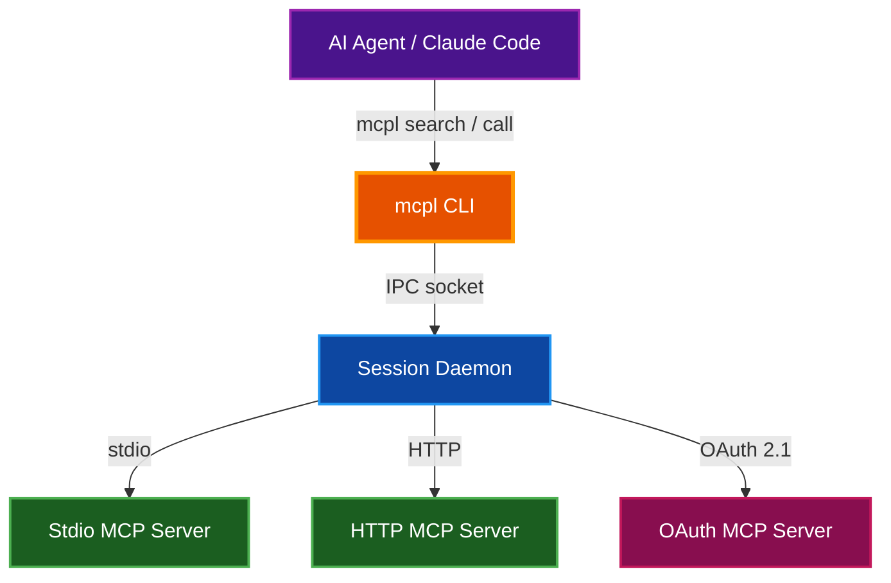
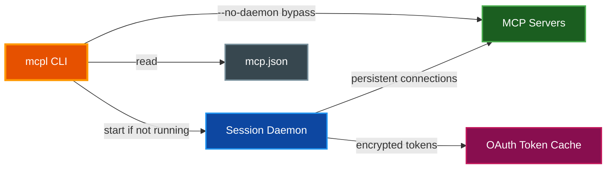
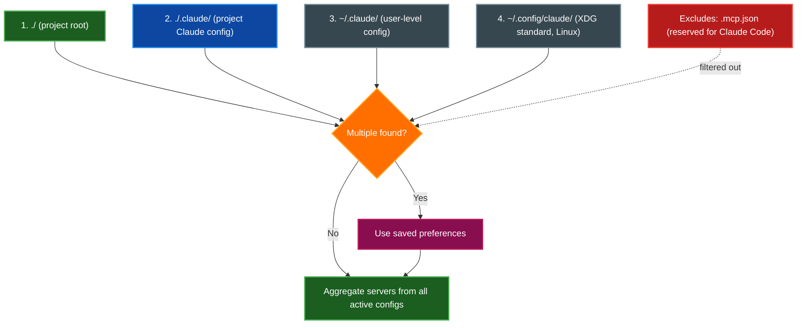
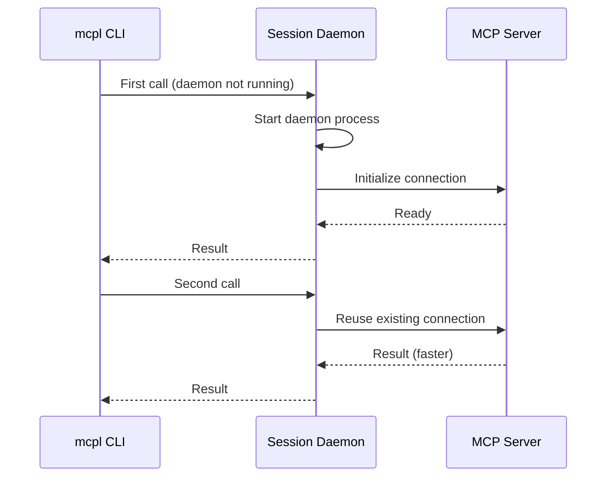
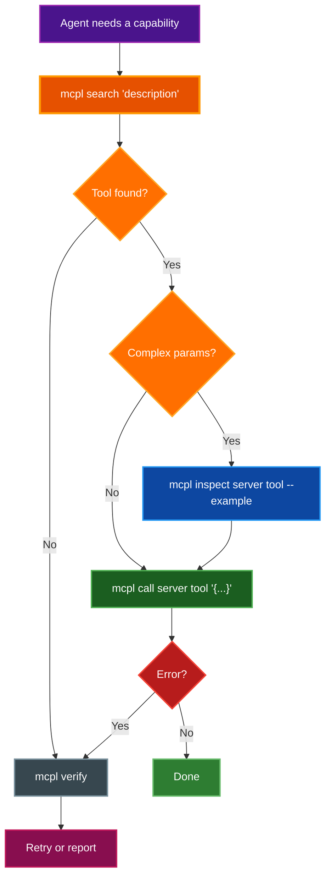

# MCP Launchpad (mcpl)

A unified command-line interface for discovering and executing tools from multiple Model Context Protocol (MCP) servers, enabling AI agents like Claude Code to access any configured MCP capability through a single, consistent gateway.

## Table of Contents

- [Overview](#overview)
- [Architecture](#architecture)
- [Installation](#installation)
- [Configuration](#configuration)
  - [Config File Format](#config-file-format)
  - [Config Discovery Order](#config-discovery-order)
  - [Managing Multiple Configs](#managing-multiple-configs)
  - [Environment Variables](#environment-variables)
- [Core Commands](#core-commands)
  - [search](#search)
  - [list](#list)
  - [call](#call)
  - [inspect](#inspect)
  - [verify](#verify)
  - [config](#config)
  - [enable / disable](#enable--disable)
  - [session](#session)
  - [auth](#auth)
  - [Global Options](#global-options)
  - [JSON Mode](#json-mode)
- [Session Daemon](#session-daemon)
- [Integration with Claude Code](#integration-with-claude-code)
  - [How CLAUDE.md References mcpl](#how-claudemd-references-mcpl)
  - [Agent Workflow Pattern](#agent-workflow-pattern)
  - [Rate Limit Fallback](#rate-limit-fallback)
- [Advanced Configuration](#advanced-configuration)
  - [HTTP Server Configuration](#http-server-configuration)
  - [SSE Transport Configuration](#sse-transport-configuration)
  - [OAuth Authentication](#oauth-authentication)
- [Common Workflows](#common-workflows)
- [Troubleshooting](#troubleshooting)
- [Related Documentation](#related-documentation)

---

## Overview

**Purpose:** MCP Launchpad solves the tool-discovery problem that emerges when AI agents work across many MCP servers. Without it, an agent must know in advance which server provides which tool — a brittle assumption as configurations grow and change. `mcpl` provides a single search interface across all configured servers, letting agents find and call tools dynamically.

**Key Features:**

- Unified tool discovery using BM25, regex, and exact matching across all configured MCP servers
- Persistent session daemon that maintains server connections for faster repeated calls
- Support for stdio (local process), HTTP, and SSE (legacy) transports
- Multi-config management — use project-level and user-level configs simultaneously
- OAuth 2.1 authentication with PKCE for cloud MCP servers (Notion, Figma, etc.)
- JSON output mode for scripting and automation
- Cross-platform: macOS, Linux, and Windows (experimental)

**The Problem It Solves:**

MCP servers expose dozens of tools with names that vary by server and version. An agent that hard-codes tool names breaks when servers are added, removed, or updated. `mcpl search` lets agents describe *what they want to do* and get back matching tool names with required parameters — without needing prior knowledge of any specific server's schema.



---

## Architecture

MCP Launchpad has two runtime components: the **CLI** (`mcpl`) and the **session daemon**.



The daemon starts automatically on first `mcpl call` and maintains long-lived connections to all configured MCP servers. Subsequent calls reuse those connections, avoiding per-call startup latency. The daemon shuts itself down when idle, when the parent terminal exits, or when the IDE session ends.

---

## Installation

**Prerequisites:** [`uv`](https://docs.astral.sh/uv/getting-started/installation/) must be installed.

```bash
# Install mcpl globally
uv tool install https://github.com/kenneth-liao/mcp-launchpad.git

# Verify the installation
mcpl --help
```

> **📝 Note:** `uv tool install` places the `mcpl` binary on your `PATH` inside a managed virtual environment. No system Python packages are modified.

---

## Configuration

### Config File Format

Create a JSON file whose name contains `mcp` (e.g., `mcp.json`) to declare which MCP servers to connect to. The file format mirrors the Claude Code MCP configuration schema. Note that `.mcp.json` is reserved for Claude Code itself and is ignored by mcpl.

```json
{
  "mcpServers": {
    "filesystem": {
      "command": "npx",
      "args": ["-y", "@anthropic/mcp-server-filesystem", "/path/to/allowed/dir"]
    },
    "github": {
      "command": "uvx",
      "args": ["mcp-server-github"],
      "env": {
        "GITHUB_TOKEN": "${GITHUB_TOKEN}"
      }
    }
  }
}
```

Environment variable references use `${VAR}` syntax. Variables are loaded from `~/.claude/.env` and `./.env` (in that order, with project-level `.env` taking precedence).

### Config Discovery Order

mcpl searches for any JSON file whose name contains `mcp` (case-insensitive) across four directories in priority order. `.mcp.json` is explicitly excluded because that filename is reserved for Claude Code's own MCP configuration.



You can also override discovery entirely with an environment variable:

```bash
# Point directly to one or more config files
export MCPL_CONFIG_FILES="/path/to/mcp.json,/other/mcp.json"
```

### Managing Multiple Configs

When you work across projects with different MCP server sets, use `mcpl config files` to control which configs are active without modifying any file:

```bash
mcpl config files               # View all discovered configs and their active status
mcpl config files --select      # Interactive prompt to pick which configs to use
mcpl config files --activate 1  # Activate config by index number
mcpl config files --deactivate 2
mcpl config files --all         # Activate every discovered config
mcpl config files --reset       # Clear saved preferences; re-prompts on next run
```

### Environment Variables

| Variable | Default | Description |
|----------|---------|-------------|
| `MCPL_CONFIG_FILES` | (auto-discover) | Comma-separated list of config file paths |
| `MCPL_CONNECTION_TIMEOUT` | `45` | Server connection/initialization timeout (seconds) |
| `MCPL_RECONNECT_DELAY` | `5` | Delay before retrying a failed server connection (seconds) |
| `MCPL_MAX_RECONNECT_ATTEMPTS` | `3` | Max reconnection attempts before giving up |
| `MCPL_IDLE_TIMEOUT` | `3600` | Daemon idle shutdown timeout (seconds; `0` disables) |
| `MCPL_DAEMON_START_TIMEOUT` | `30` | Max time to wait for daemon startup (seconds) |
| `MCPL_SESSION_ID` | (auto) | Override session ID for multi-session setups |
| `MCPL_IDE_ANCHOR_CHECK_INTERVAL` | `10` | How often to check if IDE session is alive (seconds) |

---

## Core Commands

### search

Search for tools across all configured servers by keyword or natural language description.

```bash
mcpl search "list github issues"                    # Returns 5 results by default
mcpl search "create pull request" -l 10             # Short form for --limit
mcpl search "create pull request" --limit 10
mcpl search "database query" --limit 20
mcpl search "github" -s                             # Short form for --schema
mcpl search "github" --schema                       # Include full input schema in results
mcpl search "github" --refresh                      # Refresh tool cache before searching
mcpl search "github" -m exact                       # Force exact matching
mcpl search "github" -m regex                       # Force regex matching
mcpl search "github" -m bm25                        # Force BM25 ranking (default)
```

The search supports three methods selectable via `-m, --method [bm25|regex|exact]`: BM25 ranking (default), regex matching, and exact matching. Each result shows the server name, tool name, and required parameters — giving you everything needed to construct a `call` immediately.

> **✅ Tip:** Always search before calling. Tool names vary between servers and versions. Never guess a tool name — `mcpl search` is the fastest way to confirm the correct name and its required parameters.

### list

List all configured servers, or list the tools available on a specific server.

```bash
mcpl list                    # Show all configured MCP servers
mcpl list github             # Show all tools on the 'github' server
mcpl list --refresh          # Re-connect to servers and refresh the tool cache
```

### call

Execute a tool on a specific server. Arguments are passed as a JSON string.

```bash
mcpl call github list_issues '{"owner": "acme", "repo": "api"}'
mcpl call filesystem read_file '{"path": "/project/README.md"}'
mcpl call sentry search_issues '{"organizationSlug": "my-org", "query": "is:unresolved"}'

# Bypass the session daemon (useful for debugging; note: daemon required for browser MCPs)
mcpl call github list_repos '{}' --no-daemon

# Read large argument payloads from stdin
echo '{"owner": "acme", "repo": "api"}' | mcpl call github list_issues --stdin
```

### inspect

Get the full JSON schema for a specific tool, including all parameters and their types.

```bash
mcpl inspect github list_issues               # Full schema
mcpl inspect sentry search_issues -e          # Short form for --example
mcpl inspect sentry search_issues --example   # Schema + ready-to-run example call
```

The `--example` flag outputs a ready-to-run `mcpl call` command pre-filled with placeholder values — useful when a tool has many required parameters.

### verify

Test connectivity to all configured MCP servers. Use this as the first diagnostic step when something is not working.

```bash
mcpl verify
mcpl verify -t 60    # Custom connection timeout per server (seconds)
```

Each server is tested for connection and responsiveness. Failed servers are clearly identified. Use `-t, --timeout` to override the per-server connection timeout when servers are slow to initialize.

### config

Display the current resolved configuration including all loaded servers and their settings.

```bash
mcpl config
mcpl config --show-secrets  # Show actual values of environment variables (use with caution)
mcpl config files           # Show multi-config file status
```

### enable / disable

Temporarily enable or disable a server without modifying any config file. State is persisted across sessions.

```bash
mcpl disable slow-server   # Stop mcpl from connecting to this server
mcpl enable slow-server    # Re-enable it
```

### session

Manage the background session daemon.

```bash
mcpl session status    # Show daemon PID, uptime, and connected servers
mcpl session stop      # Gracefully stop the daemon (auto-restarts on next call)
```

### auth

Manage OAuth 2.1 authentication for remote MCP servers that require it (e.g., Notion, Figma).

```bash
mcpl auth login notion              # Open browser for OAuth authorization
mcpl auth login figma --scope "read write"
mcpl auth login custom --force      # Force re-authentication
mcpl auth login custom --client-id my-id --client-secret-stdin  # Provide credentials non-interactively
mcpl auth login notion --timeout 120  # Extend browser callback timeout (seconds)
mcpl auth logout notion             # Remove stored token for one server
mcpl auth logout --all              # Clear all stored tokens
mcpl auth status                    # Show authentication status for all servers
mcpl auth status notion             # Check a specific server
```

> **⚠️ Warning:** AI agents cannot complete OAuth flows — they require browser interaction. Authenticate all OAuth-protected servers manually before using them with an agent.

### Global Options

These options apply to every `mcpl` command and are placed before the subcommand:

| Option | Description |
|--------|-------------|
| `--json` | Output in JSON format (machine-readable) |
| `--config PATH` | Path to a specific MCP config file (overrides discovery) |
| `--env-file PATH` | Path to a `.env` file for environment variable substitution |
| `-v, --verbose` | Enable verbose logging |

### JSON Mode

Add `--json` to any command for machine-readable output. Useful when scripting or when an agent needs to parse results programmatically.

```bash
mcpl --json search "github"
mcpl --json call github list_repos '{}'
mcpl --json list
```

---

## Session Daemon

The session daemon maintains persistent connections to all configured MCP servers. Without it, each `mcpl call` would spend time reconnecting and re-initializing every server.



### Daemon Lifecycle

The daemon shuts itself down automatically in any of these conditions:

| Environment | Shutdown Trigger |
|-------------|-----------------|
| Regular terminal | Parent terminal process exits |
| VS Code / Claude Code | IDE session ends (detected via VS Code socket) |
| Any environment | Idle timeout (default: 1 hour of no activity) |
| Manual | `mcpl session stop` |

> **📝 Note:** On Windows, the daemon uses named pipes for IPC instead of Unix sockets. The `--no-daemon` flag is recommended if you encounter reliability issues on Windows.

---

## Integration with Claude Code

### How CLAUDE.md References mcpl

The parsidion-cc project embeds mcpl usage instructions directly in `~/.claude/CLAUDE.md` so that Claude Code has them available in every session. The key guidance injected into the agent context is:

1. **Always discover before calling** — never guess tool names; use `mcpl search` first
2. **Search returns required params** — the search result gives you everything needed to construct a call
3. **Use `inspect --example` for complex tools** — generates a ready-to-run call with placeholders
4. **Always set a timeout** — when using MCP tools that make network requests, always specify a `timeout` parameter (API calls 5-10s, web scraping 10-30s, large downloads 30-60s)
5. **Troubleshoot with `mcpl verify`** — first step when any server fails

The mcpl guidance is part of the global user-level `~/.claude/CLAUDE.md` installed by parsidion-cc. The same pattern — embedding an "MCP Launchpad" section in your CLAUDE.md or AGENTS.md — can be applied at either the project level (`./CLAUDE.md`) or user level (`~/.claude/CLAUDE.md`).

### Agent Workflow Pattern

The recommended pattern for an agent using mcpl follows a strict discover-then-call sequence:



Example agent session:

```bash
# 1. Find the right tool
mcpl search "list projects"
# Returns: vercel list_projects (required: teamId)

# 2. For complex tools, get an example call
mcpl inspect vercel list_projects --example
# Shows: mcpl call vercel list_projects '{"teamId": "<teamId>"}'

# 3. Execute with real parameters
mcpl call vercel list_projects '{"teamId": "team_abc123"}'
```

### Rate Limit Fallback

If Brave Search or another primary tool hits a rate limit, the agent should immediately check mcpl for alternatives:

```bash
mcpl search "web search"       # Find alternative search tools
mcpl search "fetch url"        # Find web fetch alternatives
mcpl list                      # See all available servers for broader context
```

---

## Advanced Configuration

### HTTP Server Configuration

Connect to remote MCP endpoints over HTTP (Streamable HTTP transport):

```json
{
  "mcpServers": {
    "remote-api": {
      "type": "http",
      "url": "https://api.example.com/mcp",
      "headers": {
        "Authorization": "Bearer ${API_TOKEN}"
      }
    }
  }
}
```

| Field | Required | Description |
|-------|----------|-------------|
| `type` | Yes | Must be `"http"` |
| `url` | Yes | Full URL to the MCP endpoint |
| `headers` | No | HTTP headers; supports `${VAR}` syntax |

### SSE Transport Configuration

For legacy MCP servers that use Server-Sent Events instead of Streamable HTTP:

```json
{
  "mcpServers": {
    "legacy-server": {
      "type": "sse",
      "url": "https://legacy.example.com/sse",
      "headers": {
        "Authorization": "Bearer ${API_TOKEN}"
      }
    }
  }
}
```

> **📝 Note:** SSE transport exists for backwards compatibility. New MCP servers should use standard HTTP transport.

### OAuth Authentication

Some remote MCP servers require OAuth 2.1 authentication. mcpl handles this with PKCE (RFC 7636) and supports three client registration strategies:

1. **Config file** — pre-configured credentials in `mcp.json`
2. **DCR** — Dynamic Client Registration if the server supports it
3. **Interactive** — manual input as fallback

```json
{
  "mcpServers": {
    "notion": {
      "type": "http",
      "url": "https://mcp.notion.com/mcp",
      "oauth_client_id": "${NOTION_CLIENT_ID}",
      "oauth_client_secret": "${NOTION_CLIENT_SECRET}",
      "oauth_scopes": ["read", "write"]
    }
  }
}
```

Tokens are encrypted using Fernet (AES-128-CBC + HMAC) and stored in `~/.cache/mcp-launchpad/oauth/` using the OS keyring (Keychain on macOS, libsecret on Linux, DPAPI on Windows).

**Security features:**
- PKCE with S256 (RFC 7636) for secure authorization
- Token revocation on logout (RFC 7009)
- HTTPS enforcement for all OAuth endpoints
- Fallback encryption if OS keyring is unavailable (with warning)

---

## Common Workflows

### First-Time Setup

```bash
# 1. Install mcpl
uv tool install https://github.com/kenneth-liao/mcp-launchpad.git

# 2. Create a config file (project-level or user-level; name must contain "mcp")
cat > ~/.claude/mcp.json << 'EOF'
{
  "mcpServers": {
    "filesystem": {
      "command": "npx",
      "args": ["-y", "@anthropic/mcp-server-filesystem", "/Users/you/Projects"]
    }
  }
}
EOF

# 3. Verify the connection
mcpl verify

# 4. List available tools
mcpl list filesystem
```

### Discovering and Calling a Tool

```bash
# Search broadly first
mcpl search "github pull requests"

# Narrow by server if needed
mcpl list github

# Get a ready-to-run example for a complex tool
mcpl inspect github create_pull_request --example

# Call the tool
mcpl call github create_pull_request '{
  "owner": "myorg",
  "repo": "myproject",
  "title": "Fix authentication bug",
  "head": "fix/auth",
  "base": "main"
}'
```

### Adding an OAuth-Protected Server

```bash
# 1. Add to mcp.json
# (add notion config with oauth fields as shown in Advanced Configuration)

# 2. Authenticate (opens browser)
mcpl auth login notion

# 3. Verify the connection is working
mcpl verify

# 4. List notion tools
mcpl list notion
```

### Diagnosing Connection Problems

```bash
# Step 1: Test all servers
mcpl verify

# Step 2: Check daemon health
mcpl session status

# Step 3: Reset the daemon
mcpl session stop
# Daemon auto-restarts on next call

# Step 4: Test a specific call without the daemon
mcpl call github list_repos '{}' --no-daemon

# Step 5: Check for OAuth issues
mcpl auth status
```

---

## Troubleshooting

### Server Not Connecting

**Symptom:** `mcpl verify` shows a server as failed or unreachable.

**Solutions:**
1. Check that the server command or URL is correct in `mcp.json`
2. Run `mcpl session stop` and retry — stale daemon connections are the most common cause
3. For stdio servers, verify the command is on your `PATH` (e.g., `npx`, `uvx`)
4. For HTTP servers, confirm the URL is reachable: `curl https://api.example.com/mcp`

### Timeout Errors

**Symptom:** Calls time out, especially to slow or remote servers.

**Solution:** Increase the connection timeout:

```bash
MCPL_CONNECTION_TIMEOUT=120 mcpl call slow-server some_tool '{}'
```

Or set it persistently in your shell profile:

```bash
export MCPL_CONNECTION_TIMEOUT=120
```

### Tool Not Found

**Symptom:** `mcpl search` returns no results or wrong results.

**Solutions:**
1. Try broader search terms: `mcpl search "search"` instead of `mcpl search "brave web search"`
2. Refresh the tool cache: `mcpl list --refresh`
3. Confirm the server is connected: `mcpl list`
4. Check if the server was disabled: `mcpl enable server-name`

### OAuth Token Expired

**Symptom:** Calls to an OAuth-protected server return authentication errors.

**Solution:**

```bash
mcpl auth login notion --force   # Force re-authentication
```

### Multiple Configs Conflict

**Symptom:** Tools from the wrong server are being found, or expected servers are missing.

**Solution:**

```bash
mcpl config files          # See which configs are active
mcpl config files --select # Interactively choose which configs to use
mcpl config               # See the full resolved configuration
```

### Stale Daemon State

**Symptom:** Calls fail intermittently or return unexpected errors after a long idle period.

**Solution:**

```bash
mcpl session stop          # Stop the stale daemon
# Daemon auto-restarts on the next mcpl call
```

### Windows-Specific Issues

On Windows, the daemon uses named pipes instead of Unix sockets. If you encounter unreliable behavior:

```bash
# Bypass the daemon entirely
mcpl call server tool '{}' --no-daemon

# Or set an explicit session ID
set MCPL_SESSION_ID=my-session-1
```

---

## Related Documentation

- [CLAUDE.md](../CLAUDE.md) - Project instructions including mcpl usage guidance for Claude Code
- [ARCHITECTURE.md](ARCHITECTURE.md) - System architecture overview
- [MCP Launchpad GitHub Repository](https://github.com/kenneth-liao/mcp-launchpad) - Source, issues, and latest releases
- [MCP Specification](https://modelcontextprotocol.io) - The Model Context Protocol specification
- [uv Installation](https://docs.astral.sh/uv/getting-started/installation/) - Required to install mcpl
