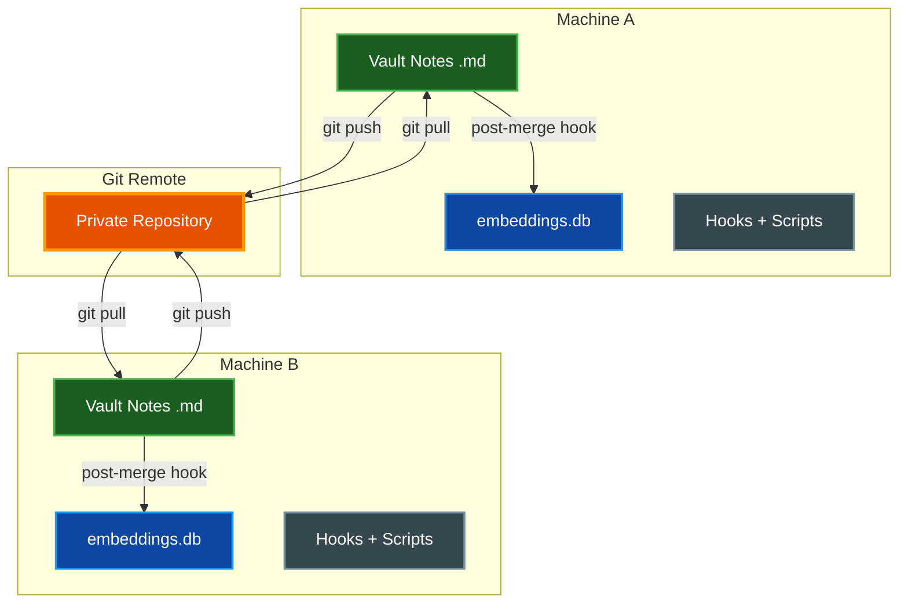

# Multi-Machine Vault Sync

Share a single ClaudeVault across multiple machines so that debugging solutions,
patterns, and project context are available everywhere you work.

## Table of Contents

- [Overview](#overview)
- [Sync Strategies](#sync-strategies)
- [Recommended Setup (Git)](#recommended-setup-git)
- [What Gets Synced](#what-gets-synced)
- [Post-Merge Hook](#post-merge-hook)
- [Architecture](#architecture)
- [Handling Conflicts](#handling-conflicts)
- [Troubleshooting](#troubleshooting)
- [Related Documentation](#related-documentation)

---

## Overview

The vault is a folder of markdown files with YAML frontmatter, plus a derived
SQLite database (`embeddings.db`) that powers semantic search.  The markdown
files are the source of truth; the database is a local cache that can be rebuilt
at any time from the notes.

This separation makes multi-machine sync straightforward: sync the markdown,
rebuild the database locally on each machine.

---

## Sync Strategies

| Strategy | Pros | Cons | Verdict |
|----------|------|------|---------|
| **Git** (recommended) | Merge conflicts are visible and resolvable; history is preserved; works offline | Requires manual push/pull (or a cron job) | Best for vault sync |
| **Syncthing** | Real-time P2P; no central server; open source | No merge — last-write-wins on conflicts; SQLite corruption risk | Good for markdown-only if you gitignore `embeddings.db` |
| **Cloud drives** (iCloud, Dropbox, OneDrive) | Zero setup; automatic | SQLite corruption from partial copies; no conflict resolution; hidden sync delays | Not recommended |

> **Warning:** Cloud sync services copy files mid-write. SQLite uses WAL
> journaling and file-level locks that these services do not understand.
> A partial copy produces a corrupted database.

---

## Recommended Setup (Git)

### 1. Run the installer (first machine)

The installer automatically:
- initializes the vault as a **git repository** (with `.gitignore` and initial commit)
- adds `embeddings.db`, `pending_summaries.jsonl`, and `hook_events.log` to `.gitignore`
- installs a **post-merge hook** that rebuilds the index and embeddings after every pull

If you already have a vault, re-running the installer adds git support without affecting
existing notes:

```bash
uv run install.py --force --yes
```

### 2. Push to a private remote

```bash
cd ~/ClaudeVault
git remote add origin git@github.com:youruser/claude-vault.git
git push -u origin main
```

### 3. Set up additional machines

```bash
# Clone the vault, then install skills and hooks
git clone git@github.com:youruser/claude-vault.git ~/ClaudeVault
cd ~/path/to/parsidion-cc
uv run install.py --force --yes
```

### 4. Pull before each session, push after

```bash
cd ~/ClaudeVault && git pull   # before starting Claude Code
cd ~/ClaudeVault && git push   # after session ends (or automate via cron)
```

The post-merge hook fires automatically after `git pull`, rebuilding the local
database so semantic search works immediately.

---

## What Gets Synced

| File / Path | Sync? | Reason |
|-------------|-------|--------|
| `*.md` notes (all folders) | Yes | Source of truth — markdown is merge-friendly |
| `config.yaml` | Yes | Shared settings across machines (uses `~` paths) |
| `CLAUDE.md` (vault root) | Yes | Auto-generated index — rebuilt by `update_index.py` |
| `**/MANIFEST.md` | Yes | Per-folder indexes — rebuilt by `update_index.py` |
| `embeddings.db` | **No** | Binary SQLite — must be rebuilt locally |
| `pending_summaries.jsonl` | **No** | Machine-local session queue, uses `fcntl.flock` |
| `hook_events.log` | **No** | Machine-local structured log |
| `.obsidian/` | **No** | Obsidian workspace state — machine-specific |

The installer adds all "No" entries to `.gitignore` automatically.

---

## Post-Merge Hook

The installer creates `.git/hooks/post-merge` inside the vault when a `.git`
directory is detected.  The hook runs two commands after every `git pull` or
`git merge`:


**What the hook does:**

1. `update_index.py` — rebuilds the `note_index` table in `embeddings.db` and
   regenerates the root `CLAUDE.md` index and per-folder `MANIFEST.md` files
2. `build_embeddings.py --incremental` — re-embeds only notes whose `mtime`
   changed, updating the `note_embeddings` table for semantic search

**Idempotency:** running the installer again does not duplicate the hook.  The
hook is identified by a marker comment (`# parsidion-cc post-merge hook`).

**Safety:** if a pre-existing `post-merge` hook is found that was not created
by the installer, it is left untouched with a warning.

---

## Architecture



Each machine maintains its own `embeddings.db` — only markdown notes travel
through git.  The post-merge hook ensures the local database is always in sync
with the latest notes.

---

## Team Vault (Multiple Users)

Multiple people can share a vault by pointing at the same git remote.  Each
person runs the installer on their own machine — the installer automatically sets
`vault.username` in `config.yaml` to their OS username (`$USER`).

Daily notes are stored as `Daily/YYYY-MM/DD-{username}.md` (e.g.
`Daily/2026-03/23-alice.md`, `Daily/2026-03/23-bob.md`), so each team member
writes their own file and git pull/push never produces daily-note conflicts.

### Migrating existing vaults

If you have existing un-namespaced daily notes (`Daily/YYYY-MM/DD.md`), run the
migration once on each machine:

```bash
# Dry-run: see what would be renamed
uv run --no-project ~/.claude/skills/parsidion-cc/scripts/vault_doctor.py \
    --migrate-daily-notes --daily-username alice

# Apply:
uv run --no-project ~/.claude/skills/parsidion-cc/scripts/vault_doctor.py \
    --migrate-daily-notes --daily-username alice --execute
```

The migration renames files in place, updates wikilinks in weekly/monthly rollup
notes, commits all changes, and rebuilds the index.

---

## Handling Conflicts

### Daily Notes

With per-user daily notes (`DD-{username}.md`), daily notes **never conflict**
— each team member writes their own file.  Pull/push freely without worrying
about merge conflicts in the Daily folder.

If you have a legacy vault that still uses un-namespaced `DD.md` files, see
[Migrating existing vaults](#migrating-existing-vaults) above.

### config.yaml

Shared configuration should use portable paths (`~` notation).  If two machines
need different settings, use machine-specific overrides via CLI flags rather than
editing `config.yaml` differently on each machine.

### pending_summaries.jsonl

This file is gitignored.  Each machine maintains its own queue of sessions
awaiting summarization.  Run `summarize_sessions.py` independently on each
machine.

---

## Troubleshooting

### Post-merge hook not running

**Symptom:** `git pull` completes but the index is not rebuilt.

**Check:**
```bash
ls -la ~/ClaudeVault/.git/hooks/post-merge
```

The hook must be executable (`-rwxr-xr-x`).  If missing, re-run the installer:
```bash
uv run install.py --force --yes
```

### Stale search results after pull

**Symptom:** semantic search does not find recently pulled notes.

**Fix:** manually rebuild:
```bash
uv run --no-project ~/.claude/skills/parsidion-cc/scripts/update_index.py
uv run ~/.claude/skills/parsidion-cc/scripts/build_embeddings.py --incremental
```

### Corrupted embeddings.db

**Symptom:** SQLite errors when searching.

**Fix:** delete and rebuild:
```bash
rm ~/ClaudeVault/embeddings.db
uv run --no-project ~/.claude/skills/parsidion-cc/scripts/update_index.py
uv run ~/.claude/skills/parsidion-cc/scripts/build_embeddings.py
```

---

## Related Documentation

- [ARCHITECTURE.md](ARCHITECTURE.md) — system architecture and hook lifecycle
- [EMBEDDINGS.md](EMBEDDINGS.md) — semantic search setup and configuration
- [VISUALIZER.md](VISUALIZER.md) — vault visualization web app
