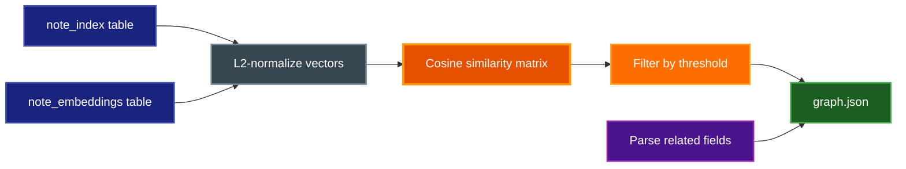
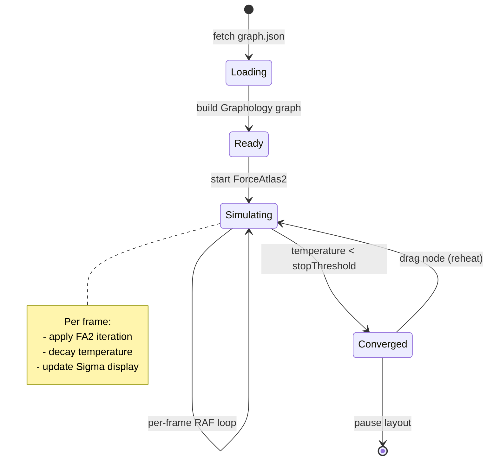

# Vault Visualizer

An interactive web application for exploring and navigating a ClaudeVault knowledge base through dual-mode reading and graph visualization.

## Table of Contents
- [Overview](#overview)
- [Architecture](#architecture)
- [Features](#features)
  - [Read Mode](#read-mode)
  - [Version History (Git Diff Viewer)](#version-history-git-diff-viewer)
  - [Graph Mode](#graph-mode)
  - [Multi-Tab Support](#multi-tab-support)
  - [File Explorer Sidebar](#file-explorer-sidebar)
  - [Unified Search](#unified-search)
  - [Keyboard Shortcuts](#keyboard-shortcuts)
  - [Real-Time Vault Sync](#real-time-vault-sync)
  - [Multi-Vault Support](#multi-vault-support)
- [Running the Visualizer](#running-the-visualizer)
- [Building Graph Data](#building-graph-data)
- [Data Model](#data-model)
- [State Management](#state-management)
- [Graph Visualization Engine](#graph-visualization-engine)
- [Configuration](#configuration)
- [File Structure](#file-structure)
- [Related Documentation](#related-documentation)

## Overview

**Purpose:** Provide a browser-based interface for reading, navigating, and visually exploring the vault knowledge graph — combining a hierarchical file browser with force-directed graph visualization powered by semantic embeddings and explicit wikilinks.

**Key Features:**
- Dual-mode interface: Read (Markdown rendering) and Graph (force-directed visualization)
- **Version history viewer** — browse git commits for any note and compare any two with syntax-highlighted diffs
- Multi-tab note browsing with persistent state
- Unified search across titles, tags, and folders (⌘K)
- Interactive graph with per-node neighborhood and full-vault views
- Pre-built graph data from vault embeddings (no live queries)

**Requirements:**
- Bun runtime
- Vault with embeddings built (`build_embeddings.py`)
- `graph.json` built via `make graph`

## Architecture

### System Design

```mermaid
graph TB
    subgraph "Browser"
        App[Next.js App]
        Read[ReadingPane]
        Graph[GraphCanvas]
        Search[UnifiedSearch]
        Sidebar[FileExplorer]
        Conflict[ConflictDialog]
    end

    subgraph "Server"
        Server[Custom server.ts]
        WS[WebSocketServer]
        Watcher[Chokidar Watcher]
    end

    subgraph "Data"
        GJ[graph.json]
        API["/api/note?stem="]
        FilesAPI["/api/files"]
        HistAPI["/api/note/history"]
        DiffAPI["/api/note/diff"]
        Vault[ClaudeVault Notes]
        Git[Git Repo]
    end

    subgraph "Build Pipeline"
        Emb[embeddings.db]
        Builder[build_graph.py]
    end

    App --> Read
    App --> Graph
    App --> Search
    App --> Sidebar
    App --> History[HistoryView]
    Read --> Conflict

    Server --> WS
    Server --> Watcher
    Watcher --> Vault
    WS -->|file:created/deleted/modified| App

    App -->|fetch on load| GJ
    Read -->|fetch on open| API
    Sidebar -->|fetch on mount| FilesAPI
    API --> Vault
    FilesAPI --> Vault
    HistAPI --> Git
    DiffAPI --> Git
    History -->|git log| HistAPI
    History -->|git diff| DiffAPI

    Emb --> Builder
    Builder --> GJ

    style App fill:#e65100,stroke:#ff9800,stroke-width:3px,color:#ffffff
    style Graph fill:#0d47a1,stroke:#2196f3,stroke-width:2px,color:#ffffff
    style Read fill:#1b5e20,stroke:#4caf50,stroke-width:2px,color:#ffffff
    style Search fill:#4a148c,stroke:#9c27b0,stroke-width:2px,color:#ffffff
    style Sidebar fill:#37474f,stroke:#78909c,stroke-width:2px,color:#ffffff
    style History fill:#006064,stroke:#00acc1,stroke-width:2px,color:#ffffff
    style Conflict fill:#b71c1c,stroke:#f44336,stroke-width:2px,color:#ffffff
    style Server fill:#4a148c,stroke:#9c27b0,stroke-width:3px,color:#ffffff
    style WS fill:#880e4f,stroke:#c2185b,stroke-width:2px,color:#ffffff
    style Watcher fill:#37474f,stroke:#78909c,stroke-width:2px,color:#ffffff
    style GJ fill:#1a237e,stroke:#3f51b5,stroke-width:2px,color:#ffffff
    style API fill:#37474f,stroke:#78909c,stroke-width:2px,color:#ffffff
    style FilesAPI fill:#37474f,stroke:#78909c,stroke-width:2px,color:#ffffff
    style HistAPI fill:#006064,stroke:#00acc1,stroke-width:1px,color:#ffffff
    style DiffAPI fill:#006064,stroke:#00acc1,stroke-width:1px,color:#ffffff
    style Vault fill:#37474f,stroke:#78909c,stroke-width:1px,color:#ffffff
    style Git fill:#311b92,stroke:#7c4dff,stroke-width:1px,color:#ffffff
    style Emb fill:#1a237e,stroke:#3f51b5,stroke-width:2px,color:#ffffff
    style Builder fill:#880e4f,stroke:#c2185b,stroke-width:2px,color:#ffffff
```

### Tech Stack

| Layer | Technology |
|-------|-----------|
| Framework | Next.js + React |
| Graph Rendering | Sigma.js (WebGL) |
| Graph Layout | Graphology + ForceAtlas2 |
| Styling | Tailwind CSS |
| Runtime / Package Manager | Bun |
| Markdown Rendering | react-markdown + remark-gfm |

### Component Hierarchy

```mermaid
graph TD
    Page[app/page.tsx]
    Toolbar[Toolbar.tsx]
    TabBar[TabBar.tsx]
    Search[UnifiedSearch.tsx]
    WsIndicator[WS Status Dot]
    ViewToggle[ViewToggle.tsx]
    Sidebar[FileExplorer.tsx]
    ReadPane[ReadingPane.tsx]
    GraphCanvas[GraphCanvas.tsx]
    HUD[HUDPanel.tsx]
    TempBar[TemperatureBar.tsx]
    NewNote[NewNoteDialog.tsx]
    Confirm[ConfirmDialog.tsx]
    Conflict[ConflictDialog.tsx]
    FmEditor[FrontmatterEditor.tsx]
    HistView[HistoryView.tsx]
    CommitList[CommitList.tsx]
    DiffViewer[DiffViewer.tsx]

    Page --> Toolbar
    Toolbar --> TabBar
    Toolbar --> Search
    Toolbar --> WsIndicator
    Toolbar --> ViewToggle
    Page --> Sidebar
    Page --> ReadPane
    Page --> GraphCanvas
    Page --> NewNote
    Page --> HistView
    ReadPane --> Confirm
    ReadPane --> Conflict
    ReadPane --> FmEditor
    GraphCanvas --> HUD
    GraphCanvas --> TempBar
    HistView --> CommitList
    HistView --> DiffViewer

    style Page fill:#e65100,stroke:#ff9800,stroke-width:3px,color:#ffffff
    style Toolbar fill:#1b5e20,stroke:#4caf50,stroke-width:2px,color:#ffffff
    style GraphCanvas fill:#0d47a1,stroke:#2196f3,stroke-width:2px,color:#ffffff
    style HUD fill:#0d47a1,stroke:#2196f3,stroke-width:1px,color:#ffffff
    style Sidebar fill:#37474f,stroke:#78909c,stroke-width:2px,color:#ffffff
    style ReadPane fill:#1b5e20,stroke:#4caf50,stroke-width:1px,color:#ffffff
    style TabBar fill:#37474f,stroke:#78909c,stroke-width:1px,color:#ffffff
    style Search fill:#4a148c,stroke:#9c27b0,stroke-width:2px,color:#ffffff
    style WsIndicator fill:#880e4f,stroke:#c2185b,stroke-width:1px,color:#ffffff
    style ViewToggle fill:#37474f,stroke:#78909c,stroke-width:1px,color:#ffffff
    style TempBar fill:#37474f,stroke:#78909c,stroke-width:1px,color:#ffffff
    style NewNote fill:#880e4f,stroke:#c2185b,stroke-width:1px,color:#ffffff
    style Confirm fill:#880e4f,stroke:#c2185b,stroke-width:1px,color:#ffffff
    style Conflict fill:#b71c1c,stroke:#f44336,stroke-width:1px,color:#ffffff
    style FmEditor fill:#880e4f,stroke:#c2185b,stroke-width:1px,color:#ffffff
    style HistView fill:#006064,stroke:#00acc1,stroke-width:2px,color:#ffffff
    style CommitList fill:#006064,stroke:#00acc1,stroke-width:1px,color:#ffffff
    style DiffViewer fill:#006064,stroke:#00acc1,stroke-width:1px,color:#ffffff
```



## Features

### Read Mode

The default mode when opening a note. Provides a distraction-free reading experience:

- Centered column layout (max-width 720px) for comfortable reading
- Metadata header: note type badge, date, confidence level
- Tag pills display below the title
- Full GitHub Flavored Markdown (GFM) rendering
- Wikilinks (`[[stem]]`) rendered as clickable purple text
  - Click → open in current tab
  - Cmd+click → open in new tab
- Related notes section extracted from YAML frontmatter
- **Inline editing**: toggle edit mode to modify note body and frontmatter
  - FrontmatterEditor provides structured editing of type, date, confidence, tags, project, sources, and related links with tag autocomplete from the graph
  - Save and delete operations via the note CRUD API

### Version History (Git Diff Viewer)

Browse the git commit history of any vault note and compare any two versions with syntax-highlighted diffs. Requires the vault to be a git repository.

**Entry Points — three ways to open history:**
- **ReadingPane toolbar** — click the `HISTORY` button (visible when viewing any note)
- **File Explorer right-click** — right-click any file item → "View History"
- **Graph node right-click** — right-click any node → "View History"

**Layout:**

```
┌─ Toolbar (← Back  stem — Version History  [UNIFIED|SPLIT|WORDS]) ──┐
├─────────────────────────────────────────────────────────────────────┤
│  CommitList (240px)    │  DiffViewer (flex 1)                       │
│                        │                                             │
│  COMMITS · N total     │  +12 additions  −5 deletions  note.md      │
│                        │  ─────────────────────────────────         │
│  [FROM] [TO] abc1234   │  old line  │  new line                     │
│  commit message        │  ...       │  ...                           │
│  3h ago · latest       │                                             │
│                        │                                             │
│  [FROM] [TO] def5678   │                                             │
│  commit message        │                                             │
│  1d ago                │                                             │
└────────────────────────┴─────────────────────────────────────────────┘
```

**Commit List:**
- Each row has independent **[FROM]** and **[TO]** badge buttons
- Clicking FROM sets the base revision; clicking TO sets the comparison target
- FROM and TO cannot be the same commit (setting one to the other's value auto-clears it)
- Defaults to FROM = latest commit, TO = previous commit on open
- Single-commit notes show "Only one version — no diff available"

**Diff Modes (toggle in toolbar):**

| Mode | Description |
|------|-------------|
| UNIFIED | Single column, `+`/`-`/space prefixes, line numbers on left |
| SPLIT | Two columns side by side (FROM left, TO right), aligned line pairs, red/green backgrounds |
| WORDS | Inline word-level diff — red strikethrough for removed words, green for added words |

Default mode is **SPLIT**.

**Edge cases:**
- No git history → "No version history found"
- Single commit → FROM shown read-only, diff panel shows message
- `from === to` → "Select two different commits to compare"
- Diff > 5000 lines → truncated with notice

### Graph Mode

Interactive force-directed graph for exploring note relationships:

**Default (Local) View**
- Displays a 2-hop neighborhood around the currently active note
- Uses wiki edges (explicit wikilinks) for BFS traversal
- Shows semantic edges within the neighborhood

**Full Vault View**
- Toggle via "Show Full Vault ⤢" button in the HUD
- Renders all notes and edges simultaneously

**Visual Encoding**

| Element | Encoding |
|---------|---------|
| Node color | Note type (pattern, debugging, research, project, tool, language, framework, daily) |
| Node size | Incoming link count (logarithmic scale) |
| Wiki edge | Solid line — explicit wikilinks |
| Semantic edge | Solid line — embedding similarity above threshold |

**Interactions**
- Click node → opens note in current tab and highlights selection
- Right-click node → context menu: "Open in Reading Pane" / "View History"
- Drag node → pins position, reheats physics simulation
- Hover node → shows label (if labels-on-hover mode is active)

#### HUD Panel

Floating overlay in the bottom-left of the graph canvas.

**Display Controls**
- Semantic similarity threshold (0.0–1.0)
- Graph source: Semantic vs. Wiki
- Overlay edges (show opposite type at low opacity)
- Node type filter checkboxes
- Show daily notes toggle
- Filter nodes by similarity toggle (show only nodes connected by semantic edges above threshold)
- Hide isolated nodes toggle
- Labels on hover only toggle

**Physics Controls**
- Scaling ratio (node repulsion strength)
- Gravity (attraction to center)
- Slow down (cooling rate)
- Edge weight influence
- Start temperature
- Stop threshold
- Pause / Resume layout button
- Reset to defaults

**Statistics**
- Visible node count
- Visible edge count
- Average semantic similarity score

**Temperature Bar**
- Visual indicator of simulation energy (0 to 1.0)
- Hotter = nodes still moving; cooler = converging

### Multi-Tab Support

- Maximum 20 open tabs
- Each tab: colored type dot, note title, close button (✕)
- Active tab: highlighted with distinct background and bottom border
- Tabs scroll horizontally on overflow
- Tab state persisted to `localStorage`
- Stale stems auto-removed on load
- Switching tabs updates content immediately (cached)

### File Explorer Sidebar

- Nested folder structure (one level of subfolders)
- Expand/collapse folders via chevrons
- Notes sorted alphabetically within folders
- Active note highlighted (indigo left border + background tint)
- Clicking a note in Graph mode also flies camera to that node
- **Right-click context menu** on any file item: Open, View History, Delete
- Resizable via drag handle (180px–400px)
- Collapsible via hamburger button (☰) in toolbar
- Auto-collapses on mobile viewports (<768px)
- Width persisted to `localStorage`
- Note count shown in header

### Unified Search

Activated with **⌘K** — three modes selectable by prefix:

| Prefix | Mode | Description |
|--------|------|-------------|
| *(none)* | Title | Fuzzy match on note titles and stem IDs |
| `#tag` | Tag | Exact tag match |
| `/path` | Folder | Prefix match on vault-relative path |

- Up to 8 results shown per query
- Each result: colored type dot, title with match highlighting, folder path, tags
- Keyboard navigation: ↑↓ to move, ⏎ to open, ⌘⏎ for new tab
- Click → open in current tab; Cmd+click → new tab
- In Graph mode: opening a result flies camera to that node
- All data served from `graph.json` — no server round-trips

### Keyboard Shortcuts

| Shortcut | Action |
|----------|--------|
| ⌘K / Ctrl+K | Focus search input |
| ⌘B / Ctrl+B | Toggle sidebar |
| ⌘\ / Ctrl+\ | Toggle Read / Graph mode |
| ⌘E / Ctrl+E | Enter edit mode (when viewing a note) |
| ⌘S / Ctrl+S | Save note (when editing) |
| Esc | Close search dropdown, cancel edit, or deselect graph node |
| ↑ ↓ (search) | Navigate results |
| ⏎ (search) | Open selected result |
| ⌘⏎ (search) | Open selected result in new tab |

### Real-Time Vault Sync

The visualizer maintains a WebSocket connection to the server for live vault updates:

**WebSocket Connection**
- Endpoint: `/ws/vault`
- Automatic reconnection with exponential backoff (1s → 30s max)
- Heartbeat: server pings every 30 seconds; clients must respond with `pong`
- Connection status indicator in toolbar: green (connected), amber (connecting), red (disconnected)

**Live Updates**
- New notes appear in FileExplorer immediately (no reload)
- Deleted notes are removed from the sidebar instantly
- Modified notes auto-refresh in read mode (scroll position preserved)
- When `graph.json` is rebuilt server-side, clients refetch automatically

**Conflict Detection**
- When saving a note that was modified externally, a `ConflictDialog` appears
- Three resolution options:
  1. **Take theirs** — use the server version
  2. **Keep mine** — overwrite with your edits
  3. **Merge** — manual editor with split/unified diff view

**External Modification Warning**
- If a note is modified externally while you are editing it, a warning appears
- Saving triggers conflict detection to prevent data loss

### Multi-Vault Support

The visualizer supports multiple isolated vaults, allowing you to switch between work, personal, or project-specific knowledge bases.

**Setup**

Create a vaults configuration file at `~/.config/parsidion-cc/vaults.yaml`:

```yaml
vaults:
  work: ~/WorkVault
  personal: ~/PersonalVault
  team: ~/shared/team-vault
```

**Vault Selector**

- Dropdown in the toolbar (left of WebSocket status indicator)
- Shows all configured vaults plus "default"
- Persists selection to localStorage (`vv:selectedVault`)
- Switching vaults clears the content cache and resets tabs

**Vault-Aware Components**

| Component | Behavior |
|-----------|----------|
| FileExplorer | Re-fetches file list from `/api/files?vault=name` |
| ReadingPane | Loads notes via `/api/note?vault=name&stem=...` |
| GraphCanvas | Graph data is vault-specific (separate `graph.json` per vault) |
| WebSocket | Reconnects to `/ws/vault?vault=name` on switch |

**API Endpoints**

All API routes accept an optional `vault` query parameter:

| Endpoint | Vault Parameter |
|----------|-----------------|
| `GET /api/files?vault=<name>` | List files in specified vault |
| `GET /api/note?vault=<name>&stem=<stem>` | Read note from vault |
| `POST /api/note?vault=<name>` | Save note to vault |
| `GET /api/note/history?vault=<name>&stem=<stem>` | Git history for vault |
| `GET /api/note/diff?vault=<name>&...` | Git diff in vault |
| `POST /api/graph/rebuild?vault=<name>` | Rebuild vault's graph.json |
| `GET /api/vaults` | List available vaults |

**Fallback Behavior**

When no `vaults.yaml` exists or only one vault is configured:
- Vault selector is hidden in the toolbar
- All operations use the default vault (`~/ClaudeVault` or `VAULT_ROOT`)

## Running the Visualizer

### Development

```bash
# Install dependencies (first time only)
make visualizer-setup

# Build graph data from vault
make graph

# Start dev server (port 3999)
cd visualizer
bun dev
```

Open `http://localhost:3999` in your browser.

### Production

```bash
make build-visualizer         # Compile Next.js production build
cd visualizer && bun start    # Start production server on port 3999
make stop-visualizer          # Kill the process on port 3999
```

## Building Graph Data

The `graph.json` file is a pre-computed snapshot of vault relationships. Rebuild it whenever notes are added, removed, or embeddings are updated.

### Prerequisites

1. Vault must have embeddings built:
   ```bash
   uv run --no-project ~/.claude/skills/parsidion-cc/scripts/build_embeddings.py
   ```

2. Run the graph builder:
   ```bash
   make graph                        # Include Daily notes (default)
   uv run scripts/build_graph.py --no-daily  # Exclude Daily folder notes
   ```

### Graph Builder Options

```bash
uv run scripts/build_graph.py [OPTIONS]

Options:
  --no-daily             Exclude Daily folder notes (included by default)
  --min-threshold FLOAT  Minimum cosine similarity for semantic edges (default: 0.70)
  --output PATH          Output path for graph.json
  --vault PATH           Custom vault root path
```

### Processing Pipeline



## Data Model

### `NoteNode`

```typescript
{
  id: string           // Unique stem identifier
  title: string        // Display title
  type: string         // Note type: pattern | debugging | research | project |
                       //   tool | language | framework | daily
  folder: string       // Top-level vault folder (e.g., "Patterns", "Daily")
  path: string         // Vault-relative path
  tags: string[]       // Note tags
  incoming_links: number  // Count of wiki links pointing to this note
  mtime: number        // File modification time (Unix timestamp)
}
```

### `GraphEdge`

```typescript
{
  s: string            // Source node stem
  t: string            // Target node stem
  w: number            // Weight: 0–1 for semantic, 1.0 for wiki
  kind: 'semantic' | 'wiki'
}
```

### `GraphData` (graph.json root)

```typescript
{
  meta: {
    generated: string        // ISO timestamp of build
    note_count: number
    edge_count: number
    min_semantic_threshold: number
  }
  nodes: NoteNode[]
  edges: GraphEdge[]
}
```

### `VaultFile` (WebSocket and API)

```typescript
{
  stem: string         // Filename without extension — e.g. "foo" for "Patterns/foo.md"
  path: string         // Path relative to vault root — e.g. "Patterns/foo.md"
  noteType?: string    // Frontmatter `type` field, if present
}
```

### `WsStatus`

```typescript
type WsStatus = 'connecting' | 'connected' | 'disconnected'
```

### API Routes

**`GET /api/note?stem=<stem>`**

Returns the Markdown content for a note identified by its stem ID.

| Parameter | Type | Required | Description |
|-----------|------|----------|-------------|
| `stem` | string | Yes | Vault note stem (filename without extension) |
| `path` | string | No | Vault-relative path (for disambiguation when multiple notes share the same stem) |

**Response (200):** JSON `{ content: string, path: string }` — raw Markdown and vault-relative path

**Response (404):** JSON error — note not found

**`POST /api/note`** — Update (overwrite) an existing note.
Body: `{ stem: string, content: string, lastModified?: number }`
- If `lastModified` is provided, server checks for conflicts (409 if note was modified externally)
- Response (409): `{ conflict: true, serverContent: string }` — conflict detected
- Response (200): `{ ok: true }`

**`PUT /api/note`** — Create a new note at a vault-relative path.
Body: `{ path: string, content: string }`. Returns 409 if the note already exists.

**`DELETE /api/note?stem=<stem>`** — Delete a note by stem.

**`POST /api/graph/rebuild`** — Trigger a server-side `build_graph.py` run to regenerate `graph.json`. Broadcasts `graph:rebuilt` event to all connected WebSocket clients.

**`GET /api/files`** — Returns the complete vault file tree.

**Response (200):** `{ files: VaultFile[] }` — flat array of all vault markdown files with stem, path, and noteType

**`GET /api/note/history?stem=<stem>`** — Returns the git commit log for a note.

| Parameter | Type | Required | Description |
|-----------|------|----------|-------------|
| `stem` | string | Yes* | Vault note stem (*required if `path` not provided) |
| `path` | string | No | Vault-relative path (for disambiguation when multiple notes share the same stem) |

**Response (200):** `{ commits: CommitEntry[] }` where each entry has `{ hash, shortHash, date, message }`. Returns `{ commits: [] }` when the vault has no git history (not an error).

**`GET /api/note/diff?stem=<stem>&from=<hash>&to=<hash>`** — Returns a unified diff between two commits.

| Parameter | Type | Required | Description |
|-----------|------|----------|-------------|
| `stem` | string | Yes* | Vault note stem (*required if `path` not provided) |
| `path` | string | No | Vault-relative path (for disambiguation when multiple notes share the same stem) |
| `from` | string | Yes | Base commit SHA (4–40 hex chars) |
| `to` | string | Yes | Target commit SHA, or `working` for the uncommitted working tree |

**Response (200):** `{ diff: string, truncated: boolean }` — raw unified diff text; `truncated` is true when the diff exceeded 5000 lines.

Both history routes path-traverse-protect with `guardPath()` (same pattern as `/api/note`) and validate SHA parameters against `/^[a-f0-9]{4,40}$|^working$/`.

## State Management

All application state is managed by the `useVisualizerState` hook (`lib/useVisualizerState.ts`) and the `useVaultFiles` hook (`lib/useVaultFiles.ts`). State is split into categories:

**Vault State**

| Key | Type | Description |
|-----|------|-------------|
| `selectedVault` | `string \| null` | Currently selected vault name (null = default) |
| `setSelectedVault(vault)` | callback | Switch vaults (clears cache and tabs on change) |

**Tab / View State**

| Key | Type | Description |
|-----|------|-------------|
| `openTabs` | `string[]` | Array of open note stems |
| `activeTab` | `string \| null` | Currently displayed note stem |
| `viewMode` | `'read' \| 'graph'` | Current display mode |
| `graphScope` | `'local' \| 'full'` | Neighborhood vs. full vault |

**History Mode State**

| Key | Type | Description |
|-----|------|-------------|
| `historyMode` | `boolean` | Whether the history viewer is active |
| `historyNote` | `string \| null` | Stem of the note whose history is being viewed |
| `historyPath` | `string \| null` | Vault-relative path for disambiguation |
| `openHistory(stem, path?)` | callback | Enters history mode; saves current `viewMode` for restoration |
| `closeHistory()` | callback | Exits history mode; restores `viewMode` to its pre-history value |

**Sidebar State**

| Key | Type | Description |
|-----|------|-------------|
| `sidebarWidth` | `number` | Width in pixels (180–400) |
| `sidebarCollapsed` | `boolean` | Whether sidebar is hidden |

**Content Cache & Sync**

| Key | Type | Description |
|-----|------|-------------|
| `contentCache` | `Map<string, string>` | In-memory cache of note content (stem/path → content) |
| `invalidateNote(stem, path?)` | callback | Evict cached content when external modification detected |
| `saveNote(stem, content, lastModified?, path?)` | callback | Save with optional conflict detection |
| `deleteNote(stem)` | callback | Delete a note by stem |
| `createNote(path, content)` | callback | Create a new note at a vault-relative path |

**WebSocket State** (from `useVaultFiles`)

| Key | Type | Description |
|-----|------|-------------|
| `fileTree` | `VaultFileTree` | Nested Map<folder, Map<subfolder, VaultFile[]>> |
| `wsStatus` | `WsStatus` | Connection state |
| `totalFiles` | `number` | Total vault note count |

**Graph Controls** (all persisted to `localStorage` with `vv:` prefix)

| Key | Default | Description |
|-----|---------|-------------|
| `threshold` | `0.80` | Semantic similarity cutoff |
| `graphSource` | `'semantic'` | Primary edge type to display |
| `showOverlayEdges` | `false` | Show opposite edge type at low opacity |
| `filterNodesBySimilarity` | `false` | Show only nodes connected by semantic edges above threshold |
| `activeTypes` | all types (excluding daily) | Visible note type filters |
| `showDaily` | `false` | Show Daily folder notes |
| `hideIsolated` | `false` | Hide unconnected nodes |
| `labelsOnHoverOnly` | `false` | Only show labels on hover |
| `scalingRatio` | `10` | Node repulsion multiplier |
| `gravity` | `1` | Attraction to center |
| `slowDown` | `0.5` | Cooling rate |
| `edgeWeightInfluence` | `2` | Edge attraction multiplier |
| `startTemperature` | `0.8` | Initial simulation energy |
| `stopThreshold` | `0.01` | Energy level below which layout pauses |

**Computed State**

| Key | Description |
|-----|-------------|
| `fileTree` | Nested folder structure derived from nodes |
| `nodeMap` | `Map<stem, NoteNode>` for O(1) lookup |
| `stemLookup` | Wikilink resolution map (exact + fuzzy matching) |
| `stats` | Visible node/edge counts and average semantic score |
| `selectedNode` | Currently highlighted graph node |

## Graph Visualization Engine

### Physics Simulation

The ForceAtlas2 algorithm drives the layout:



**Cooling:** Temperature decays per frame at `temp *= (1 - 0.002 * slowDown)`. At `slowDown=1`, convergence takes ~29 seconds at 60 fps; at `slowDown=5`, ~6 seconds.

### Neighborhood Computation

For local (2-hop) view:

1. Build adjacency list from wiki edges (O(E) setup, done once)
2. BFS from active note using wiki edges only
3. Collect all nodes within 2 hops
4. Include semantic edges between neighborhood nodes

> **Why wiki-only BFS?** Semantic edges form a dense graph (19K+ edges at 0.70 threshold). 2-hop semantic BFS reaches ~70% of the vault. Wiki edges reflect true structural relationships and produce useful, bounded neighborhoods.

### Performance

| Metric | Value |
|--------|-------|
| Tested vault size | 1000+ notes |
| Semantic edges at 0.70 threshold | ~19,000 |
| Rendering | WebGL via Sigma.js — ~1000 nodes at 60 fps |
| Physics | O(N) per iteration with velocity tracking |
| Content loading | Cached per-tab after first fetch |

## Configuration

### Environment Variables

| Variable | Default | Description |
|----------|---------|-------------|
| `VAULT_ROOT` | `~/ClaudeVault` | Custom vault root path |

### Dev Server Port

The dev and production server runs on **port 3999** (configured in `package.json`).

### localStorage Persistence

All graph controls and UI layout are persisted to `localStorage` using the `vv:` prefix. Keys are listed in the [State Management](#state-management) section. Clear `localStorage` in browser DevTools to reset all settings to defaults.

## File Structure

```
parsidion-cc/
├── visualizer/                       # Next.js app root
│   ├── server.ts                     # Custom server: Next.js + WebSocket + chokidar (multi-vault)
│   ├── app/
│   │   ├── page.tsx                  # Main layout and state wiring
│   │   ├── layout.tsx                # HTML head, global styles
│   │   ├── api/note/route.ts         # Note CRUD API (GET, POST, PUT, DELETE)
│   │   ├── api/note/history/route.ts # Git log for a note (GET)
│   │   ├── api/note/diff/route.ts    # Git diff between two commits (GET)
│   │   ├── api/files/route.ts        # Vault file tree (GET)
│   │   ├── api/vaults/route.ts       # List available vaults (GET)
│   │   └── api/graph/rebuild/route.ts  # Trigger graph.json rebuild (POST)
│   ├── components/
│   │   ├── GraphCanvas.tsx           # Sigma.js WebGL renderer + node right-click menu
│   │   ├── HUDPanel.tsx              # Graph controls overlay
│   │   ├── FileExplorer.tsx          # Sidebar with folder tree + right-click context menu
│   │   ├── ReadingPane.tsx           # Markdown renderer + HISTORY toolbar button
│   │   ├── HistoryView.tsx           # Split-screen git history viewer
│   │   ├── CommitList.tsx            # Scrollable commit list with FROM/TO selection
│   │   ├── DiffViewer.tsx            # Diff renderer (unified / split / words modes)
│   │   ├── Toolbar.tsx               # Top bar with tabs + vault selector + WS status
│   │   ├── VaultSelector.tsx         # Multi-vault dropdown switcher
│   │   ├── TabBar.tsx                # Scrollable tab strip
│   │   ├── UnifiedSearch.tsx         # ⌘K search input + dropdown
│   │   ├── ViewToggle.tsx            # Read/Graph mode toggle button
│   │   ├── TemperatureBar.tsx        # Simulation energy indicator
│   │   ├── NewNoteDialog.tsx         # Dialog for creating new vault notes
│   │   ├── ConfirmDialog.tsx         # Reusable confirmation prompt
│   │   ├── ConflictDialog.tsx        # Edit conflict resolution (take theirs / keep mine / merge)
│   │   └── FrontmatterEditor.tsx    # Structured YAML frontmatter editor
│   ├── lib/
│   │   ├── graph.ts                  # Data types and fetch helpers
│   │   ├── useVisualizerState.ts     # Central state management hook (incl. vault + history)
│   │   ├── useVaultFiles.ts          # WebSocket hook for real-time vault sync
│   │   ├── vaultFile.ts              # VaultFile type (shared client/server)
│   │   ├── vaultResolver.ts          # Multi-vault path resolution (server-side)
│   │   ├── vaultBroadcast.server.ts  # Global EventEmitter for server-side events
│   │   ├── parseDiff.ts              # Client-side unified diff parser (DiffHunk, DiffLine)
│   │   ├── sigma-colors.ts           # Note type → color mapping
│   │   ├── frontmatter.ts           # Frontmatter parse/serialize helpers
│   │   └── useLocalStorage.ts        # localStorage persistence hook
│   ├── public/
│   │   └── graph.json                # Pre-computed graph (generated)
│   ├── package.json
│   ├── tsconfig.json
│   ├── tsconfig.server.json          # TypeScript config for server.ts
│   └── next.config.ts
│
├── scripts/
│   └── build_graph.py                # Graph data generator
│
└── Makefile                          # Build targets
```

## Related Documentation

- [Architecture](ARCHITECTURE.md) — Full system component map
- [Embeddings](EMBEDDINGS.md) — How embeddings are built and evaluated
- [CLAUDE.md](../CLAUDE.md) — Project conventions and script reference
